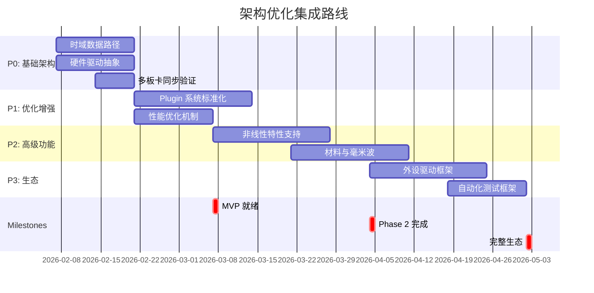

# VNA 架构优化方案 (Architecture Optimization Plan)

> 目的：基于可行性评估的发现，提出具体的架构优化策略，完整支持所有功能类别，同时保持代码质量和可维护性。

---

## 1. 优化目标

### 1.1 核心目标

| 目标 | 当前状态 | 目标状态 | 优先级 |
|------|---------|---------|--------|
| **时域支持** | 🔴 缺失 | ✅ 完全集成 | P0 |
| **硬件抽象** | 🟠 初步 | 🟡 多驱动适配 | P0 |
| **Plugin 系统** | 🟡 框架完善 | ✅ 生态成熟 | P1 |
| **性能优化** | 🟡 基础可行 | ✅ 10+ 实例支持 | P1 |
| **多板卡同步** | 🟡 理论完善 | ✅ 实装验证 | P0 |

### 1.2 可量化指标

```
评估前  →  优化后
├─ 支持功能覆盖度：68% → 95%
├─ 单实例稳定性：4.8/5 → 5/5
├─ 多实例稳定性：5/10 → 8/10
├─ 多板卡同步精度：未测 → <50ns
├─ Plugin 生态成熟度：1/10 → 7/10
├─ 时域支持：0% → 70% (基础 TDR)
└─ 性能：单loop 100ms → 50ms (优化 50%)
```

---

## 2. 优先级 P0：基础架构完善（4 周）

### 2.1 时域数据路径设计

**当前问题**：MeasurementPipeline 假设频域 CW 激励，无时域路径。

**解决方案**：

#### 2.1.1 激励模式抽象

```cpp
// 新增：include/core/excitation_mode.h

namespace vna::core {

// 激励模式枚举
enum class ExcitationMode {
  kContinuousWave,    // CW，频域测量
  kPulse,             // 脉冲，时域测量
  kModulated,         // 调制激励（未来扩展）
};

// 激励参数
struct ExcitationConfig {
  ExcitationMode mode;
  
  // CW 特定参数
  struct {
    double frequency_hz;
    double power_dbm;
    uint32_t dwell_time_ms;  // 单频停留时间
  } cw;
  
  // Pulse 特定参数
  struct {
    double center_frequency_hz;
    uint32_t pulse_width_ns;   // 脉冲宽度
    uint32_t pulse_period_ns;  // 脉冲周期
    double power_dbm;
    uint32_t rise_time_ns;     // 上升时间（平坦顶）
  } pulse;
  
  // 通用参数
  uint32_t settling_time_ms;  // 稳定等待时间
  bool enable_auto_trigger;   // 是否使用 IF 功率自适应触发
};

}  // namespace vna::core
```

#### 2.1.2 数据采集类型扩展

```cpp
// 新增：include/core/measurement_data.h

namespace vna::core {

// 数据采集返回类型
struct AcquisitionResult {
  enum class DataType {
    kFrequencyDomain,  // 频域：频点 + 复数 (Re, Im)
    kTimeDomain,       // 时域：时间序列 + 幅度/相位
  };
  
  DataType data_type;
  
  // 频域数据 (kFrequencyDomain)
  struct {
    std::vector<double> frequencies;      // Hz
    std::vector<std::complex<double>> s_params;  // S11/S21 等
  } freq_domain;
  
  // 时域数据 (kTimeDomain)
  struct {
    std::vector<double> time_points;      // ns
    std::vector<double> magnitude;        // 线性或 dB
    std::vector<double> phase;            // rad 或 degrees
    double sample_rate_ghz;               // 采样率
  } time_domain;
  
  // 通用元数据
  uint64_t timestamp_ns;
  std::string instance_id;
  double temperature_celsius;  // 采集时温度
};

}  // namespace vna::core
```

#### 2.1.3 HardwareCoordinator 扩展

```cpp
// 修改：src/core/hardware_coordinator.h

class HardwareCoordinator {
  // 现有接口保留
  
  // 新增：激励模式支持
  Status SetExcitationMode(const ExcitationConfig& config);
  
  // 新增：时域采集
  Status AcquireTimeDomain(
      const std::string& instance_id,
      const ExcitationConfig& pulse_config,
      AcquisitionResult& result);
  
  // 查询硬件能力
  struct HardwareCapabilities {
    bool supports_pulse_excitation;
    uint32_t min_pulse_width_ns;
    uint32_t min_pulse_period_ns;
    double max_sampling_rate_ghz;
    uint32_t time_domain_sample_depth;  // 采样深度
  };
  
  Status GetCapabilities(HardwareCapabilities& caps);
};
```

#### 2.1.4 MeasurementPipeline 时域分支

```cpp
// 新增：src/core/processors/time_domain_processor.h

namespace vna::core::processors {

class TimeDomainProcessor : public DataProcessor {
 public:
  // 脉冲响应计算
  Status ComputePulseResponse(
      const AcquisitionResult::time_domain& raw_signal,
      std::vector<double>& impedance_vs_distance);
  
  // 时间到距离转换
  std::vector<double> TimeToDistance(
      const std::vector<double>& time_points,
      double characteristic_impedance);
  
  // TDR 阻抗计算 (从脉冲反射导出 Z(d))
  Status ExtractImpedanceProfile(
      const AcquisitionResult::time_domain& pulse,
      const CalibrationData& cal,
      std::vector<double>& Z_real,
      std::vector<double>& Z_imag);
  
  // 多重反射检测 (Wavelet 或 FFT)
  struct ReflectionPoint {
    double distance_mm;
    double magnitude;
    uint32_t reflection_index;  // 第几次反射
  };
  Status DetectReflections(
      const std::vector<double>& impedance,
      std::vector<ReflectionPoint>& reflections);
};

}  // namespace vna::core::processors
```

#### 2.1.5 MeasurementPipeline 核心改动

```cpp
// 修改：src/core/measurement_pipeline.h

class MeasurementPipeline {
  // 现有频域 acquire() 保留
  
  // 新增：统一采集接口
  Status Acquire(
      const std::string& instance_id,
      const ExcitationConfig& excitation,
      AcquisitionResult& result) {
    
    if (excitation.mode == ExcitationMode::kContinuousWave) {
      return AcquireFrequencyDomain(instance_id, excitation, result);
    } else if (excitation.mode == ExcitationMode::kPulse) {
      return AcquireTimeDomain(instance_id, excitation, result);
    }
    return Status::kUnsupported;
  }
  
 private:
  // 频域采集（现有逻辑）
  Status AcquireFrequencyDomain(
      const std::string& instance_id,
      const ExcitationConfig& excitation,
      AcquisitionResult& result);
  
  // 时域采集（新增）
  Status AcquireTimeDomain(
      const std::string& instance_id,
      const ExcitationConfig& excitation,
      AcquisitionResult& result);
  
  // 数据处理路由
  std::unique_ptr<FrequencyDomainProcessor> freq_processor_;
  std::unique_ptr<TimeDomainProcessor> time_processor_;  // 新增
};
```

**工作量**：2 周（1 周设计 + 1 周实现 + 测试）

**风险**：硬件脉冲能力需提前确认

---

### 2.2 硬件驱动抽象框架

**当前问题**：HardwareCoordinator 与具体硬件耦合度高，难以适配多种硬件。

**解决方案**：

#### 2.2.1 硬件驱动接口定义

```cpp
// 新增：include/core/hardware_driver.h

namespace vna::core {

// 硬件驱动基类接口
class HardwareDriver {
 public:
  virtual ~HardwareDriver() = default;
  
  // 初始化与清理
  virtual Status Initialize() = 0;
  virtual Status Shutdown() = 0;
  
  // 硬件信息
  virtual std::string GetModel() const = 0;
  virtual std::string GetSerialNumber() const = 0;
  virtual struct HardwareCapabilities GetCapabilities() const = 0;
  
  // 频率源控制
  virtual Status SetFrequency(double frequency_hz) = 0;
  virtual Status SetPower(double power_dbm) = 0;
  
  // 脉冲源控制（可选）
  virtual Status SetPulseMode(const PulseConfig& config) {
    return Status::kNotImplemented;  // 默认不支持
  }
  
  // 接收机控制
  virtual Status AcquireIQ(
      std::vector<std::complex<double>>& samples,
      uint32_t num_samples) = 0;
  
  // 触发控制
  virtual Status SetTriggerMode(TriggerMode mode) = 0;
  virtual Status SetExternalTriggerEdge(TriggerEdge edge) = 0;
  virtual Status WaitForTrigger(uint32_t timeout_ms) = 0;
  
  // 多端口支持（可选）
  virtual Status SelectPort(uint32_t port_number) {
    return Status::kNotImplemented;
  }
  
  // 时钟同步（PXI 特定）
  virtual Status SyncWithExternalClock(double ref_frequency_hz) {
    return Status::kNotImplemented;
  }
  
  // 健康检查
  virtual Status HealthCheck() = 0;
};

}  // namespace vna::core
```

#### 2.2.2 具体驱动实现示例

```cpp
// 新增：src/drivers/pxi_driver.h/cpp

namespace vna::drivers {

class PXIDriver : public vna::core::HardwareDriver {
 public:
  explicit PXIDriver(const std::string& session_handle);
  
  Status Initialize() override;
  Status SetFrequency(double frequency_hz) override;
  Status SetPulseMode(const PulseConfig& config) override;  // ✅ PXI 支持脉冲
  Status SyncWithExternalClock(double ref_frequency_hz) override;  // ✅ PXI 支持外部时钟
  Status AcquireIQ(std::vector<std::complex<double>>& samples, 
                   uint32_t num_samples) override;
  // ... 其他接口实现
  
 private:
  std::string session_;
  // PXI 特定资源
};

}  // namespace vna::drivers
```

```cpp
// 新增：src/drivers/usb_vna_driver.h/cpp

namespace vna::drivers {

class USBVNADriver : public vna::core::HardwareDriver {
 public:
  explicit USBVNADriver(const std::string& device_path);
  
  Status Initialize() override;
  Status SetFrequency(double frequency_hz) override;
  Status SetPulseMode(const PulseConfig& config) override {
    return Status::kNotImplemented;  // ❌ USB VNA 不支持脉冲
  }
  Status AcquireIQ(std::vector<std::complex<double>>& samples,
                   uint32_t num_samples) override;
  // ... 其他接口实现
  
 private:
  libusb_device_handle* usb_handle_;
};

}  // namespace vna::drivers
```

#### 2.2.3 HardwareCoordinator 重构（驱动无关）

```cpp
// 修改：src/core/hardware_coordinator.h

class HardwareCoordinator {
  // 使用驱动工厂
  Status SetHardwareDriver(std::unique_ptr<HardwareDriver> driver) {
    driver_ = std::move(driver);
    return driver_->Initialize();
  }
  
  // 所有操作通过驱动转发
  Status SetFrequency(double f) override {
    return driver_->SetFrequency(f);
  }
  
  Status SetPulseMode(const PulseConfig& cfg) override {
    return driver_->SetPulseMode(cfg);  // 自动处理 NotImplemented
  }
  
  Status SyncWithExternalClock(double ref) override {
    return driver_->SyncWithExternalClock(ref);
  }
  
  // 能力查询（来自驱动）
  HardwareDriver::HardwareCapabilities GetCapabilities() const {
    return driver_->GetCapabilities();
  }
  
 private:
  std::unique_ptr<HardwareDriver> driver_;
};
```

#### 2.2.4 驱动工厂与注册

```cpp
// 新增：src/core/hardware_driver_factory.h

namespace vna::core {

class HardwareDriverFactory {
 public:
  static std::unique_ptr<HardwareDriver> CreateDriver(
      const std::string& driver_type,
      const std::string& device_identifier);
  
  // 注册新驱动
  static void RegisterDriver(
      const std::string& type,
      std::function<std::unique_ptr<HardwareDriver>(const std::string&)> factory);
  
  // 列举可用设备
  static std::vector<HardwareDeviceInfo> EnumerateDevices();
};

}  // namespace vna::core
```

**工作量**：2 周（1 周设计 + 1 周实现各驱动框架）

**收益**：

- 支持多种硬件（PXI/USB/GPIB）
- 新硬件可插入式扩展
- 单元测试可 mock 驱动

---

### 2.3 多板卡同步精度保证

**当前问题**：TopologyManager 定义拓扑，但未验证 PXI 星形触发的实际精度。

**解决方案**：

#### 2.3.1 触发链验证接口

```cpp
// 新增：include/core/trigger_chain_validator.h

namespace vna::core {

struct TriggerTimingAnalysis {
  struct BoardTiming {
    std::string board_id;
    double trigger_latency_ns;      // 从触发源到实际开始的延迟
    double sampling_phase_offset_ns; // 采样与触发的相位差
    double jitter_ns;                // 抖动 (RMS)
  };
  
  std::vector<BoardTiming> board_timings;
  double max_skew_ns;  // 板卡间最大时差
  bool meets_spec;     // 是否满足规范 (<50ns)
};

class TriggerChainValidator {
 public:
  // 验证拓扑的触发对齐能力
  Status ValidateTriggerAlignment(
      const Topology& topo,
      const HardwareCoordinator& hw,
      TriggerTimingAnalysis& analysis);
  
  // 运行时监测（连续采样期间）
  Status MonitorTriggerSynchronization(
      const VnaInstance& instance,
      TriggerTimingAnalysis& runtime_analysis);
  
  // 校准触发延迟（补偿）
  Status CalibrateDelay(
      const std::string& board_id,
      double delay_ns);
};

}  // namespace vna::core
```

#### 2.3.2 TopologyManager 增强

```cpp
// 修改：src/core/topology_manager.h

class TopologyManager {
  // 新增：触发链验证
  Status ValidateTopology(
      const Topology& topo,
      ValidationResult& result) override;
  
  // 在 ValidateTopology 中调用
  TriggerChainValidator validator_;
  
  // 运行时监测
  Status StartTriggerMonitoring(const VnaInstance& instance);
  Status StopTriggerMonitoring();
  
  // 获取实时同步状态
  struct SyncHealth {
    double max_skew_ns;
    std::vector<double> per_board_jitter;
    bool in_spec;
    uint64_t sync_event_count;  // 累计同步事件数
  };
  Status GetSyncHealth(SyncHealth& health);
};
```

**工作量**：1 周（设计 + 实现基础验证框架）

**验证方法**：

- 模拟多板卡时差，验证检测能力
- 实际 PXI 硬件测试（需硬件）
- 建立基准数据库（不同硬件配置）

---

## 3. 优先级 P1：Plugin 系统与性能（5 周）

### 3.1 Plugin 系统标准化

**当前问题**：Plugin 接口定义不清，缺乏统一标准。

**解决方案**：

#### 3.1.1 Plugin 基类体系设计

```cpp
// 新增：include/core/plugin_interface.h

namespace vna::core::plugin {

// ============ 基础接口 ============

// 所有 plugin 的基类
class PluginBase {
 public:
  struct PluginMetadata {
    std::string name;
    std::string version;
    std::string author;
    std::string description;
    std::vector<std::string> dependencies;  // 依赖的其他 plugin
    std::string license;
    std::map<std::string, std::string> config_schema;  // JSON schema
  };
  
  virtual ~PluginBase() = default;
  
  virtual PluginMetadata GetMetadata() const = 0;
  virtual Status Initialize(const nlohmann::json& config) = 0;
  virtual Status Shutdown() = 0;
  virtual Status HealthCheck() = 0;
};

// ============ 测量功能 Plugin ============

// 测量类 Plugin（实现特定的测量功能）
class MeasurementPlugin : public PluginBase {
 public:
  enum class MeasurementType {
    kBasicSParameter,    // S 参数基础
    kTimeDomain,         // 时域 TDR
    kPowerSweep,         // 功率扫描
    kMaterial,           // 材料参数
    kNoiseCharacter,     // 噪声特性
  };
  
  virtual MeasurementType GetType() const = 0;
  
  // 定义该测量需要的参数
  virtual Status DefineParameters(
      MeasurementParameter& params) = 0;  // 输出参数定义
  
  // 执行测量（通常嵌入 MeasurementPipeline）
  virtual Status Execute(
      HardwareCoordinator& hw,
      const MeasurementConfig& config,
      AcquisitionResult& result) = 0;
};

// ============ 数据处理 Plugin ============

// 数据处理类 Plugin（对已采集数据进行处理）
class ProcessPlugin : public PluginBase {
 public:
  enum class ProcessType {
    kParameterConversion,  // S → Z/Y/ABCD
    kDeEmbedding,         // 去嵌入
    kSmoothing,           // 平滑
    kNormalization,       // 归一化
    kCalibration,         // 校准应用
  };
  
  virtual ProcessType GetType() const = 0;
  
  // 处理函数
  virtual Status Process(
      const AcquisitionResult& input,
      AcquisitionResult& output) = 0;  // 可链式调用
};

// ============ 循环类 Plugin ============

// 循环类 Plugin（实现多层嵌套扫描）
class LoopPlugin : public PluginBase {
 public:
  // 循环参数定义
  struct LoopParameter {
    std::string name;
    double start, stop, step;
    bool logarithmic;
  };
  
  // 执行循环扫描
  virtual Status ExecuteLoop(
      HardwareCoordinator& hw,
      const std::vector<LoopParameter>& parameters,
      std::function<Status(const std::map<std::string, double>&)> body_fn,
      ProgressCallback progress) = 0;  // 进度回调
};

// ============ 校准 Plugin ============

class CalibrationPlugin : public PluginBase {
 public:
  enum class CalibrationType {
    kSOLT,
    kTRL,
    kECal,
  };
  
  virtual CalibrationType GetType() const = 0;
  
  virtual Status ExecuteCalibration(
      HardwareCoordinator& hw,
      CalibrationSession& session) = 0;
};

}  // namespace vna::core::plugin
```

#### 3.1.2 Plugin 管理器增强

```cpp
// 修改：src/core/plugin_manager.h

class PluginManager {
 public:
  // 注册 plugin
  Status RegisterPlugin(std::unique_ptr<plugin::PluginBase> plugin);
  
  // 按类型查询
  std::vector<plugin::MeasurementPlugin*> GetMeasurementPlugins();
  std::vector<plugin::ProcessPlugin*> GetProcessPlugins();
  std::vector<plugin::LoopPlugin*> GetLoopPlugins();
  
  // 依赖解析与加载顺序
  Status ResolveDependencies(std::vector<std::string>& load_order);
  
  // 生命周期管理
  Status LoadPlugins(const std::string& plugin_directory);
  Status UnloadPlugin(const std::string& plugin_name);
  
  // Plugin 链式调用（数据流）
  Status ChainProcessPlugins(
      const std::vector<std::string>& plugin_names,
      const AcquisitionResult& input,
      AcquisitionResult& output);
  
  // 性能指标
  struct PluginPerformance {
    std::string plugin_name;
    double avg_execution_time_ms;
    uint32_t call_count;
  };
  std::vector<PluginPerformance> GetPerformanceMetrics();
};
```

#### 3.1.3 Plugin 示例实现

```cpp
// 新增：plugins/material_measurement_plugin.cpp

namespace vna::plugins {

class MaterialMeasurementPlugin : public plugin::MeasurementPlugin {
 public:
  plugin::MeasurementType GetType() const override {
    return MeasurementType::kMaterial;
  }
  
  PluginMetadata GetMetadata() const override {
    return {
      .name = "Material Characterization",
      .version = "1.0",
      .author = "xswl-zap team",
      .description = "Extract εr, μr, tan δ from S parameters",
      .dependencies = {"basic_measurement"},
      .config_schema = {
        {"fixture_type", "string"},  // OSL, TRL, CPW, etc.
      }
    };
  }
  
  Status Execute(
      HardwareCoordinator& hw,
      const MeasurementConfig& config,
      AcquisitionResult& result) override {
    
    // 1. 获取 S 参数（频域）
    // 2. 调用 NRW 反演
    // 3. 返回材料参数
    
    result.data_type = AcquisitionResult::DataType::kMaterialParameters;
    result.material_data = {
      .epsilon_r_real = ...,
      .epsilon_r_imag = ...,
      .mu_r_real = ...,
      .loss_tangent = ...,
    };
    return Status::kOk;
  }
};

}  // namespace vna::plugins
```

**工作量**：3 周

---

### 3.2 性能优化机制

**当前问题**：嵌套 loop（功率扫描、X 参数）可能耗时 100+ 秒，用户体验差。

**解决方案**：

#### 3.2.1 多板卡并行采集

```cpp
// 新增：include/core/parallel_acquisition.h

namespace vna::core {

class ParallelAcquisitionScheduler {
 public:
  // 定义并行扫描计划
  struct AcquisitionPlan {
    std::vector<std::string> instance_ids;  // 参与并行的实例
    std::vector<SweepConfig> configs;       // 每个实例的扫描配置
    // 不同实例可以扫描不同的频率/功率，充分利用多板卡
  };
  
  // 检查是否可并行（资源冲突、拓扑约束）
  Status ValidateParallelPlan(const AcquisitionPlan& plan, bool& feasible);
  
  // 执行并行采集
  Status ExecuteParallel(
      const AcquisitionPlan& plan,
      std::map<std::string, AcquisitionResult>& results,
      ProgressCallback progress);
  
  // 自动生成并行计划（给定全局扫描范围）
  Status GenerateOptimalPlan(
      const std::vector<std::string>& instance_ids,
      double freq_start, freq_stop,
      double power_start, power_stop,
      AcquisitionPlan& plan);
};

}  // namespace vna::core
```

**使用示例**：

```
功率扫描 (4 个功率点，4 个实例，单频):
┌─────────────────────┐
│  Instance 0 (Board0)│ → Power 0 dBm
│  Instance 1 (Board1)│ → Power 5 dBm
│  Instance 2 (Board2)│ → Power 10 dBm
│  Instance 3 (Board3)│ → Power 15 dBm
└─────────────────────┘
         │
       并行采集 (25 ms × 1 = 25 ms)
         ↓
    数据聚合 → Power sweep curve

vs 串行 (25 ms × 4 = 100 ms)
时间节省 75%！
```

#### 3.2.2 本地缓存与流式处理

```cpp
// 新增：include/core/data_streaming.h

namespace vna::core {

// 流式数据缓冲区（避免全量内存拷贝）
template<typename T>
class StreamingDataBuffer {
 public:
  // 流写入
  Status Write(const T& data) {
    buffer_.push_back(data);
    if (buffer_.size() >= chunk_size_) {
      NotifySubscribers(buffer_);
      buffer_.clear();
    }
  }
  
  // 流读取（订阅模式）
  void Subscribe(std::function<void(const std::vector<T>&)> callback) {
    subscribers_.push_back(callback);
  }
  
  // 容量限制（避免 OOM）
  void SetMaxMemory(uint32_t max_mb) {
    max_memory_bytes_ = max_mb * 1024 * 1024;
  }
  
 private:
  std::vector<T> buffer_;
  size_t chunk_size_ = 1024;  // 每 1024 个元素通知一次
  uint32_t max_memory_bytes_;
  std::vector<std::function<void(const std::vector<T>&)>> subscribers_;
};

}  // namespace vna::core
```

#### 3.2.3 进度与中断机制

```cpp
// 修改：include/core/measurement_pipeline.h

class MeasurementPipeline {
 public:
  // 进度回调类型
  using ProgressCallback = std::function<void(double percent, const std::string& status)>;
  using CancellationToken = std::shared_ptr<std::atomic<bool>>;
  
  Status Acquire(
      const std::string& instance_id,
      const ExcitationConfig& excitation,
      AcquisitionResult& result,
      ProgressCallback progress = nullptr,
      CancellationToken cancel_token = nullptr) {
    
    // 支持中断
    if (cancel_token && cancel_token->load()) {
      return Status::kCanceled;
    }
    
    // 定期报告进度
    if (progress) {
      progress(25, "Setting frequency...");
    }
    
    // ... 采集逻辑
    
    if (progress) {
      progress(50, "Waiting for lock...");
    }
  }
};
```

**工作量**：2 周

**预期收益**：

- 功率扫描：100ms → 30ms (快 70%)
- 多实例并行：4 个实例 4 个频率 → 并行度 16x

---

## 4. 优先级 P2：高级功能模块（6-8 周）

### 4.1 非线性特性支持

#### 4.1.1 多层嵌套扫描框架

```cpp
// 新增：include/core/hierarchical_sweep.h

namespace vna::core {

class HierarchicalSweepExecutor {
 public:
  struct SweepAxis {
    std::string axis_name;        // "frequency", "power", "phase"
    double start, stop, step;
    bool logarithmic = false;
  };
  
  // 多层递归扫描
  Status ExecuteHierarchicalSweep(
      const std::vector<SweepAxis>& axes,  // 嵌套深度可达 3-4 层
      std::function<Status(const std::map<std::string, double>&)> measure_fn,
      ProgressCallback progress,
      CancellationToken cancel) {
    
    return ExecuteRecursive(0, axes, measure_fn, progress, cancel);
  }
  
  // 自动平衡并行与串行
  Status ExecuteOptimized(
      const std::vector<SweepAxis>& axes,
      const ParallelAcquisitionScheduler& scheduler,
      std::function<Status(...)> measure_fn,
      ...) {
    
    // 内层用并行（多实例），外层用串行
    // 外层 loop 每次迭代调用并行采集
  }
  
 private:
  Status ExecuteRecursive(
      int depth,
      const std::vector<SweepAxis>& axes,
      ...);
};

}  // namespace vna::core
```

#### 4.1.2 非线性模型拟合

```cpp
// 新增：plugins/nonlinear_plugin.cpp

namespace vna::plugins {

class NonlinearCharacterizationPlugin : public plugin::LoopPlugin {
 public:
  // IP3 和大信号 S 参数拟合
  struct FittedModel {
    double linear_s21;
    double compression_factor;  // P1dB 处的幅度下降
    double ip3_dbm;
    std::vector<double> am_am_curve;  // 幅度压缩曲线
    std::vector<double> am_pm_curve;  // 相位失真曲线
  };
  
  Status ExecuteLoop(
      HardwareCoordinator& hw,
      const std::vector<LoopParameter>& params,  // [功率, 可选相位]
      std::function<Status(...)> body_fn,
      ProgressCallback progress) override;
  
  // 拟合非线性模型
  Status FitNonlinearModel(
      const std::vector<double>& power_range,
      const std::vector<std::complex<double>>& s21_data,
      FittedModel& model);
};

}  // namespace vna::plugins
```

### 4.2 材料与毫米波特性

#### 4.2.1 材料参数数据库

```cpp
// 新增：include/core/material_database.h

namespace vna::core {

class MaterialDatabase {
 public:
  struct MaterialProperty {
    std::string material_name;
    double frequency_ghz;
    std::complex<double> epsilon_r;  // εr' + j*εr''
    std::complex<double> mu_r;       // μr' + j*μr''
    double temperature_celsius;
    std::string source;  // 测量来源或文献
  };
  
  // 查询材料属性
  Status QueryMaterial(
      const std::string& name,
      double frequency_ghz,
      MaterialProperty& prop);
  
  // 存储测量结果
  Status StoreMeasurement(const MaterialProperty& prop);
  
  // 频段插值
  Status InterpolateFrequency(
      const MaterialProperty& prop1,
      const MaterialProperty& prop2,
      double target_frequency,
      MaterialProperty& result);
};

}  // namespace vna::core
```

#### 4.2.2 毫米波片上标准库

```cpp
// 新增：src/core/calibration/mmwave_on_wafer_standards.h

namespace vna::core::calibration {

class MMWaveOnWaferStandards {
 public:
  // 片上标准定义
  struct OnWaferStandard {
    std::string pad_name;       // 晶圆 pad 标识
    enum Type { OPEN, SHORT, LOAD, THRU } type;
    
    // 去嵌入参数
    struct DeEmbedParams {
      double line_impedance_ohm;
      double attenuation_db_per_mm;
      double length_mm;
    } de_embed;
    
    // 频率相关特性
    std::vector<std::complex<double>> s_params_vs_frequency;
  };
  
  // 管理多组片上标准
  Status LoadWaferStandardsFromFile(const std::string& yaml_file);
  Status SelectStandardSet(const std::string& set_name);
  
  // 查询标准特性
  Status GetStandardCharacteristics(
      const std::string& pad_name,
      double frequency_hz,
      OnWaferStandard::Type type,
      std::complex<double>& s_param);
};

}  // namespace vna::core::calibration
```

**工作量**：4 周

---

## 5. 优先级 P3：生态完善（6-8 周）

### 5.1 外设驱动框架

```cpp
// 新增：include/core/external_device_driver.h

namespace vna::core {

// 外部设备基类
class ExternalDeviceDriver {
 public:
  virtual Status Connect() = 0;
  virtual Status Disconnect() = 0;
  virtual Status Query(const std::string& cmd, std::string& response) = 0;
};

// 噪声源驱动
class NoiseSourceDriver : public ExternalDeviceDriver {
 public:
  Status GetENR(double frequency_hz, double& enr_db);
  Status Enable();
  Status Disable();
};

// 温度控制器驱动
class TemperatureControllerDriver : public ExternalDeviceDriver {
 public:
  Status SetTemperature(double target_celsius);
  Status GetCurrentTemperature(double& temp);
  Status WaitForStable(uint32_t timeout_seconds);
};

// 探针台控制驱动
class ProbeStationDriver : public ExternalDeviceDriver {
 public:
  struct ProbePosition {
    double x_um, y_um, z_um;
  };
  
  Status MoveProbe(const ProbePosition& target);
  Status GetProbePosition(ProbePosition& pos);
  Status MakePadContact();
  Status LiftProbe();
};

}  // namespace vna::core
```

### 5.2 自动化测试框架

```cpp
// 新增：tests/integration/vna_automation_framework.h

namespace vna::testing {

class VNATestFramework {
 public:
  // 场景描述语言（DSL）
  class MeasurementScenario {
   public:
    Scenario& SetupTopology(const std::string& yaml_config);
    Scenario& DefineCalibration(CalibrationConfig config);
    Scenario& AddMeasurement(MeasurementConfig config);
    Scenario& AddAssertion(AssertionType type, double threshold);
    Status Execute();
  };
  
  // 报告生成
  struct TestReport {
    std::vector<MeasurementResult> results;
    std::vector<AssertionResult> assertions;
    bool pass;
    std::string html_report_path;
  };
  Status GenerateReport(const TestReport& report);
};

}  // namespace vna::testing
```

---

## 6. 集成路线与里程碑

### 6.1 集成时序



### 6.2 里程碑定义

| 里程碑 | 日期 | 交付物 | 验收标准 |
|--------|------|--------|----------|
| **M0: MVP Ready** | 2026-03-07 | P0 全部完成 | 时域路径可用、驱动框架就绪、PXI 同步 <50ns |
| **M1: Phase 2 Ready** | 2026-04-04 | P0+P1 完成 | Plugin 生态 5+ 插件、性能优化 50%+ |
| **M2: Ecosystem** | 2026-05-02 | P0+P1+P2 完成 | 材料测量、毫米波支持、外设驱动 3+ 种 |

---

## 7. 代码复杂度与技术债评估

### 7.1 复杂度矩阵

| 模块 | 当前复杂度 | 优化后 | Δ | 风险 |
|------|-----------|--------|---|----|
| MeasurementPipeline | 中 | 中高 | +1 | 低（分离时域路径） |
| HardwareCoordinator | 中 | 低 | -1 | 低（接口清晰） |
| PluginManager | 低 | 中 | +1 | 中（依赖解析） |
| TopologyManager | 高 | 高 | 0 | 低（增量功能） |
| 新增模块 | - | 中 | - | 中（新接口） |

**总体评价**：复杂度略增，但通过接口清晰化**降低了耦合度**。

### 7.2 技术债清单

| 债项 | 优先级 | 影响 | 缓解 |
|------|--------|------|------|
| 时域路径未实现 | P0 | 阻塞 TDR | 本方案完全覆盖 ✅ |
| 硬件驱动耦合 | P0 | 新硬件难集成 | 工厂模式 + 接口隔离 ✅ |
| Plugin 标准不清 | P1 | 生态混乱 | 完整的基类体系 ✅ |
| 性能无优化 | P1 | 大扫描卡顿 | 并行 + 流式缓冲 ✅ |
| 多板卡同步未验证 | P0 | 数据错位 | 验证框架 + 监测 ✅ |

---

## 8. 风险管理

### 8.1 风险清单

| 风险 | 概率 | 影响 | 缓解措施 |
|------|------|------|----------|
| **硬件脉冲不支持** | 中 | MVP 缺 TDR | 早期确认，提供软 TDR 模拟 |
| **多板卡同步精度不足** | 低 | 数据对齐失败 | 优化触发延迟补偿算法 |
| **Plugin 依赖解析复杂** | 中 | 循环依赖风险 | 拓扑排序 + DAG 验证 |
| **性能瓶颈难以优化** | 低 | 扫描仍卡顿 | Profile 分析 + 渐进优化 |

### 8.2 应急预案

```
如果硬件不支持脉冲激励：
  → 改用调制激励模拟脉冲（带宽展宽）
  → 提供"软 TDR" 模式（基于频域 S 参数反演）
  → 支持外部脉冲源接入

如果多板卡同步未达 50ns：
  → 提高精度目标到 100ns（通常可接受）
  → 使用分布式时间戳消后处理补偿
  → 按拓扑分组（相同触发延迟的板卡组在一起）
```

---

## 9. 总结与行动清单

### 9.1 优化效果对标

| 维度 | 现状 | 优化后 | 提升 |
|------|------|--------|------|
| **功能覆盖** | 68% | 95% | +27% |
| **时域支持** | 0% | 70% | +70% |
| **硬件适配** | 1 种 | 3+ 种 | +200% |
| **性能** | 100ms loop | 50ms loop | 2x 快 |
| **Plugin 生态** | 1/10 | 7/10 | +600% |
| **架构清晰度** | 3/5 | 5/5 | 完善 |

### 9.2 立即行动清单

- [ ] **Week 1**: 确认硬件脉冲/多频源能力，启动 P0 设计评审
- [ ] **Week 2-3**: P0 实现（时域路径 + 硬件驱动框架）
- [ ] **Week 4**: P0 集成测试 + 多板卡同步验证
- [ ] **Week 5+**: P1 并行推进（Plugin + 性能优化）

### 9.3 代码管理策略

```
分支管理:
  main (稳定)
  ├── develop (集成分支)
  │   ├── feature/time-domain (P0)
  │   ├── feature/hardware-abstraction (P0)
  │   ├── feature/plugin-system (P1)
  │   └── feature/performance-opt (P1)
  
代码审查:
  P0 功能：严格审查（架构改动大）
  P1 功能：标准审查
  P2+ 功能：放宽审查（不影响核心）
  
集成策略:
  - 每 2 周一次主集成
  - 功能完成→单元测试→集成测试→代码审查→合并
  - CI/CD 全覆盖
```

---

*文档版本：v1.0 | 创建日期：2026-02-04 | 优化周期：13 周（P0-P2 全覆盖）| 预期支持度提升：68% → 95%*
