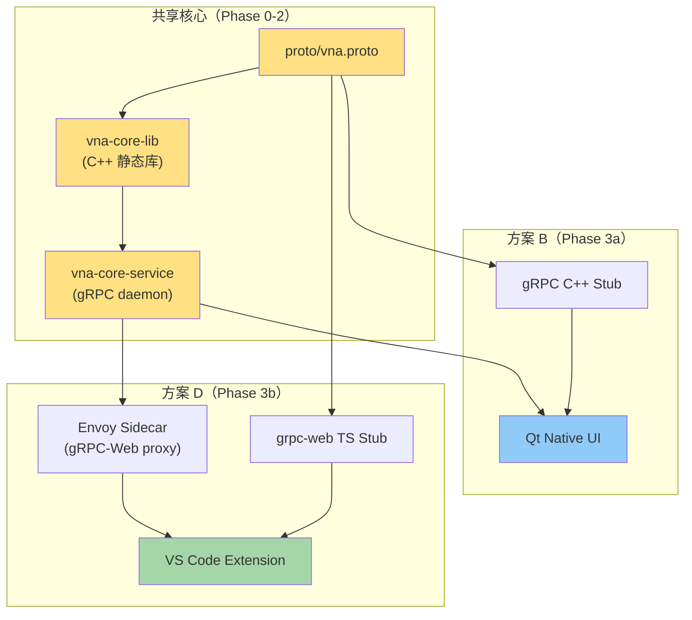
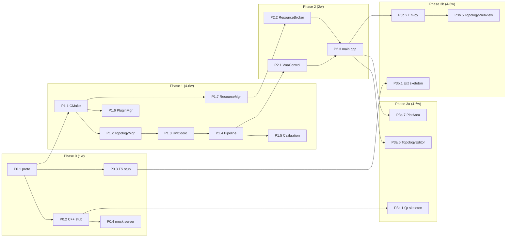
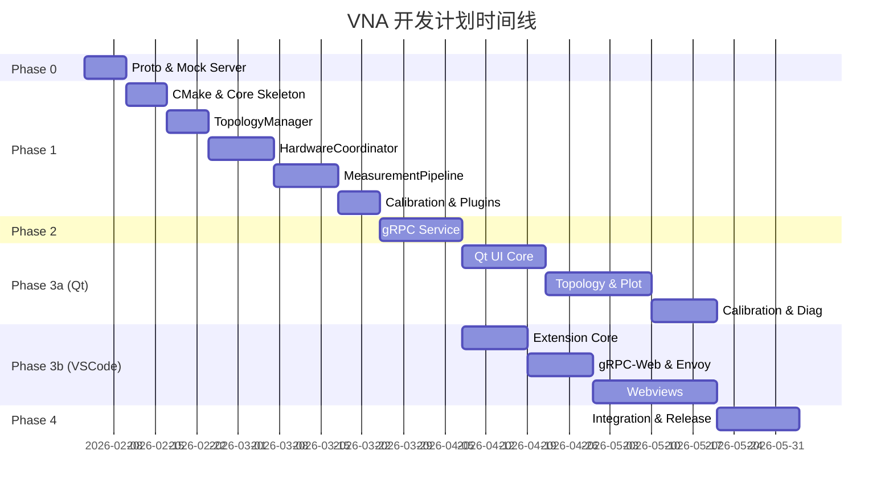

# xswl-zap-vna — 开发计划 (v1.0)

> 目的：定义 VNA 上位机软件的分阶段开发计划，明确任务分解、依赖关系、里程碑与交付物。

---

## 1. 项目概述

### 1.1 目标架构

采用 **方案 B + D 组合**：
- **方案 B**：Qt Native UI + gRPC + vna-core-service（面向传统仪器用户）
- **方案 D**：VS Code Extension + gRPC-Web + vna-core-service（面向开发者/自动化）

两者共享同一后台服务，实现代码复用最大化。

### 1.2 技术栈

| 层级 | 技术选型 |
|------|----------|
| 核心库 | C++11, CMake ≥3.10, MinGW-w64 / GCC |
| 通信协议 | gRPC (proto3), gRPC-Web (via Envoy) |
| 配置格式 | YAML (yaml-cpp), JSON Schema 校验 |
| Qt UI | Qt 5.15 / Qt 6.x, QWidgets, QGraphicsView, QCustomPlot |
| VS Code | TypeScript, Webview API, grpc-web |
| 测试框架 | GoogleTest (C++), Jest (TS), Qt Test |

### 1.3 架构总览



---

## 2. 阶段划分

### Phase 0: 接口契约与 Mock 服务（1 周）

**目标**：定义 gRPC 接口，搭建可运行的 mock 服务，使前端开发可以并行启动。

| 任务 | 描述 | 产出 | 负责 |
|------|------|------|------|
| P0.1 | 编写 proto 文件 | `proto/vna.proto` | 后端 |
| P0.2 | 生成 C++ gRPC stub | `generated/cpp/` | 后端 |
| P0.3 | 生成 TypeScript grpc-web stub | `generated/ts/` | 前端 |
| P0.4 | 实现 mock gRPC server | `src/service/mock_server.cpp` | 后端 |
| P0.5 | 编写 proto 接口文档 | `docs/api-reference.md` | 后端 |

**里程碑 M0**：mock server 可启动，客户端能调用 `ValidateTopology` 并返回假数据。

---

### Phase 1: 核心库开发（4-6 周）

**目标**：实现 vna-core-lib 的核心模块，不依赖 UI。

#### 1.1 模块分解

| 模块 | 功能 | 预估工时 |
|------|------|----------|
| TopologyManager | 拓扑解析、验证、master/slave 角色分配 | 1 周 |
| HardwareCoordinator | 多板卡同步、触发链配置、端口映射 | 1.5 周 |
| MeasurementPipeline | 数据采集、对齐、流式输出 | 1.5 周 |
| CalibrationSession | 校准流程、误差项计算、CalibrationDB | 1 周 |
| PluginManager | C ABI 插件加载、生命周期、License 检查 | 0.5 周 |
| ResourceManager | 租约管理、workspace 隔离、冲突检测 | 0.5 周 |

#### 1.2 任务列表

| 任务 | 描述 | 依赖 | 产出 |
|------|------|------|------|
| P1.1 | CMake 项目骨架 | - | `CMakeLists.txt`, 目录结构 |
| P1.2 | TopologyManager 实现 | P0.1 | `src/core/topology_manager.*` |
| P1.3 | HardwareCoordinator 实现 | P1.2 | `src/core/hardware_coordinator.*` |
| P1.4 | MeasurementPipeline 实现 | P1.3 | `src/core/measurement_pipeline.*` |
| P1.5 | CalibrationSession 实现 | P1.4 | `src/core/calibration_session.*` |
| P1.6 | PluginManager 实现 | P1.1 | `src/core/plugin_manager.*` |
| P1.7 | ResourceManager 实现 | P1.1 | `src/core/resource_manager.*` |
| P1.8 | 单元测试 | P1.2-P1.7 | `tests/core/*_test.cpp` |

**里程碑 M1**：vna-core-lib 编译通过，单元测试覆盖率 ≥80%。

---

### Phase 2: gRPC 服务封装（2 周）

**目标**：将 vna-core-lib 封装为独立 gRPC 服务进程。

| 任务 | 描述 | 依赖 | 产出 |
|------|------|------|------|
| P2.1 | VnaControlService 实现 | P1.4, P0.2 | `src/service/vna_control_service.*` |
| P2.2 | ResourceBrokerService 实现 | P1.7, P0.2 | `src/service/resource_broker_service.*` |
| P2.3 | 服务主入口 | P2.1, P2.2 | `src/service/main.cpp` |
| P2.4 | 进程管理（启动/停止/健康检查） | P2.3 | `src/service/process_manager.*` |
| P2.5 | 配置加载（端口/TLS/日志） | P2.3 | `config/service.yaml` |
| P2.6 | 集成测试 | P2.1-P2.4 | `tests/integration/*_test.cpp` |

**里程碑 M2**：vna-core-service 可独立运行，gRPC 接口可通过 `grpcurl` 调用。

---

### Phase 3a: Qt Native UI（4-6 周）

**目标**：实现完整的 Qt 桌面客户端（方案 B）。

#### 3a.1 模块分解

| 模块 | 功能 | 预估工时 |
|------|------|----------|
| MainWindow | 主窗口框架、Dock 布局、菜单/工具栏 | 0.5 周 |
| WorkspacePanel | 工作区列表、切换、快照管理 | 0.5 周 |
| TopologyEditor | QGraphicsView 拓扑编辑、拖拽、验证 | 1.5 周 |
| MeasurementView | 测量控制、Sweep 配置、触发设置 | 1 周 |
| PlotArea | QCustomPlot 集成、Smith/Polar/Bode 图 | 1 周 |
| CalibrationWizard | 步骤向导、标准连接指示、进度显示 | 1 周 |
| DiagnosticsPanel | 日志、PLL 状态、资源监控 | 0.5 周 |

#### 3a.2 任务列表

| 任务 | 描述 | 依赖 | 产出 |
|------|------|------|------|
| P3a.1 | Qt 项目骨架 | P0.2 | `apps/qt-ui/CMakeLists.txt` |
| P3a.2 | gRPC 客户端封装 | P0.2 | `apps/qt-ui/grpc_client.*` |
| P3a.3 | MainWindow 实现 | P3a.1 | `apps/qt-ui/main_window.*` |
| P3a.4 | WorkspacePanel 实现 | P3a.3 | `apps/qt-ui/workspace_panel.*` |
| P3a.5 | TopologyEditor 实现 | P3a.3 | `apps/qt-ui/topology_editor.*` |
| P3a.6 | MeasurementView 实现 | P3a.3, P3a.2 | `apps/qt-ui/measurement_view.*` |
| P3a.7 | PlotArea 实现 | P3a.6 | `apps/qt-ui/plot_area.*` |
| P3a.8 | CalibrationWizard 实现 | P3a.2 | `apps/qt-ui/calibration_wizard.*` |
| P3a.9 | DiagnosticsPanel 实现 | P3a.3 | `apps/qt-ui/diagnostics_panel.*` |
| P3a.10 | UI 测试 | P3a.3-P3a.9 | `tests/ui/*_test.cpp` |

**里程碑 M3a**：Qt UI 可连接 vna-core-service，完成拓扑配置 → 测量 → 显示全流程。

---

### Phase 3b: VS Code Extension（4-6 周）

**目标**：实现 VS Code 插件（方案 D），与 Qt UI 并行开发。

#### 3b.1 模块分解

| 模块 | 功能 | 预估工时 |
|------|------|----------|
| Extension Core | 激活、命令注册、配置管理 | 0.5 周 |
| gRPC-Web Client | grpc-web stub 封装、连接管理 | 1 周 |
| TopologyWebview | Webview 拓扑编辑器（SVG/Canvas） | 1.5 周 |
| MeasurementPanel | 测量控制 Webview | 1 周 |
| PlotWebview | 图表显示（Chart.js / ECharts） | 1 周 |
| Envoy Config | gRPC-Web 代理配置 | 0.5 周 |

#### 3b.2 任务列表

| 任务 | 描述 | 依赖 | 产出 |
|------|------|------|------|
| P3b.1 | Extension 项目骨架 | P0.3 | `apps/vscode-ext/package.json` |
| P3b.2 | Envoy 配置 | P2.3 | `config/envoy.yaml` |
| P3b.3 | gRPC-Web 客户端封装 | P0.3, P3b.2 | `apps/vscode-ext/src/grpc-client.ts` |
| P3b.4 | Extension Core 实现 | P3b.1 | `apps/vscode-ext/src/extension.ts` |
| P3b.5 | TopologyWebview 实现 | P3b.3 | `apps/vscode-ext/src/topology-webview.ts` |
| P3b.6 | MeasurementPanel 实现 | P3b.3 | `apps/vscode-ext/src/measurement-panel.ts` |
| P3b.7 | PlotWebview 实现 | P3b.6 | `apps/vscode-ext/src/plot-webview.ts` |
| P3b.8 | 端到端测试 | P3b.4-P3b.7 | `apps/vscode-ext/test/*.test.ts` |

**里程碑 M3b**：VS Code Extension 可通过 gRPC-Web 连接 vna-core-service，完成基本测量流程。

---

### Phase 4: 集成与发布（2 周）

**目标**：集成测试、打包、文档完善、首次发布。

| 任务 | 描述 | 依赖 | 产出 |
|------|------|------|------|
| P4.1 | 端到端集成测试 | M2, M3a, M3b | `tests/e2e/` |
| P4.2 | Windows 安装包 | P4.1 | `dist/vna-installer.exe` |
| P4.3 | VS Code Marketplace 发布 | P4.1 | `vna-tools.vsix` |
| P4.4 | 用户文档 | P4.1 | `docs/user-guide.md` |
| P4.5 | API 文档 | P4.1 | `docs/api-reference.md` |
| P4.6 | Release Notes | P4.1 | `CHANGELOG.md` |

**里程碑 M4**：v1.0.0 正式发布。

---

## 3. 依赖关系图



---

## 4. 里程碑时间线



---

## 5. 目录结构规划

```
xswl-zap-vna/
├── proto/
│   └── vna.proto                 # gRPC 接口定义
├── generated/
│   ├── cpp/                      # C++ gRPC stub (自动生成)
│   └── ts/                       # TypeScript grpc-web stub (自动生成)
├── src/
│   ├── core/                     # vna-core-lib
│   │   ├── CMakeLists.txt
│   │   ├── topology_manager.h/cpp
│   │   ├── hardware_coordinator.h/cpp
│   │   ├── measurement_pipeline.h/cpp
│   │   ├── calibration_session.h/cpp
│   │   ├── plugin_manager.h/cpp
│   │   └── resource_manager.h/cpp
│   └── service/                  # vna-core-service
│       ├── CMakeLists.txt
│       ├── main.cpp
│       ├── vna_control_service.h/cpp
│       └── resource_broker_service.h/cpp
├── apps/
│   ├── qt-ui/                    # Qt Native UI
│   │   ├── CMakeLists.txt
│   │   ├── main.cpp
│   │   ├── main_window.h/cpp
│   │   ├── topology_editor.h/cpp
│   │   ├── plot_area.h/cpp
│   │   └── ...
│   └── vscode-ext/               # VS Code Extension
│       ├── package.json
│       ├── src/
│       │   ├── extension.ts
│       │   ├── grpc-client.ts
│       │   ├── topology-webview.ts
│       │   └── ...
│       └── test/
├── config/
│   ├── service.yaml              # 服务配置
│   └── envoy.yaml                # gRPC-Web 代理配置
├── tests/
│   ├── core/                     # 核心库单元测试
│   ├── integration/              # 集成测试
│   └── e2e/                      # 端到端测试
├── docs/
│   ├── framework.md              # 架构设计文档
│   ├── framework-ui.md           # UI 设计文档
│   ├── development-plan.md       # 本文档
│   ├── api-reference.md          # API 参考
│   └── user-guide.md             # 用户指南
├── CMakeLists.txt                # 顶层 CMake
└── README.md
```

---

## 6. 风险与缓解

| 风险 | 影响 | 概率 | 缓解措施 |
|------|------|------|----------|
| gRPC-Web 延迟过高 | VS Code 体验差 | 中 | 使用 WebSocket 双向流；关键操作走本地 IPC |
| Qt 6 兼容性问题 | 编译/运行失败 | 低 | 保持 Qt 5.15 兼容；CI 双版本测试 |
| 多板卡同步不稳定 | 数据错位 | 中 | 增加同步健康检查；提供诊断工具 |
| 插件 ABI 不兼容 | 插件加载失败 | 中 | 严格版本检查；提供 ABI 检测工具 |
| 开发资源不足 | 进度延期 | 中 | 优先 MVP 功能；Phase 3a/3b 按需裁剪 |

---

## 7. 资源需求

| 角色 | 人数 | 职责 |
|------|------|------|
| C++ 后端 | 1-2 | vna-core-lib, vna-core-service |
| Qt 前端 | 1 | Qt UI 开发 |
| TS 前端 | 1 | VS Code Extension 开发 |
| 测试 | 0.5 | 自动化测试、CI 维护 |
| 文档 | 0.5 | 用户文档、API 文档 |

最小团队：2 人（1 全栈 C++/Qt + 1 TS 前端）

---

## 8. 下一步行动

1. [ ] **Phase 0 启动**：创建 `proto/vna.proto` 文件
2. [ ] **项目骨架**：创建顶层 `CMakeLists.txt` 和目录结构
3. [ ] **Mock Server**：实现最小可运行的 mock gRPC 服务
4. [ ] **CI 配置**：GitHub Actions 自动构建与测试

---

*文档版本：v1.0 | 创建日期：2026-02-03 | 最后更新：2026-02-03*
