# Modern Instrument Workbench Layout (v2.0 Redesign)

> **设计理念**：融合专业测试仪器的严谨性与现代 Web 应用的灵活性。采用 "沉浸式工作台" + "多维视图" 架构。

## 1. 核心理念

- **沉浸式工作台 (Immersive Workbench)**: 最大化内容区域（波形/拓扑），工具栏按需浮动或折叠。
- **多维视图 (Multi-View)**: 利用 VS Code 分发能力，将“波形监视”、“拓扑配置”视为独立可拆分视图。
- **即时反馈 (Reactive Status)**: 状态栏不仅仅是静态文本，而是可交互的系统健康心跳。

## 2. 布局架构图

采用 CSS Grid 定义的 "Holy Grail Layout" 变体，引入 Docking/Split 概念：

```mermaid
graph TD
    subgraph "VS Code Window"
        direction TB
        Header["🔴 顶部命令栏 (Global Command Bar)"]

        subgraph "Main Workspace (Flex/Grid)"
            direction LR
            Sidebar["🗂️ 侧边资源栏 (Resource Navigator)"]

            subgraph "Central Stage (Center)"
                Tabs["📑 视图选项卡 (Topo / Waveform / Table)"]
                Canvas["📈 动态主画布 (Canvas/WebGL)"]
                FloatPanel["🛠️ 浮动参数面板 (Contextual Toolbox)"]
            end

            RightPanel["⚙️ 属性/检查器 (Inspector) - 可折叠"]
        end

        Footer["🟢 底部状态流 (Status Stream)"]
    end

    Header --> Sidebar
    Sidebar --> CentralStage
    CentralStage --> RightPanel
    RightPanel --> Footer

    style Header fill:#2d2d2d,stroke:#555,color:#fff
    style Sidebar fill:#1e1e1e,stroke:#333
    style Canvas fill:#000,stroke:#666
    style Footer fill:#007acc,stroke:#007acc,color:#fff
```



```
+---------------------------------------------------------------+
|  [ws-main]  |  ▶ RUN  ⏸ HOLD  ■ STOP  |  ⚠️ 2 Errors  ⚙️   |  <-- Header
+-------------------+-------------------------------------------+
| 📂 Resources      |  [ Tab: Topology ] [ Tab: Waveform x ]    |
|                   | +-------------------+-------------------+ |
| > Channels        | |                   |                   | |
|   :: S11 (Active) | |   Waveform A      |    Smith Chart    | |
|   :: S21          | |  (WebGL/Canvas)   |                   | |
|                   | |                   |                   | |
| > Boards          | +-------------------+-------------------+ |
|   :: PXI-Card1    | |                   |                   | |
|   :: USB-VNA      | |   Log Heatmap     |    Data Table     | |
|                   | |                   |                   | |
| > Calibrations    | +-------------------+-------------------+ |  <-- Main Stage
|                   |                                           |
+-------------------+-------------------------------------------+
| Ready. |  Scan: 100ms |  Temp: 45°C |  Log: Connection lost   |  <-- Footer
+---------------------------------------------------------------+
```

## 3. 各区域详细设计

### A. 顶部区域：菜单栏 + 状态栏 + 工具栏 (Header Complex)

- **菜单栏 (Menu Bar)**: 遵循桌面应用惯例，提供 `File`, `Edit`, `View`, `Setup`, `Calibration`, `Analysis`, `Help` 等顶级菜单，作为各种低频功能的可靠入口。
- **全局状态栏 (Header Status)**: 位于右上角，显示工作区名称（如 "Workspace: Main Lab"）。
    - **点击交互**: 直接点击工作区名称即可打开 **拓扑/工作区配置模态窗**，进行硬件重组或环境切换（此类低频重操作不应占用侧边栏宝贵空间）。
- **工具栏 (Toolbar)**: 一排可独立配置、吸附的快捷按钮组：
    - **Control**: Play/Pause/Stop/Trigger。
    - **History**: Undo / Redo。
    - **Marker**: Add/Delete Marker, Peak Search, Min Search。
    - **Scale**: Autoscale All, Reference Level Up/Down。
    - **Layout**: 1x1, 2x1, 2x2, 4x4 网格切换。
- **布局建议**: 菜单栏置顶（紧凑），状态栏与工具栏可同处一行或分两行，支持 **吸附 / 悬浮**，方便最大化工作区。

### B. 侧边功能导航栏 (Measurements & Analysis Sidebar) - 宽度: 260px

- **双层架构**：
    - **通道列表 (Channels)**: 仅显示当前测量任务（Channel/Trace），移除底层硬件资源展示。
    - **设置 (Setup)**: 替代原 "Analysis" 名称，采用标准仪器分类组织各项参数：
        - **Stimulus**: Center/Span, Start/Stop, Power, IFBW, Sweep Type.
        - **Response**: Measure (S-Param), Format, Scale, Averaging.
        - **Calibration**: Cal Wizard, Correction Toggle, ECal.
        - **Marker / Analysis**: Markers, Search, Limits, Time Domain.
- **职责分离**：
    - 此区域仅关注 **测量维度**。
    - 硬件设备资源（拓扑、物理连接）移至顶部状态栏的 **工作区配置模态窗** 中统一管理。
- **菜单层级规划**：
    1.  **Stimulus (激励配置)**: 频率范围、点数、中频带宽 (IFBW)、功率 (Power)、扫描类型 (Linear/Log/Segment)。
    2.  **Response (响应配置)**: 测量参数 (S-Param/Receiver)、格式 (LogMag/Phase/Smith)、平均 (Averaging)、平滑 (Smoothing)。
    3.  **Calibration (校准)**: 校准向导入口、校准件管理、误差项应用开关、置信度检查。
    4.  **Trigger (触发)**: 触发源选择 (Internal/External/Bus)、触发延迟、握手时序。
    5.  **Analysis (分析)**: 时域变换 (Time Domain)、门控 (Gating)、夹具去嵌入 (Fixturing)、光标 (Markers)、极限测试 (Limit Test)。
- **交互优化**：
    - 顶部提供 **快速搜索框 (Quick Find)**，输入关键词直接定位配置项。
    - 支持 **拖拽 (Drag & Drop)**：将 Channel 拖入主舞台创建窗口，将 Trace 拖入窗口叠加显示。
    - 常用配置（如 Start/Stop Freq）支持在侧边栏直接输入，无需弹窗。

### C. 中央主舞台 (Central Stage)

- **纯净波形区**: 移除 "Topology Editor" 等配置类 Tabs，主舞台专注于测量数据的可视化（Waveform / Chart / Table）。
- **模态交互 (Modal Interactions)**:
    - **拓扑编辑 (Topology Editor)**: 由于硬件拓扑变更会重置测量状态，该操作放入 **模态对话框 (Modal)**，明确提示用户测量将被中断。
    - **工作区管理 (Workspace)**: 切换或重置工作区同样通过模态窗进行，确保原子性操作。
- Waveform Mode 提供 Grid 布局、独立渲染上下文、Pop-out（波形拖出为独立 Tab / Panel）与 PiP 等能力。

### D. 底部状态流 (Status Stream) - 高度: 28px

- **消息显示区 (Message Area)**: 位于中间或扫描控制右侧，循环显示系统状态、警告或 SCPI 交互日志。
- **扫描指标 (Metrics)**: 显示扫描时间、点数等实时参数。
- **扫描控制 (Sweep Control)**: 左侧集成 `CONTINUE` / `SINGLE` / `HOLD` 切换按钮。
    - *响应式设计*: 当底部水平空间不足时，这组按钮可自动收缩为 **ComboBox (下拉组合框)** 以节省空间。

### E. 告警与通知

- 非阻塞 Toasts；优先使用 Inline Dialog / Drawer 替代全屏 Modal，降低打断成本。

## 4. VS Code 原生扩展点

- 支持 `vscode.window.createWebviewPanel` 实现波形 Pop-out（跨标签页/副屏展示）。
- 将部分长期常驻导航迁移到 VS Code TreeView，状态指示可映射到 VS Code StatusBar。

## 5. 实施路线（Control Center v2）

1. CSS Grid 重构：主布局切换到 Grid（Header / Sidebar / Main / Footer）。
2. 组件化渲染：拆分 `renderHeader`、`renderSidebar`、`renderMain` 等。
3. 引入轻量 Store：实现局部刷新、避免整页重绘。
4. 波形独立化：实现 `vna.openWaveformWindow` 命令，支持多 Webview 通信与数据订阅。

---

## 附注

- 来源：`vna/framework-ui.md`（已将第 13、14 节迁移至此文件）。
- 建议下一步：从 `unifiedControlCenter.ts` 开始实现 Grid 骨架，将现有拓扑/波形内容逐步迁移进新布局。

## 6. 最终界面布局 (交互式预览)

下面的组件已提取为独立的交互式原型文件，便于进行更丰富的脚本与响应式验证：

- 文件：`vna/docs/ui-workbench-redesign.preview.html`
- 在 VS Code 中打开该文件或使用下面的内嵌预览（若 Markdown 预览器支持 iframe）：

<iframe src="./ui-workbench-redesign.preview.html" style="width:100%; height:600px; border:1px solid #444; display:block;"></iframe>

> 提示：若你的 Markdown 预览器不允许内嵌 HTML，请直接打开上面的文件链接以查看完整原型。
