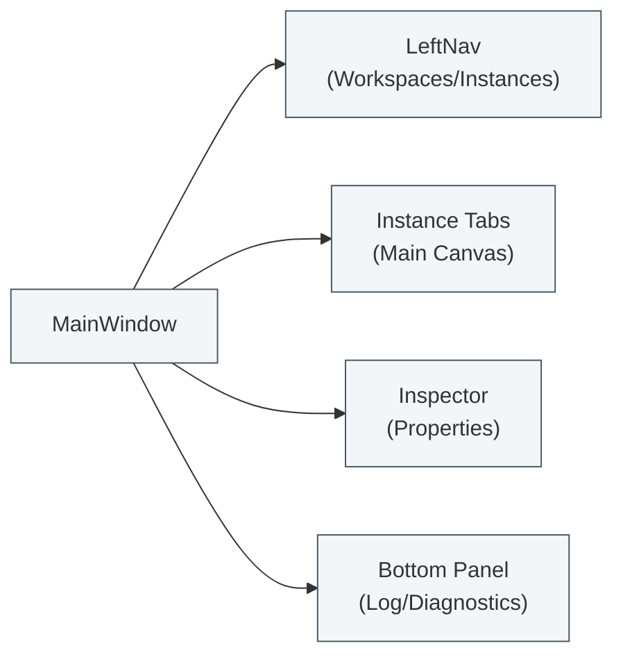
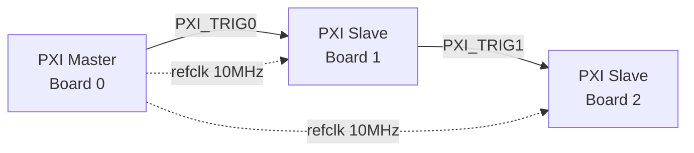
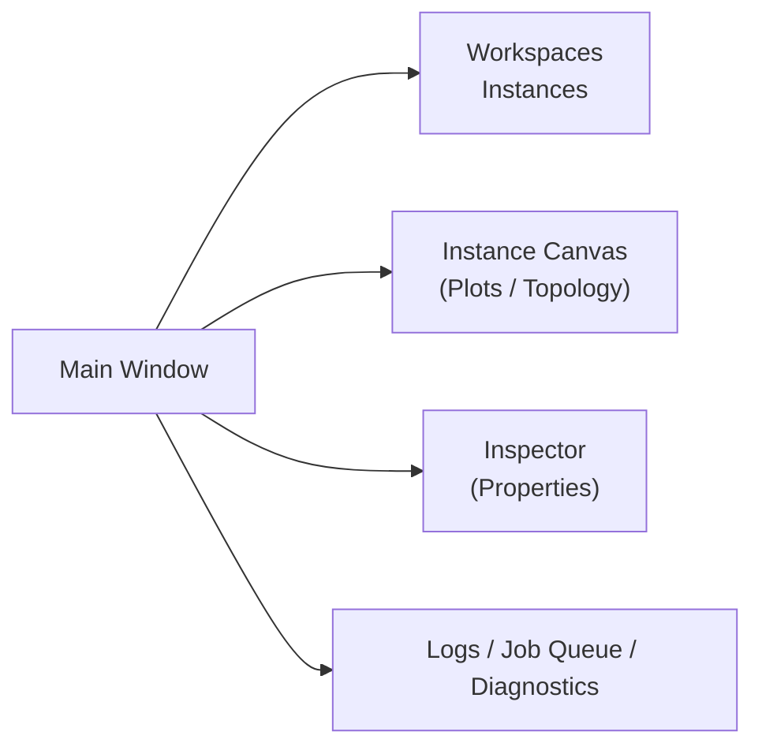
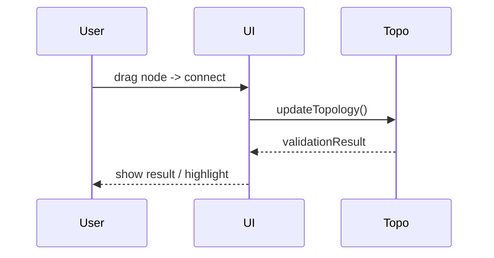
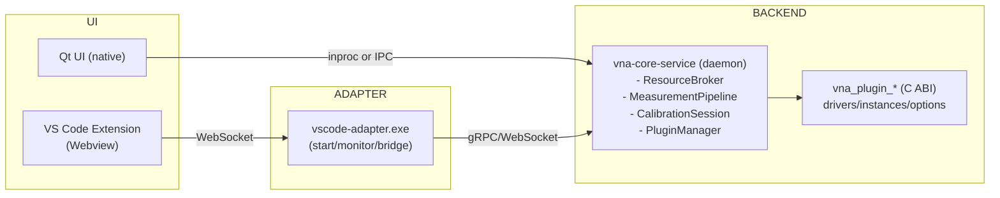
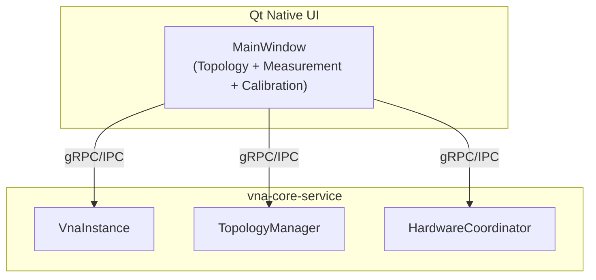
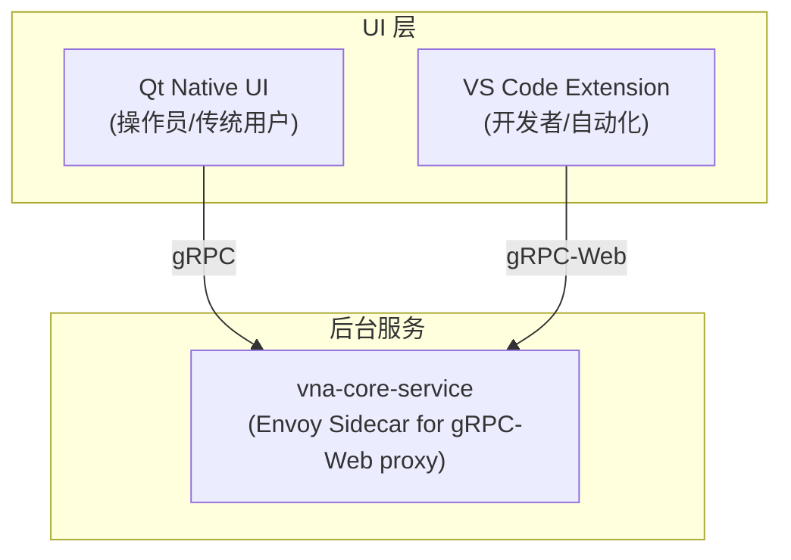
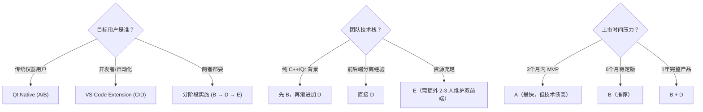

# xswl-zap-vna — UI 设计文档 (v1.0)

> 目的：定义应用主界面与关键子界面的 UX / UI 设计、交互流程与实现建议，便于快速实现 Qt 原型与前端-后端契约。

---

## 1. 设计目标与原则 ✅
- **清晰可见性**：实时显示实例状态、资源占用、同步健康（sync_quality）。
- **实例与工作区优先**：以 Workspace 和 VnaInstance 为一等实体，支持多开隔离与切换。
- **可操作性**：一键创建/启动/停止实例、可视化拓扑编辑与配置校验。
- **可追溯性**：日志、审计、诊断指标与测量 trace 易访问。
- **响应性**：常规 UI 交互 <200ms；测量数据流以可视化节流显示。

---

## 2. 总体布局（主窗口）
- 左侧导航（Dock）: Workspaces / Instances / Plugins / Tests
- 主区域（Tab）: Instance Tabs（每个 tab 对应一个 VnaInstance）
- 顶部工具栏: 全局操作（新建 workspace/实例、加载拓扑、校准向导、开始/停止）
- 右侧 Inspector: 选中对象属性（Port/Node/Instance/Plugin）
- 底部面板: Log / Diagnostics / Job Queue / Measurement History



---

## 3. 关键视图与交互

### 3.1 Dashboard / Workspace 列表
- 展示所有 Workspace 的名称、owner、policy（strict/shared）、资源占用状态和 sync_health 汇总。
- 支持快速切换、快照/恢复、克隆与删除。
- 点击 Workspace 打开该工作区下的实例列表。

### 3.2 Instance View（主测量画布）
- **Header**: Instance name, status badge (Idle/Measuring/Calibrating/Error), start/stop, enable option(s).
- **Left Pane**: Topology (graph) + Port list (映射/占用/lock)
- **Center**: Plot area（多个可停靠视图：Smith、Linear、Polar、Bode），Trace 列表（可隐藏/显示、数学运算）
- **Right Pane**: Measurement controls / Sweep config / Trigger settings / Option activation
- **Bottom**: Acquisition timeline + live log + progress bar

交互示例：
- 在 Topology 面板拖动端口到节点 -> 自动映射 -> TopologyManager.validateTopology() 校验 -> Highlight conflict
- 点击 "Calibrate" -> 弹出 Calibration Wizard（step-by-step）

### 3.3 Topology Editor（图形化）
- 基于 QGraphicsView（Qt）或同等控件实现节点/链接拖拽、选择、右键菜单（set master/role、set trigger lines）
- 支持 validation 导出与模拟（模拟 trigger propagation、PLL lock）



### 3.4 Calibration Wizard
- 步骤化向导：选择校准类型（SOLT/TRL/ECal）→ 指示连接哪种标准 → 自动测量并计算误差项 → 保存到 CalibrationDB（Workspace-scoped）
- 支持“半自动/全自动”两种模式（半自动：用户手动更换标准并点击确认；全自动：与 ECal 硬件交互）

### 3.5 Measurement Session Manager
- 支持单次测量、批次（scripted runs）、定时/调度
- Job Queue 面板显示进度、历史与重跑选项
- 支持 Scripted API（Python/CLI）触发并显示返回状态

### 3.6 Plugin/Options 管理
- Plugin Browser：显示插件类型、状态、版本、License 信息
- Per-instance options 列表（enable/disable），带 license 状态与到期提醒

### 3.7 Diagnostics & Logs
- 实时日志（支持 filter by instance_id/board_id/level）
- Diagnostics 面板：PLL lock status, trigger delay measurements, CPU/Memory usage, Broker state
- 支持导出诊断包（zip）用于问题回溯

---

## 4. UX Patterns / Notifications
- 非阻塞通知（toast）显示短时反馈；关键错误或严格模式冲突以 modal 显示并要求确认
- 长运行任务（采集、校准）在后台运行并在 Job Queue 中显示进度
- 所有可能导致资源冲突的操作都提示并列出占用者与等待队列

---

## 5. Accessibility & Shortcuts
- 支持键盘导航、全局快捷键（Start/Stop, Snapshot, Toggle Logs）
- 高对比度模式、放大可用字体、可配置缩放

---

## 6. Backend API / Event Map (建议)
- UI -> Backend (synchronous or async via IPC/HTTP/DBus):
  - create_instance(workspace_id, topology_config)
  - validate_topology(workspace_id, topology)
  - acquire_resource(lease_request)
  - start_acquisition(instance_id, params)
  - wait_for_aligned_samples(instance_id)
  - calibrate(instance_id, cal_type)
  - plugin_enable(instance_id, plugin_id)

- Backend -> UI: events and WebSocket/Signal updates
  - instance_status_changed
  - acquisition_progress
  - diagnostics_update
  - plugin_loaded/failed

示例 Qt mapping:
- QMainWindow -> MainWindow
- QDockWidget -> LeftNav / Inspector / BottomPanel
- QTabWidget -> Instance Tabs
- QGraphicsView -> Topology Editor
- QCustomPlot / QChart -> Plot area

---

## 7. Wireframes & Mermaid UI snippets

**主界面高层示意**


**Topology 编辑器操作序列**


---

## 8. Acceptance Criteria & UX Tests ✅
- 创建/切换 workspace/instance 无死锁、UI 响应 <200ms
- Topology validation 能发现端口/trigger/PLL/role 不一致并显示原因
- 校准向导在 95% 情况下自动完成（若 ECal 可用）
- 严格模式下不能在被占用资源上启动测量
- 自动化 UI tests 覆盖 80% 核心工作流（创建实例/测量/校准/快照）

---

## 9. Implementation Roadmap (UI)
1. 快速原型：实现 MainWindow、LeftNav、Instance Tabs、Bottom Logs（2 weeks）
2. Topology Editor 原型（拖拽 + validation）（3 weeks）
3. Plot area 与 Measurement Pipeline 连接（3 weeks）
4. Calibration Wizard 与 Job Queue（2 weeks）
5. Workspace + Broker 可视化与抢占交互（2 weeks）

---

## 10. Next steps
- 生成 Qt 原型（QWidgets 或 QML）并与 backend stub 集成做 end-to-end demo
- 写 UI 测试脚本（QtTest / Squish）并在 CI 中运行

---

*若你想，我可以把关键 UI 视图做成最小 Qt 样机：生成 `apps/ui/` 下的 Qt 项目骨架和几个窗口实现。是否需要我继续生成这些文件？*

---

## 11. VS Code 插件集成架构（Adapter + Backend + gRPC）

### 11.1 概要
- 目标：同时支持 **原生 Qt UI**（低延迟、原生控件）和 **VS Code 插件 UI**（Webview 快速分发、开发者友好），并复用相同的后端业务逻辑。  
- 核心思想：把测量、硬件控制、插件加载与高吞吐数据处理放到一个可复用的本地后端（daemon / service），UI 与 VS Code 插件通过轻量 adapter/IPC 与之交互。



### 11.2 gRPC / 协议草案（示例）
- 推荐使用 **gRPC（proto3）** 做控制与流式数据传输（强类型、stream 支持）。下面给出一个最小 proto 草案用于控制、流式帧和租约管理。

```proto
syntax = "proto3";
package vna;

message Topology {
  string id = 1;
  string yaml = 2; // 原始拓扑 YAML 文本（或更结构化字段）
}

message ValidationResult {
  bool ok = 1;
  repeated string errors = 2;
}

message AcqConfig {
  string instance_id = 1;
  uint32 sample_count = 2;
  uint32 timeout_ms = 3;
}

message LeaseInfo {
  string lease_id = 1;
  string resource_id = 2;
  uint32 ttl_seconds = 3;
}

message AlignedFrame {
  string instance_id = 1;
  uint64 timestamp = 2;
  bytes payload = 3; // 二进制帧（IQ/packed）
}

service VnaControl {
  rpc ValidateTopology(Topology) returns (ValidationResult);
  rpc StartAcquisition(AcqConfig) returns (LeaseInfo);
  rpc StopAcquisition(AcqConfig) returns (ValidationResult);
  rpc StreamAlignedFrames(AcqConfig) returns (stream AlignedFrame);
}

service ResourceBroker {
  rpc Acquire(ResourceRequest) returns (LeaseInfo);
  rpc Renew(LeaseInfo) returns (ValidationResult);
  rpc Release(LeaseInfo) returns (ValidationResult);
}

message ResourceRequest {
  string resource_id = 1;
  string workspace_id = 2;
  bool exclusive = 3;
  uint32 timeout_ms = 4;
}
```

### 11.3 实现要点与注意
- 实时数据流使用 gRPC server-stream（binary frames），或在极端场景下使用共享内存 / mmap 以避免拷贝。  
- Adapter 负责启动/监控 Backend（若 Backend 作为独立进程），并为 VS Code 插件桥接 WebSocket ↔ gRPC。  
- 在本机部署时，优先限制接口为 loopback/UDS 并使用本地 token 授权；若支持远程则启用 TLS。  
- 在 UI 端对数据做下采样/可视化友好化（Smith Chart 绘图可在 Webview/Qt 层实现，后端返回 S-params 或聚合帧）。

### 11.4 最小接口验收测试
- ValidateTopology: 返回错误列表并在 UI 中高亮错误节点。  
- StartAcquisition/StreamAlignedFrames: 启动后能在 VS Code Webview 或 Qt Plot 区看到对齐帧（mock 后端实现）。  
- ResourceBroker: 在多进程模拟中验证租约/抢占/回收策略。

---

## 12. 实现方式分析与技术选型

### 12.1 方案矩阵

| 方案 | 前端 | 通信 | 后台 | 复杂度 |
|------|------|------|------|--------|
| **A** | Qt Native | 进程内调用 | vna_core_lib (嵌入) | ★☆☆ |
| **B** | Qt Native | gRPC/IPC | vna-core-service (独立) | ★★☆ |
| **C** | VS Code Extension | WebSocket → Adapter → gRPC | vna-core-service | ★★★ |
| **D** | VS Code Extension | gRPC-Web 直连 | vna-core-service | ★★☆ |
| **E** | 双 UI 共存 | 各自最优路径 | 共享 vna-core-service | ★★★ |

### 12.2 多维度对比

#### 12.2.1 开发效率

| 方案 | 前端开发 | 后台开发 | 联调成本 | 总评 |
|------|----------|----------|----------|------|
| A | Qt/C++ 同栈，IDE 支持好 | 无额外接口层 | 断点直接跟 | ⭐⭐⭐⭐⭐ |
| B | Qt/C++ | 需维护 proto/stub | 跨进程调试 | ⭐⭐⭐☆☆ |
| C | TypeScript 生态丰富 | 多一层 Adapter | 三层联调 | ⭐⭐☆☆☆ |
| D | TypeScript | proto + gRPC-Web 学习曲线 | 两层联调 | ⭐⭐⭐☆☆ |
| E | 两套前端 | 统一后台 | 双线维护 | ⭐⭐☆☆☆ |

#### 12.2.2 运行性能

| 方案 | 延迟 | 吞吐 | 内存开销 | 总评 |
|------|------|------|----------|------|
| A | <1μs 函数调用 | 无瓶颈 | 单进程 ~50MB | ⭐⭐⭐⭐⭐ |
| B | ~100μs IPC | gRPC 流式优化 | 双进程 ~80MB | ⭐⭐⭐⭐☆ |
| C | ~1ms WebSocket + gRPC | 中等 | 三进程 ~150MB | ⭐⭐⭐☆☆ |
| D | ~500μs gRPC-Web | 较好 | 双进程 ~100MB | ⭐⭐⭐⭐☆ |
| E | 取决于使用的 UI | - | ~150MB+ | ⭐⭐⭐☆☆ |

#### 12.2.3 稳定性与隔离

| 方案 | 崩溃隔离 | 资源泄漏隔离 | 热重载 | 总评 |
|------|----------|--------------|--------|------|
| A | ❌ 同归于尽 | ❌ 共享堆 | ❌ 需重启 | ⭐⭐☆☆☆ |
| B | ✅ 服务独立 | ✅ 进程边界 | ✅ UI 可重启 | ⭐⭐⭐⭐⭐ |
| C | ✅ 三层隔离 | ✅ 完全隔离 | ✅ Extension 热重载 | ⭐⭐⭐⭐⭐ |
| D | ✅ 两层隔离 | ✅ 进程边界 | ✅ Extension 热重载 | ⭐⭐⭐⭐⭐ |
| E | ✅ 服务独立 | ✅ 进程边界 | ✅ 各自可重载 | ⭐⭐⭐⭐⭐ |

#### 12.2.4 部署与分发

| 方案 | 打包复杂度 | 依赖管理 | 跨平台 | 用户安装体验 | 总评 |
|------|------------|----------|--------|--------------|------|
| A | 单 exe + DLL | Qt 运行时 | Win/Linux/macOS | 简单 | ⭐⭐⭐⭐☆ |
| B | exe + service + proto | gRPC 运行时 | 全平台 | 中等 | ⭐⭐⭐☆☆ |
| C | vsix + adapter + service | Node + gRPC | 全平台 | 复杂 | ⭐⭐☆☆☆ |
| D | vsix + service | gRPC-Web | 全平台 | 中等 | ⭐⭐⭐☆☆ |
| E | Qt包 + vsix + service | 全部 | 全平台 | 最复杂 | ⭐☆☆☆☆ |

#### 12.2.5 扩展性与生态

| 方案 | 第三方集成 | 脚本化 | 插件生态 | 自动化测试 | 总评 |
|------|------------|--------|----------|------------|------|
| A | ❌ 需 SDK | ❌ 嵌入脚本引擎 | Qt 插件 | ❌ UI 自动化难 | ⭐⭐☆☆☆ |
| B | ✅ gRPC 客户端 | ✅ Python/JS 调用 | Qt 插件 | ✅ 服务可 mock | ⭐⭐⭐⭐☆ |
| C | ✅ gRPC + REST | ✅ VS Code 任务 | VS Code 扩展 | ✅ 全链路 mock | ⭐⭐⭐⭐⭐ |
| D | ✅ gRPC | ✅ VS Code 任务 | VS Code 扩展 | ✅ 服务可 mock | ⭐⭐⭐⭐⭐ |
| E | ✅ 最灵活 | ✅ 多种方式 | 双生态 | ✅ 但成本高 | ⭐⭐⭐⭐☆ |

### 12.3 用户画像匹配

| 用户类型 | 需求特点 | 推荐方案 |
|----------|----------|----------|
| **仪器操作员** | 开箱即用、稳定、界面直观 | A 或 B |
| **测试工程师** | 脚本自动化、批量测试、集成 CI | B 或 D |
| **RF 研发** | 快速迭代、数据分析、Jupyter 联动 | D 或 C |
| **系统集成商** | API 调用、多语言客户端、嵌入 | B |
| **开源社区** | 低门槛、现代工具链、可扩展 | D |

### 12.4 推荐方案

#### 12.4.1 短期目标（MVP 阶段）

**推荐方案：B - Qt Native + gRPC + vna-core-service**

理由：
1. **开发效率最优** - C++/Qt 同栈，团队学习曲线低
2. **架构已解耦** - 服务化设计为未来扩展铺路
3. **稳定性有保障** - 进程隔离，崩溃不影响硬件
4. **部署可接受** - 两个二进制，用户可理解
5. **测试友好** - 服务可独立 mock，支持自动化



#### 12.4.2 中期目标（生态扩展）

**推荐方案：D - 追加 VS Code Extension (gRPC-Web 直连)**

理由：
1. **复用 vna-core-service** - 零后台改动
2. **gRPC-Web 直连** - 比 Adapter 简单，延迟更低
3. **覆盖开发者用户** - 脚本、Notebook、自动化
4. **渐进式投入** - 不影响 Qt UI 用户



#### 12.4.3 长期目标（完整产品）

**推荐方案：E 变体 - 双 UI 共存，但共享测量逻辑**

架构演进：
- Qt UI → 渐进简化为「仪器控制台」（轻量、专业）
- VS Code → 成为「开发者工作台」（脚本、分析、自动化）
- 共享 vna-core-service → 状态同步、资源仲裁

### 12.5 决策树



### 12.6 最终结论

**如果只能选一个，推荐 B（Qt + gRPC + Service）**

| 维度 | 评价 |
|------|------|
| 风险 | 低 - 技术栈成熟，团队可控 |
| 收益 | 中高 - 稳定隔离 + 未来可扩展 |
| 成本 | 中 - 比 A 多 20% 开发量 |
| 扩展 | 高 - 服务化后可接任意前端 |

**下一步行动建议：**
1. 确定 vna-core-service 的 gRPC proto 接口（已有草稿，见 11.2）
2. 搭建 Qt + gRPC 客户端脚手架
3. 实现最小可用的 Topology + Measurement 界面
4. 验证 IPC 延迟是否满足实时显示需求（目标 <1ms）

---

*如需，我可以把上面的 proto 存入 `proto/vna.proto` 并生成 C++/TS 的 stub（gRPC），或直接生成 VS Code adapter + minimal backend stub。你想先把 proto 文件加入到 repo 吗？*
