# xswl-zap-vna 架构设计文档

> **版本**: v3.0（优化版）  
> **日期**: 2026-01-31  
> **目标**: 提供专业、可实现的 VNA 上位机架构设计

---

## 1. 设计目标与原则

### 1.1 设计目标
- 实现完整的矢量网络分析仪上位机功能
- 支持控制真实 VNA 仪器与 PXI 板卡构建的虚拟 VNA 实例
- 提供可扩展的插件化架构，支持选件与第三方扩展
- 确保架构可实现、可维护、可测试

### 1.2 设计原则
1. **模块化** — 功能按职责拆分为独立动态库
2. **插件化** — 驱动、选件、硬件实现均可热插拔
3. **实例隔离** — 多 VNA 实例独立运行、互不干扰
4. **接口稳定** — 使用 C ABI 保证跨编译器兼容
5. **可测试性** — 虚拟仪器支持 CI 自动化测试

### 1.3 技术选型

| 类别 | 选型 | 说明 |
|-----|------|-----|
| 开发语言 | C++11 | 兼容性好，性能高 |
| 构建系统 | CMake ≥3.10 | 跨平台，支持多生成器 |
| 工具链 | MinGW-w64 (Windows) | 兼容 GCC/Clang (Linux/macOS) |
| UI 框架 | Qt 5/6 | 跨平台，成熟稳定 |
| 插件接口 | C ABI | 避免 C++ ABI 兼容问题 |

---

## 2. 系统架构总览

### 2.1 架构图

```mermaid
flowchart TB
  %% ===== 可执行文件层 =====
  subgraph EXECUTABLES["可执行文件 (.exe)"]
    direction LR
    UI["vna_ui<br>(Qt GUI 主程序)"]
    CLI["vna_cli<br>(命令行工具)"]
    SIMAPP["vna_sim_app<br>(独立仿真器)"]
    TESTS["vna_tests<br>(GoogleTest)"]
  end

  %% ===== 核心动态库层 =====
  subgraph CORE_LIBS["核心动态库 (.dll)"]
    subgraph CORE_BASE["vna_core_base (稳定层)"]
      direction TB
      CFG["ConfigManager<br>- JSON/INI 解析<br>- 默认值管理<br>- 热重载"]
      LOG["LogManager<br>- 多级别日志<br>- 文件/控制台输出<br>- 结构化格式"]
      ERR["ErrorHandler<br>- 错误码定义<br>- 状态机<br>- 恢复策略"]
    end
    
    subgraph CORE_RUNTIME["vna_core_runtime (运行时层)"]
      direction TB
      PLUGIN_MGR["PluginManager<br>- 插件发现/加载<br>- C ABI 版本握手<br>- 生命周期管理"]
      INST_MGR["InstanceManager<br>- 实例工厂<br>- 实例注册表<br>- 并发控制"]
      RES_MGR["ResourceManager<br>- 资源池<br>- 租约机制<br>- 超时释放"]
      OPT_MGR["OptionManager<br>- License 验证<br>- 选件注册<br>- 实例级分发"]
    end
  end

  %% ===== 接口定义 =====
  subgraph API_HEADERS["接口定义 (headers)"]
    API["vna_plugin_api<br>(C ABI 头文件)<br>- VnaPlugin 结构体<br>- 导出函数规范<br>- 版本常量"]
  end

  %% ===== VNA 实例层 =====
  subgraph INSTANCE_LAYER["VNA 实例层 (.dll)"]
    INST["VnaInstance (Facade)<br>- instance_id<br>- state machine<br>- unified API"]
    
    subgraph INST_INTERNAL["实例内部组件"]
      direction TB
      PIPELINE["MeasurementPipeline<br>- 采集调度<br>- 流程编排<br>- 结果聚合"]
      CAL_SESSION["CalibrationSession<br>- 校准向导<br>- 标准件测量<br>- 误差项计算"]
      INST_OPT["InstanceOptionContext<br>- 选件激活状态<br>- 实例级配置<br>- 扩展测量注册"]
    end
  end

  %% ===== 测量引擎 =====
  subgraph MEAS_LIB["vna_meas (测量引擎 .dll)"]
    direction TB
    MEAS_CORE["MeasurementCore<br>- S参数计算<br>- 格式转换 (dB/Phase/RI)<br>- 平均/平滑"]
    
    subgraph TRACE_MARKER["轨迹与游标"]
      direction LR
      TRACE_MGR["TraceManager<br>- 多Trace管理<br>- 数据格式<br>- Trace Math"]
      MARKER_MGR["MarkerManager<br>- M1-M10 游标<br>- Delta Marker<br>- Peak/BW Search"]
    end
    
    subgraph SWEEP_TRIG["扫描与触发"]
      direction LR
      SWEEP_CTRL["SweepController<br>- Linear/Log/Segment<br>- Power Sweep<br>- CW Time"]
      TRIG_MGR["TriggerManager<br>- Int/Ext/Manual<br>- Point/Sweep<br>- 多仪器同步"]
    end
    
    DOMAIN_CVT["DomainConverter<br>- FFT/IFFT<br>- 频域↔时域<br>- TDR/TDT<br>- Impulse/Step"]
  end

  %% ===== 校准模块 =====
  subgraph CAL_LIB["vna_calib (校准模块 .dll)"]
    direction TB
    CAL_ENGINE["CalibrationEngine<br>- SOLT/TRL/QSOLT<br>- ECal (插件)<br>- Unknown Thru<br>- 误差模型"]
    
    subgraph FIXTURE["夹具与门控"]
      direction LR
      FIXTURE_SIM["FixtureSimulator<br>- De-embedding<br>- Embedding<br>- Port Extension<br>- Adapter Removal"]
      GATING["TimeGating<br>- BP/BS/LP/HP<br>- 门控窗口<br>- 多次反射去除"]
    end
    
    CAL_DB["CalibrationDB<br>- SQLite 存储<br>- 校准元数据<br>- 版本/温度/时间<br>- 自动过期"]
  end

  %% ===== 数据模块 =====
  subgraph DATA_LIB["vna_data (数据模块 .dll)"]
    direction TB
    DATA_IO["DataIO<br>- Touchstone (.sNp)<br>- CSV/MAT/JSON<br>- 导入/导出"]
    DATA_PROC["DataProcessor<br>- 复数运算<br>- S↔Z/Y/ABCD<br>- 平滑/滤波<br>- 插值"]
  end

  %% ===== 硬件抽象层 =====
  subgraph HW_LAYER["硬件抽象层 (.dll)"]
    direction TB
    HW_ABS["vna_hw_abstraction<br>- IHardwareDriver 接口<br>- 采集控制<br>- 数据缓冲"]
    HW_ARB["HardwareArbitrator<br>- 通道分配<br>- 触发同步<br>- 时钟管理<br>- 冲突检测"]
  end

  %% ===== 插件层 =====
  subgraph PLUGINS["插件 (C ABI .dll)"]
    subgraph DRV_PLUGINS["驱动插件"]
      direction TB
      DRV_KS["driver_keysight<br>- PNA/ENA 系列<br>- VISA 通信"]
      DRV_RS["driver_rs<br>- ZNB/ZVA 系列<br>- VISA 通信"]
      DRV_OTHER["driver_...<br>- 其他厂商"]
    end
    
    subgraph INST_PLUGINS["实例插件"]
      direction TB
      INST_PXI["instance_pxi<br>- PXI 板卡控制<br>- IQ 采集<br>- 时序同步"]
      INST_SIM["instance_sim<br>- 虚拟数据生成<br>- 可配置响应<br>- CI 测试用"]
    end
    
    subgraph OPT_PLUGINS["选件插件 (实例级)"]
      direction TB
      OPT_PULSE["opt_pulse<br>- 脉冲包络<br>- 调制分析"]
      OPT_NF["opt_nf<br>- 噪声系数<br>- 噪声温度"]
      OPT_TDR["opt_tdr<br>- 高级 TDR<br>- 眼图分析"]
      OPT_OTHER["opt_...<br>- 更多选件"]
    end
  end

  %% ===== 依赖关系 =====
  UI ==>|link| CORE_RUNTIME
  UI -->|creates| INST
  CLI -->|uses| CORE_RUNTIME
  CLI -->|creates| INST
  SIMAPP ==>|link| INST_SIM
  TESTS -.->|tests| INST
  TESTS -.->|tests| MEAS_LIB
  TESTS -.->|tests| CAL_LIB

  CORE_RUNTIME --> CORE_BASE
  CORE_RUNTIME --> API

  INST_MGR -->|creates/manages| INST
  INST --> PIPELINE
  INST --> CAL_SESSION
  INST --> INST_OPT
  
  PIPELINE --> MEAS_CORE
  PIPELINE --> SWEEP_CTRL
  PIPELINE --> TRIG_MGR
  PIPELINE --> TRACE_MGR
  PIPELINE --> MARKER_MGR
  PIPELINE --> DOMAIN_CVT
  PIPELINE --> DATA_IO
  PIPELINE --> HW_ABS
  
  CAL_SESSION --> CAL_ENGINE
  CAL_SESSION --> FIXTURE_SIM
  CAL_SESSION --> GATING
  CAL_SESSION --> CAL_DB

  MEAS_CORE --> DATA_PROC
  DOMAIN_CVT --> DATA_PROC
  MARKER_MGR --> TRACE_MGR
  
  INST_OPT -.->|loads per-instance| OPT_PLUGINS
  OPT_PLUGINS -.->|extends| MEAS_CORE

  HW_ABS --> HW_ARB
  HW_ABS -.->|loads| DRV_PLUGINS
  
  RES_MGR --> HW_ARB
  PLUGIN_MGR -.->|manages| PLUGINS
  OPT_MGR -->|distributes to| INST_OPT

  INST_PXI -.->|implements| INST
  INST_PXI --> HW_ABS
  INST_SIM -.->|implements| INST

  %% ===== 样式定义 =====
  classDef exe fill:#E3F2FD,stroke:#1565C0,stroke-width:2px
  classDef coreBase fill:#C8E6C9,stroke:#2E7D32,stroke-width:1.5px
  classDef coreRuntime fill:#A5D6A7,stroke:#1B5E20,stroke-width:1.5px
  classDef funcLib fill:#FFE0B2,stroke:#EF6C00,stroke-width:1.5px
  classDef instance fill:#E1BEE7,stroke:#7B1FA2,stroke-width:2px
  classDef plugin fill:#FFF9C4,stroke:#F9A825,stroke-dasharray:5 5
  classDef hwLayer fill:#CFD8DC,stroke:#455A64,stroke-width:1.5px
  classDef api fill:#B2DFDB,stroke:#00796B,stroke-width:1.5px

  class UI,CLI,SIMAPP,TESTS exe
  class CFG,LOG,ERR coreBase
  class PLUGIN_MGR,INST_MGR,RES_MGR,OPT_MGR coreRuntime
  class API api
  class MEAS_CORE,TRACE_MGR,MARKER_MGR,SWEEP_CTRL,TRIG_MGR,DOMAIN_CVT,CAL_ENGINE,FIXTURE_SIM,GATING,CAL_DB,DATA_IO,DATA_PROC funcLib
  class INST,PIPELINE,CAL_SESSION,INST_OPT instance
  class DRV_KS,DRV_RS,DRV_OTHER,INST_PXI,INST_SIM,OPT_PULSE,OPT_NF,OPT_TDR,OPT_OTHER plugin
  class HW_ABS,HW_ARB hwLayer
```



### 2.2 架构分层说明

| 层级 | 库/组件 | 职责 | 发布形式 |
|-----|--------|-----|---------|
| 可执行文件 | vna_ui, vna_cli, vna_sim_app, vna_tests | 用户入口与测试 | .exe |
| 核心基础 | vna_core_base | 配置/日志/错误处理 | .dll (稳定) |
| 核心运行时 | vna_core_runtime | 插件/实例/资源/选件管理 | .dll |
| 接口定义 | vna_plugin_api | C ABI 类型与接口定义 | .h (header-only) |
| VNA 实例 | vna_instance | 实例 Facade + 内部组件 | .dll |
| 测量引擎 | vna_meas | 测量算法/Trace/Marker/扫描/触发 | .dll |
| 校准模块 | vna_calib | 校准引擎/夹具仿真/校准数据库 | .dll |
| 数据模块 | vna_data | I/O 格式/数据处理 | .dll |
| 硬件抽象 | vna_hw_abstraction | 驱动接口/硬件调度 | .dll |
| 插件 | vna_driver_*, vna_instance_*, vna_opt_* | 可替换实现 | .dll (插件) |

### 2.3 图例

| 颜色 | 类型 | 说明 |
|-----|------|------|
| 蓝色 | 可执行文件 | .exe 程序 |
| 绿色 | 核心库 | 稳定/运行时核心 |
| 橙色 | 功能库 | 测量/校准/数据 |
| 紫色 | VNA 实例 | Facade + 内部组件 |
| 黄色虚线 | 插件 | 可替换/可热插拔 |
| 灰色 | 硬件层 | 硬件抽象/调度 |

---

## 3. 核心模块详细设计

### 3.1 VNA 实例设计

VNA 实例是系统的核心概念，代表一台逻辑上完整的矢量网络分析仪。

```
┌─────────────────────────────────────────────────────────────┐
│                      VnaInstance (Facade)                   │
├─────────────────────────────────────────────────────────────┤
│  - instance_id: string                                      │
│  - hardware_config: HardwareConfig                          │
│  - state: InstanceState                                     │
├─────────────────────────────────────────────────────────────┤
│  + configure(config) → Status                               │
│  + measure(params) → MeasurementResult                      │
│  + calibrate(type, standards) → CalibrationData             │
│  + getTrace(index) → TraceData                              │
│  + getMarker(index) → MarkerData                            │
│  + enableOption(option_id) → Status                         │
│  + save(path) / restore(path)                               │
├─────────────────────────────────────────────────────────────┤
│                    内部组件 (委托)                           │
│  ┌─────────────────┐ ┌──────────────────┐ ┌──────────────┐ │
│  │ Measurement     │ │ Calibration      │ │ Instance     │ │
│  │ Pipeline        │ │ Session          │ │ OptionContext│ │
│  └─────────────────┘ └──────────────────┘ └──────────────┘ │
└─────────────────────────────────────────────────────────────┘
```

#### 3.1.1 实例类型

| 类型 | 实现插件 | 硬件 | 说明 |
|-----|---------|-----|------|
| 真实仪器 | vna_driver_* | 第三方 VNA | 通过 VISA/驱动控制 |
| PXI 实例 | vna_instance_pxi | PXI 板卡 | 上位机实现 VNA 业务 |
| 虚拟实例 | vna_instance_sim | 无 | 仿真数据，用于开发/CI |

#### 3.1.2 多板卡支持设计

一个 VnaInstance 可由多块 PXI 板卡组成，框架通过以下机制支持：

**配置层（端口映射）**
```
逻辑 VNA 端口配置:
  Port 1 → {BoardId: 0, PhysicalPort: A}
  Port 2 → {BoardId: 0, PhysicalPort: B}
  Port 3 → {BoardId: 1, PhysicalPort: A}  ← 不同板卡
  ...
```

**协调层（HardwareCoordinator）**
- **板卡发现与注册** — 启动时扫描所有可用板卡，建立板卡资源表
- **物理端口→逻辑端口映射** — 维护双向映射表，支持动态配置
- **时序同步协议** — 设定 Master 板卡与 Slave 板卡的时钟源、触发线连接
- **采集编排** — 确定采集顺序（并行/串行）与数据汇聚点
- **资源冲突检测** — 防止同一物理端口被多个实例占用

**数据流层（多源聚合）**
```
[Board 0 - Port A] → ┐
[Board 0 - Port B] → ├→ [IQ 采集缓冲] → [时间对齐] → [结果聚合]
[Board 1 - Port A] → ┘
```
- 环形缓冲独立管理（每块板卡一个缓冲）
- 时间戳对齐（基于 Master 时钟参考）
- 样点交错处理（支持数据的并行处理）

#### 3.1.3 实例生命周期

```
创建 → 绑定板卡 → 端口配置 → [启用选件] → 校准 → 测量 → 保存 → 销毁
                 ↑
             多板卡协调点
```

### 3.2 测量引擎设计 (vna_meas)

```
┌─────────────────────────────────────────────────────────────┐
│                    MeasurementPipeline                      │
├─────────────────────────────────────────────────────────────┤
│  采集 → 处理 → 校准应用 → 域转换 → Trace → Marker → 导出   │
└─────────────────────────────────────────────────────────────┘
```

| 模块 | 职责 | 核心功能 |
|-----|------|---------|
| SweepController | 扫描控制 | Linear/Log/Segment/Power/CW 扫描 |
| TriggerManager | 触发管理 | Internal/External/Manual/Bus 触发 |
| MeasurementCore | 测量算法 | S参数计算、格式转换 |
| DomainConverter | 域转换 | 频域↔时域、TDR/TDT |
| TraceManager | 轨迹管理 | 多Trace、格式、数学运算 |
| MarkerManager | 游标管理 | Marker/Delta/Peak/Bandwidth |

### 3.3 校准模块设计 (vna_calib)

| 模块 | 职责 |
|-----|------|
| CalibrationEngine | SOLT/TRL/QSOLT/ECal 校准算法 |
| FixtureSimulator | De-embedding/Embedding/Port Extension |
| TimeGating | 时域门控滤波 |
| CalibrationDB | 校准数据存储（SQLite） |

### 3.4 插件系统设计

#### C ABI 插件接口

```c
// vna_plugin_api.h

#define VNA_PLUGIN_API_VERSION 1

typedef enum {
    VNA_PLUGIN_DRIVER,
    VNA_PLUGIN_INSTANCE,
    VNA_PLUGIN_OPTION
} VnaPluginType;

typedef struct {
    const char* id;           // "vna.driver.keysight"
    const char* name;         // "Keysight VNA Driver"
    const char* version;      // "1.0.0"
    uint32_t api_version;
    VnaPluginType type;
} VnaPluginInfo;

typedef struct VnaPlugin {
    VnaPluginInfo info;
    int  (*init)(void);
    void (*cleanup)(void);
    void* (*create_context)(const char* config_json);
    void  (*destroy_context)(void* ctx);
} VnaPlugin;

// 导出函数
extern "C" VNA_EXPORT VnaPlugin* vna_plugin_create(void);
extern "C" VNA_EXPORT void vna_plugin_destroy(VnaPlugin* plugin);
```

---

## 4. 选件插件化设计（实例级）

### 4.1 核心原则

1. **选件是实例级别的** — 每个 VNA 实例独立启用/配置选件
2. **支持多种 License 模式** — 全局/实例/混合
3. **热插拔** — 运行时加载/卸载选件插件

### 4.2 实例级选件架构

```
┌───────────────────────────────────────────────────────────┐
│                 OptionManager (全局单例)                   │
│  - 扫描并加载所有选件插件                                  │
│  - 管理全局 License                                        │
└───────────────────────────────────────────────────────────┘
                            │
          ┌─────────────────┼─────────────────┐
          ▼                 ▼                 ▼
┌────────────────┐ ┌────────────────┐ ┌────────────────┐
│ VnaInstance #1 │ │ VnaInstance #2 │ │ VnaInstance #3 │
├────────────────┤ ├────────────────┤ ├────────────────┤
│ InstanceOption │ │ InstanceOption │ │ InstanceOption │
│ Context        │ │ Context        │ │ Context        │
│ ┌────────────┐ │ │ ┌────────────┐ │ │ ┌────────────┐ │
│ │ pulse ✓   │ │ │ │ nf ✓       │ │ │ │ (无选件)   │ │
│ │ tdr ✓     │ │ │ │            │ │ │ │            │ │
│ └────────────┘ │ │ └────────────┘ │ │ └────────────┘ │
└────────────────┘ └────────────────┘ └────────────────┘
```

### 4.3 可插件化选件列表

| 选件 ID | 名称 | 功能 | License |
|--------|------|------|---------|
| vna.opt.pulse | 脉冲测量 | 脉冲 RF 包络/调制 | 实例级 |
| vna.opt.nf | 噪声系数 | 噪声系数/温度测量 | 实例级 |
| vna.opt.imd | 非线性测试 | IMD/谐波/压缩 | 实例级 |
| vna.opt.tdr | 高级时域 | TDR/TDT/眼图 | 实例级 |
| vna.opt.material | 材料测量 | 介电常数/磁导率 | 全局 |
| vna.opt.ecal.* | ECal 支持 | 电子校准件驱动 | 全局 |

### 4.4 核心非插件化功能

以下功能必须在核心库，**不应插件化**：
- 基础 S 参数测量（S11/S21/S12/S22）
- 基本校准（SOLT/TRL）
- 标准 Trace/Marker 功能
- 基础时域转换（FFT/IFFT）
- Touchstone 导出
- 基本扫描与触发

## 5. 多板卡协调与硬件管理

### 5.1 硬件协调器（HardwareCoordinator）

多板卡场景下，每个 VnaInstance 需要一个独立的硬件协调器来管理板卡集群：

```cpp
class HardwareCoordinator {
public:
    // 板卡管理
    Status discoverBoards();
    std::vector<BoardInfo> getAvailableBoards();
    
    // 端口映射
    Status mapLogicalPort(PortNumber logical, BoardId board, PhysicalPort physical);
    PhysicalPortRef resolveLogicalPort(PortNumber logical);
    
    // 采集协调
    Status configureSync(SyncMode mode, BoardId master_board);
    Status startAcquisition(const AcquisitionConfig& config);
    Status stopAcquisition();
    
    // 时间戳对齐（多板卡）
    std::vector<SampleBuffer> waitForAlignedSamples(uint32_t sample_count);
    
    // 资源检查
    ConflictInfo detectPortConflict(PortNumber logical);
};
```

**关键特性：**
- **板卡集群视图** — 将多块板卡视为逻辑整体，对上层提供统一采集接口
- **时钟主从配置** — 支持 Master-Slave 时钟同步（FPGA 触发同步）
- **多源缓冲管理** — 每块板卡独立环形缓冲，避免队头阻塞
- **时间戳对齐** — 基于 Master 时钟参考，自动对齐 Slave 的采样时间

### 5.2 采集编排模式

| 编排模式 | 说明 | 适用场景 |
|---------|------|---------|
| **同步并行** | 所有板卡同时采集，触发信号一致 | 多端口 4-port VNA |
| **时序级联** | Master 先采，Slave 根据 Master 结果触发（罕见） | 特殊 de-embedding 流程 |
| **采样级交错** | 多板卡按时钟比例交替采样（降低总采样率要求） | 高频段多板卡组合 |

### 5.3 ResourceManager 与 HardwareArbitrator 职责划分

| 组件 | 职责 | 作用域 |
|-----|------|--------|
| **ResourceManager** | 生命周期租约、超时释放、全局冲突检测 | 全局（跨实例） |
| **HardwareArbitrator** | 通道分配、触发线路由、时钟树管理 | 全局（板卡级） |
| **HardwareCoordinator** | 板卡集群管理、端口映射、采集编排 | 实例级 |

---

## 5. 资源管理与并发

原有的 5.1-5.2 内容保持不变，见下面...

### 5.1 ResourceManager

```cpp
class ResourceManager {
public:
    Lease acquireResource(ResourceId id, Duration timeout);
    void releaseResource(Lease& lease);
    bool isAvailable(ResourceId id);
    ConflictInfo checkConflict(ResourceRequest request);
};
```

### 5.2 HardwareArbitrator

```cpp
class HardwareArbitrator {
public:
    ChannelHandle allocateChannel(PortConfig config);
    void releaseChannel(ChannelHandle handle);
    void configureTriggerSync(std::vector<InstanceId> instances);
    void setReferenceClock(ClockSource source);
};
```

### 5.3 多实例并发策略

| 场景 | 策略 |
|-----|------|
| 硬件通道冲突 | 互斥 + 队列等待 |
| 触发同步 | Master-Slave 模式 |
| 时钟共享 | 统一参考源 |
| 资源超时 | 租约机制自动释放 |

---

## 6. vna_instance_pxi 设计细节（多板卡实例）

### 6.1 PXI 实例的关键职责

`vna_instance_pxi` 是 VnaInstance 的 PXI 具体实现，需要处理的核心问题：

| 问题 | 解决方案 |
|-----|---------|
| **多板卡发现** | 启动时枚举 PXI 机箱中所有可用板卡，注册到 HardwareCoordinator |
| **端口映射** | 将逻辑 VNA 端口（Port 1/2/3/4）映射到物理板卡的收发端口 |
| **时钟同步** | 选定 Master 板卡作为参考时钟源，配置触发同步线路 |
| **采集协调** | 根据配置启动多板卡同步采集，汇聚 IQ 数据到统一缓冲 |
| **时间戳对齐** | 处理不同板卡的采样延迟，确保样点时间一致 |
| **资源冲突** | 检测端口占用、触发线冲突、时钟源冲突 |

### 6.2 配置示例

```yaml
# instance_pxi_config.yaml
instance:
  id: "vna_instance_01"
  type: "pxipxi"

boards:
  - id: 0
    model: "PXI-5160"
    role: "master"        # 时钟主板
    ref_clock: 10MHz
    ports:
      - logical: 1
        physical: A
      - logical: 2
        physical: B
  
  - id: 1
    model: "PXI-5160"
    role: "slave"
    trigger_master: 0     # 从触发线连接到 Board 0
    ports:
      - logical: 3
        physical: A
      - logical: 4
        physical: B

sync:
  mode: "parallel"        # 并行同步采集
  trigger_bus: "PXI7"
  clock_bus: "CLK10"

calibration:
  per_instance: true
  storage: "instance_01_calib.db"
```

### 6.3 数据流示例

```
┌─────────────────────────────────────────────────────────┐
│              VnaInstance (Facade)                       │
│  measure(freq: 1-10GHz, ports: [1,2,3,4])              │
└────────────────────┬────────────────────────────────────┘
                     │
         ┌───────────┴────────────┐
         ▼                        ▼
   ┌──────────────┐        ┌──────────────┐
   │ Board 0      │        │ Board 1      │
   │ (Master)     │        │ (Slave)      │
   │ Ports: 1,2   │        │ Ports: 3,4   │
   └──────┬───────┘        └────┬─────────┘
          │ RefClk 10MHz        │ TrigIn (PXI7)
          │ │                   │
          │ ▼───────────────────▼
          │  [采集同步点]
          │
    ┌─────┴─────┬─────────┬─────────┐
    ▼           ▼         ▼         ▼
  [IQ Buf0]  [IQ Buf1] [IQ Buf0] [IQ Buf1]
    A           B         A         B
    
    所有缓冲基于同一时钟参考（Master Board 10MHz）
    ↓
 [多源聚合]
    ├─ Port 1 → Board 0 Port A
    ├─ Port 2 → Board 0 Port B
    ├─ Port 3 → Board 1 Port A
    └─ Port 4 → Board 1 Port B
    
    ↓
 [时间戳对齐]  → 补偿采样延迟
    
    ↓
 [S参数计算]  → MeasurementCore (4 对端口)
    
    ↓
 [Trace 返回]  → (S11, S21, S12, S22 @ 1-10GHz)
```

### 6.4 HardwareCoordinator API 在 vna_instance_pxi 中的使用

```cpp
// 伪代码示例
class PxiInstanceImpl : public VnaInstance {
private:
    std::unique_ptr<HardwareCoordinator> hw_coord_;
    
public:
    Status configure(const PxiConfig& cfg) override {
        // 1. 发现所有可用板卡
        hw_coord_->discoverBoards();
        
        // 2. 建立端口映射
        for (const auto& [logical_port, board_cfg] : cfg.port_mapping) {
            hw_coord_->mapLogicalPort(
                logical_port,
                board_cfg.board_id,
                board_cfg.physical_port
            );
        }
        
        // 3. 配置同步（Master-Slave）
        hw_coord_->configureSync(
            SyncMode::PARALLEL,
            cfg.master_board_id
        );
        
        return Status::OK;
    }
    
    Status measure(const MeasurementParams& params) override {
        // 1. 启动采集
        hw_coord_->startAcquisition(params.config);
        
        // 2. 等待对齐的多源样点
        while (!measurement_complete) {
            auto aligned_samples = hw_coord_->waitForAlignedSamples(1024);
            // aligned_samples[0]: Port 1
            // aligned_samples[1]: Port 2
            // aligned_samples[2]: Port 3
            // aligned_samples[3]: Port 4
            
            // 3. 传给 MeasurementPipeline 处理
            pipeline_->process(aligned_samples);
        }
        
        // 4. 停止采集
        hw_coord_->stopAcquisition();
        
        return Status::OK;
    }
};
```

---

## 6. 构建产物清单

### 6.1 动态库

| 库名称 | 类型 | 说明 |
|-------|------|------|
| vna_core_base | 核心 | 配置/日志/错误 |
| vna_core_runtime | 核心 | 插件/实例/资源管理 |
| vna_plugin_api | 核心 | C ABI 接口定义 |
| vna_instance | 核心 | 实例 Facade |
| vna_meas | 功能 | 测量引擎 |
| vna_calib | 功能 | 校准模块 |
| vna_data | 功能 | 数据 I/O |
| vna_hw_abstraction | 功能 | 硬件抽象 |

### 6.2 插件

| 插件名称 | 类型 |
|---------|------|
| vna_driver_keysight | 驱动 |
| vna_driver_rs | 驱动 |
| vna_instance_pxi | 实例 |
| vna_instance_sim | 实例 |
| vna_opt_pulse | 选件 |
| vna_opt_nf | 选件 |
| vna_opt_tdr | 选件 |

### 6.3 可执行文件

| 程序名称 | 功能 |
|---------|------|
| vna_ui | Qt GUI 主程序 |
| vna_cli | 命令行工具 |
| vna_sim_app | 独立仿真器 |
| vna_tests | 测试套件 |

---

## 7. 目录结构

```
xswl-zap-vna/
├── CMakeLists.txt
├── cmake/
│   └── VnaPlugin.cmake
├── include/vna/
│   ├── core/
│   ├── meas/
│   ├── calib/
│   ├── data/
│   └── plugin_api.h
├── src/
│   ├── core_base/
│   ├── core_runtime/
│   ├── instance/
│   ├── meas/
│   ├── calib/
│   ├── data/
│   └── hw_abstraction/
├── plugins/
│   ├── drivers/
│   ├── instances/
│   └── options/
├── apps/
│   ├── ui/
│   ├── cli/
│   └── sim_app/
├── tests/
│   ├── unit/
│   └── integration/
└── docs/
```

---

## 8. 实现路线图

### Phase 1: MVP
- [ ] vna_core_base（配置/日志/错误）
- [ ] vna_plugin_api（C ABI 接口）
- [ ] vna_data（Touchstone I/O）
- [ ] vna_meas（基础 S 参数）
- [ ] vna_calib（SOLT 校准）
- [ ] vna_instance + vna_instance_sim
- [ ] vna_cli + 单元测试

### Phase 2: 核心功能
- [ ] vna_core_runtime
- [ ] vna_hw_abstraction + HardwareArbitrator
- [ ] vna_instance_pxi
- [ ] TraceManager / MarkerManager / SweepController
- [ ] vna_ui 基础版

### Phase 3: 完整功能
- [ ] DomainConverter（时域/TDR）
- [ ] FixtureSimulator / TimeGating
- [ ] OptionManager + 选件框架
- [ ] 多实例并发
- [ ] 厂商驱动插件

### Phase 4: 生产优化
- [ ] 性能优化
- [ ] 选件插件（Pulse/NF/TDR）
- [ ] 完整 UI
- [ ] 文档与 SDK

---

## 9. 设计满足性评估

| VNA 功能 | 对应模块 | 状态 |
|---------|---------|------|
| 多种测试功能 | MeasurementCore + 选件 | ✅ |
| 测量模式 | SweepController + TriggerManager | ✅ |
| 游标功能 | MarkerManager | ✅ |
| 校准 | CalibrationEngine | ✅ |
| 夹具仿真 | FixtureSimulator | ✅ |
| 时域测量/TDR | DomainConverter | ✅ |
| 频率功率设置 | SweepController | ✅ |
| 扫描触发配置 | TriggerManager | ✅ |
| 选件功能 | OptionManager + 插件 | ✅ |
| PXI 实例 | vna_instance_pxi | ✅ |
| 多实例并发 | ResourceManager + Arbitrator | ✅ |
| **多板卡实例** | **HardwareCoordinator + vna_instance_pxi** | **✅** |
| **端口映射** | **HardwareCoordinator** | **✅** |
| **多板卡时钟同步** | **HardwareCoordinator + PXI 触发线** | **✅** |
| **多源数据聚合** | **HardwareCoordinator 缓冲管理** | **✅** |

---

## 10. 架构风险与改进建议

本设计已通过多轮评审与优化，但仍需在实现阶段注意以下风险点：

### 问题 1: 多板卡采集数据一致性
**风险**: 不同板卡的采样时钟、采样延迟存在差异，可能导致时间戳对齐不准确。  
**改进**: 在 HardwareCoordinator 中实现显式的时戳校准机制，记录每块板卡相对于 Master 的时序偏差，在数据聚合前进行补偿。

### 问题 2: 插件卸载时的引用安全
**风险**: 选件插件卸载时，如果仍有实例在使用，可能导致悬垂引用。  
**改进**: PluginManager 卸载前应检查引用计数，实例销毁时显式释放选件插件引用；考虑延迟卸载或禁止热卸载。

### 问题 3: 校准数据与硬件配置的版本绑定
**风险**: 升级硬件驱动或更新板卡配置后，旧校准数据可能失效但无法检测。  
**改进**: CalibrationDB 应记录校准时的硬件版本、IFBW、温度等上下文；恢复时校验一致性，失配时警告或禁用。

### 问题 4: 选件扩展点不够细粒度
**风险**: 选件只能扩展 MeasurementCore，难以在校准、数据导出等流程中插入自定义逻辑。  
**改进**: 在 CalibrationSession、DataIO、MeasurementPipeline 的关键节点定义钩子接口，允许选件注册回调。

### 问题 5: 多实例资源竞争的公平性
**风险**: ResourceManager 的租约机制是先来先得，可能导致某些实例长期无法获得资源。  
**改进**: 实现优先级队列和公平调度算法；提供超时重试和降级策略文档。

### 问题 6: 真实仪器驱动与 PXI 实例的接口差异
**风险**: vna_driver_* 和 vna_instance_pxi 两种实现的硬件接口差异大，客户端代码难以统一。  
**改进**: 在 vna_hw_abstraction 上再抽一层适配器（IVnaHardwareAdapter），屏蔽驱动与实例的差异。

### 问题 7: 日志与诊断的可观测性
**风险**: 多实例+多板卡场景下，日志混乱难以追踪问题（如哪个板卡的触发线故障）。  
**改进**: 在日志中加入 instance_id、board_id、port_id 等标签；支持按标签过滤输出。

### 问题 8: 性能瓶颈未提前规划
**风险**: 多源缓冲、时戳对齐、S参数计算可能成为吞吐瓶颈，导致实时性下降。  
**改进**: 在 Phase 2 中补充性能基准测试（throughput, latency, CPU/内存用量）；考虑 SIMD/多线程优化。

---
