# xswl-zap-vna 架构设计文档

> **版本**: v3.0（优化版）  
> **日期**: 2026-01-31  
> **目标**: 提供专业、可实现的 VNA 上位机架构设计

---

## 1. 设计目标与原则

### 1.1 设计目标
- 实现完整的矢量网络分析仪上位机功能
- 支持控制真实 VNA 仪器与 PXI 板卡构建的虚拟 VNA 实例
- 提供可扩展的插件化架构，支持选件与第三方扩展
- 确保架构可实现、可维护、可测试

### 1.2 设计原则
1. **模块化** — 功能按职责拆分为独立动态库
2. **插件化** — 驱动、选件、硬件实现均可热插拔
3. **实例隔离** — 多 VNA 实例独立运行、互不干扰
4. **接口稳定** — 使用 C ABI 保证跨编译器兼容
5. **可测试性** — 虚拟仪器支持 CI 自动化测试

### 1.3 技术选型

| 类别 | 选型 | 说明 |
|-----|------|-----|
| 开发语言 | C++11 | 兼容性好，性能高 |
| 构建系统 | CMake ≥3.10 | 跨平台，支持多生成器 |
| 工具链 | MinGW-w64 (Windows) | 兼容 GCC/Clang (Linux/macOS) |
| UI 框架 | Qt 5/6 | 跨平台，成熟稳定 |
| 插件接口 | C ABI | 避免 C++ ABI 兼容问题 |

---

## 2. 系统架构总览

### 2.1 架构图

```mermaid
flowchart TB
  %% ===== 可执行文件层 =====
  subgraph EXECUTABLES["可执行文件 (.exe)"]
    direction LR
    UI["vna_ui<br>(Qt GUI 主程序)"]
    CLI["vna_cli<br>(命令行工具)"]
    SIMAPP["vna_sim_app<br>(独立仿真器)"]
    TESTS["vna_tests<br>(GoogleTest)"]
  end

  %% ===== 核心动态库层 =====
  subgraph CORE_LIBS["核心动态库 (.dll)"]
    subgraph CORE_BASE["vna_core_base (稳定层)"]
      direction TB
      CFG["ConfigManager<br>- JSON/INI 解析<br>- 默认值管理<br>- 热重载"]
      LOG["LogManager<br>- 多级别日志<br>- 文件/控制台输出<br>- 结构化格式"]
      ERR["ErrorHandler<br>- 错误码定义<br>- 状态机<br>- 恢复策略"]
    end
    
    subgraph CORE_RUNTIME["vna_core_runtime (运行时层)"]
      direction TB
      PLUGIN_MGR["PluginManager<br>- 插件发现/加载<br>- C ABI 版本握手<br>- 生命周期管理"]
      INST_MGR["InstanceManager<br>- 实例工厂<br>- 实例注册表<br>- 并发控制"]
      RES_MGR["ResourceManager<br>- 资源池<br>- 租约机制<br>- 超时释放"]
      OPT_MGR["OptionManager<br>- License 验证<br>- 选件注册<br>- 实例级分发"]
    end
  end

  %% ===== 接口定义 =====
  subgraph API_HEADERS["接口定义 (headers)"]
    API["vna_plugin_api<br>(C ABI 头文件)<br>- VnaPlugin 结构体<br>- 导出函数规范<br>- 版本常量"]
  end

  %% ===== VNA 实例层 =====
  subgraph INSTANCE_LAYER["VNA 实例层 (.dll)"]
    INST["VnaInstance (Facade)<br>- instance_id<br>- state machine<br>- unified API"]
    
    subgraph INST_INTERNAL["实例内部组件"]
      direction TB
      PIPELINE["MeasurementPipeline<br>- 采集调度<br>- 流程编排<br>- 结果聚合"]
      CAL_SESSION["CalibrationSession<br>- 校准向导<br>- 标准件测量<br>- 误差项计算"]
      INST_OPT["InstanceOptionContext<br>- 选件激活状态<br>- 实例级配置<br>- 扩展测量注册"]
    end
  end

  %% ===== 测量引擎 =====
  subgraph MEAS_LIB["vna_meas (测量引擎 .dll)"]
    direction TB
    MEAS_CORE["MeasurementCore<br>- S参数计算<br>- 格式转换 (dB/Phase/RI)<br>- 平均/平滑"]
    
    subgraph TRACE_MARKER["轨迹与游标"]
      direction LR
      TRACE_MGR["TraceManager<br>- 多Trace管理<br>- 数据格式<br>- Trace Math"]
      MARKER_MGR["MarkerManager<br>- M1-M10 游标<br>- Delta Marker<br>- Peak/BW Search"]
    end
    
    subgraph SWEEP_TRIG["扫描与触发"]
      direction LR
      SWEEP_CTRL["SweepController<br>- Linear/Log/Segment<br>- Power Sweep<br>- CW Time"]
      TRIG_MGR["TriggerManager<br>- Int/Ext/Manual<br>- Point/Sweep<br>- 多仪器同步"]
    end
    
    DOMAIN_CVT["DomainConverter<br>- FFT/IFFT<br>- 频域↔时域<br>- TDR/TDT<br>- Impulse/Step"]
  end

  %% ===== 校准模块 =====
  subgraph CAL_LIB["vna_calib (校准模块 .dll)"]
    direction TB
    CAL_ENGINE["CalibrationEngine<br>- SOLT/TRL/QSOLT<br>- ECal (插件)<br>- Unknown Thru<br>- 误差模型"]
    
    subgraph FIXTURE["夹具与门控"]
      direction LR
      FIXTURE_SIM["FixtureSimulator<br>- De-embedding<br>- Embedding<br>- Port Extension<br>- Adapter Removal"]
      GATING["TimeGating<br>- BP/BS/LP/HP<br>- 门控窗口<br>- 多次反射去除"]
    end
    
    CAL_DB["CalibrationDB<br>- SQLite 存储<br>- 校准元数据<br>- 版本/温度/时间<br>- 自动过期"]
  end

  %% ===== 数据模块 =====
  subgraph DATA_LIB["vna_data (数据模块 .dll)"]
    direction TB
    DATA_IO["DataIO<br>- Touchstone (.sNp)<br>- CSV/MAT/JSON<br>- 导入/导出"]
    DATA_PROC["DataProcessor<br>- 复数运算<br>- S↔Z/Y/ABCD<br>- 平滑/滤波<br>- 插值"]
  end

  %% ===== 硬件抽象层 =====
  subgraph HW_LAYER["硬件抽象层 (.dll)"]
    direction TB
    HW_ABS["vna_hw_abstraction<br>- IHardwareDriver 接口<br>- 采集控制<br>- 数据缓冲"]
    HW_ARB["HardwareArbitrator<br>- 通道分配<br>- 触发同步<br>- 时钟管理<br>- 冲突检测"]
  end

  %% ===== 插件层 =====
  subgraph PLUGINS["插件 (C ABI .dll)"]
    subgraph DRV_PLUGINS["驱动插件"]
      direction TB
      DRV_KS["driver_keysight<br>- PNA/ENA 系列<br>- VISA 通信"]
      DRV_RS["driver_rs<br>- ZNB/ZVA 系列<br>- VISA 通信"]
      DRV_OTHER["driver_...<br>- 其他厂商"]
    end
    
    subgraph INST_PLUGINS["实例插件"]
      direction TB
      INST_PXI["instance_pxi<br>- PXI 板卡控制<br>- IQ 采集<br>- 时序同步"]
      INST_SIM["instance_sim<br>- 虚拟数据生成<br>- 可配置响应<br>- CI 测试用"]
    end
    
    subgraph OPT_PLUGINS["选件插件 (实例级)"]
      direction TB
      OPT_PULSE["opt_pulse<br>- 脉冲包络<br>- 调制分析"]
      OPT_NF["opt_nf<br>- 噪声系数<br>- 噪声温度"]
      OPT_TDR["opt_tdr<br>- 高级 TDR<br>- 眼图分析"]
      OPT_OTHER["opt_...<br>- 更多选件"]
    end
  end

  %% ===== 依赖关系 =====
  UI ==>|link| CORE_RUNTIME
  UI -->|creates| INST
  CLI -->|uses| CORE_RUNTIME
  CLI -->|creates| INST
  SIMAPP ==>|link| INST_SIM
  TESTS -.->|tests| INST
  TESTS -.->|tests| MEAS_LIB
  TESTS -.->|tests| CAL_LIB

  CORE_RUNTIME --> CORE_BASE
  CORE_RUNTIME --> API

  INST_MGR -->|creates/manages| INST
  INST --> PIPELINE
  INST --> CAL_SESSION
  INST --> INST_OPT
  
  PIPELINE --> MEAS_CORE
  PIPELINE --> SWEEP_CTRL
  PIPELINE --> TRIG_MGR
  PIPELINE --> TRACE_MGR
  PIPELINE --> MARKER_MGR
  PIPELINE --> DOMAIN_CVT
  PIPELINE --> DATA_IO
  PIPELINE --> HW_ABS
  
  CAL_SESSION --> CAL_ENGINE
  CAL_SESSION --> FIXTURE_SIM
  CAL_SESSION --> GATING
  CAL_SESSION --> CAL_DB

  MEAS_CORE --> DATA_PROC
  DOMAIN_CVT --> DATA_PROC
  MARKER_MGR --> TRACE_MGR
  
  INST_OPT -.->|loads per-instance| OPT_PLUGINS
  OPT_PLUGINS -.->|extends| MEAS_CORE

  HW_ABS --> HW_ARB
  HW_ABS -.->|loads| DRV_PLUGINS
  
  RES_MGR --> HW_ARB
  PLUGIN_MGR -.->|manages| PLUGINS
  OPT_MGR -->|distributes to| INST_OPT

  INST_PXI -.->|implements| INST
  INST_PXI --> HW_ABS
  INST_SIM -.->|implements| INST

  %% ===== 样式定义 =====
  classDef exe fill:#E3F2FD,stroke:#1565C0,stroke-width:2px
  classDef coreBase fill:#C8E6C9,stroke:#2E7D32,stroke-width:1.5px
  classDef coreRuntime fill:#A5D6A7,stroke:#1B5E20,stroke-width:1.5px
  classDef funcLib fill:#FFE0B2,stroke:#EF6C00,stroke-width:1.5px
  classDef instance fill:#E1BEE7,stroke:#7B1FA2,stroke-width:2px
  classDef plugin fill:#FFF9C4,stroke:#F9A825,stroke-dasharray:5 5
  classDef hwLayer fill:#CFD8DC,stroke:#455A64,stroke-width:1.5px
  classDef api fill:#B2DFDB,stroke:#00796B,stroke-width:1.5px

  class UI,CLI,SIMAPP,TESTS exe
  class CFG,LOG,ERR coreBase
  class PLUGIN_MGR,INST_MGR,RES_MGR,OPT_MGR coreRuntime
  class API api
  class MEAS_CORE,TRACE_MGR,MARKER_MGR,SWEEP_CTRL,TRIG_MGR,DOMAIN_CVT,CAL_ENGINE,FIXTURE_SIM,GATING,CAL_DB,DATA_IO,DATA_PROC funcLib
  class INST,PIPELINE,CAL_SESSION,INST_OPT instance
  class DRV_KS,DRV_RS,DRV_OTHER,INST_PXI,INST_SIM,OPT_PULSE,OPT_NF,OPT_TDR,OPT_OTHER plugin
  class HW_ABS,HW_ARB hwLayer
```

### 2.2 架构分层说明

| 层级 | 库/组件 | 职责 | 发布形式 |
|-----|--------|-----|---------|
| 可执行文件 | vna_ui, vna_cli, vna_sim_app, vna_tests | 用户入口与测试 | .exe |
| 核心基础 | vna_core_base | 配置/日志/错误处理 | .dll (稳定) |
| 核心运行时 | vna_core_runtime | 插件/实例/资源/选件管理 | .dll |
| 接口定义 | vna_plugin_api | C ABI 类型与接口定义 | .h (header-only) |
| VNA 实例 | vna_instance | 实例 Facade + 内部组件 | .dll |
| 测量引擎 | vna_meas | 测量算法/Trace/Marker/扫描/触发 | .dll |
| 校准模块 | vna_calib | 校准引擎/夹具仿真/校准数据库 | .dll |
| 数据模块 | vna_data | I/O 格式/数据处理 | .dll |
| 硬件抽象 | vna_hw_abstraction | 驱动接口/硬件调度 | .dll |
| 插件 | vna_driver_*, vna_instance_*, vna_opt_* | 可替换实现 | .dll (插件) |

### 2.3 图例

| 颜色 | 类型 | 说明 |
|-----|------|------|
| 蓝色 | 可执行文件 | .exe 程序 |
| 绿色 | 核心库 | 稳定/运行时核心 |
| 橙色 | 功能库 | 测量/校准/数据 |
| 紫色 | VNA 实例 | Facade + 内部组件 |
| 黄色虚线 | 插件 | 可替换/可热插拔 |
| 灰色 | 硬件层 | 硬件抽象/调度 |

---

## 3. 核心模块详细设计

### 3.1 VNA 实例设计

VNA 实例是系统的核心概念，代表一台逻辑上完整的矢量网络分析仪。

```
┌─────────────────────────────────────────────────────────────┐
│                      VnaInstance (Facade)                   │
├─────────────────────────────────────────────────────────────┤
│  - instance_id: string                                      │
│  - hardware_config: HardwareConfig                          │
│  - state: InstanceState                                     │
├─────────────────────────────────────────────────────────────┤
│  + configure(config) → Status                               │
│  + measure(params) → MeasurementResult                      │
│  + calibrate(type, standards) → CalibrationData             │
│  + getTrace(index) → TraceData                              │
│  + getMarker(index) → MarkerData                            │
│  + enableOption(option_id) → Status                         │
│  + save(path) / restore(path)                               │
├─────────────────────────────────────────────────────────────┤
│                    内部组件 (委托)                           │
│  ┌─────────────────┐ ┌──────────────────┐ ┌──────────────┐ │
│  │ Measurement     │ │ Calibration      │ │ Instance     │ │
│  │ Pipeline        │ │ Session          │ │ OptionContext│ │
│  └─────────────────┘ └──────────────────┘ └──────────────┘ │
└─────────────────────────────────────────────────────────────┘
```

#### 3.1.1 VnaInstance 内部组件关系图

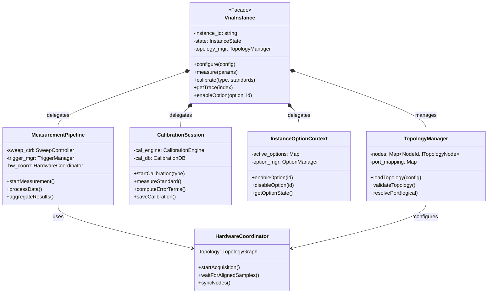

#### 3.1.2 实例类型

| 类型 | 实现插件 | 硬件 | 说明 |
|-----|---------|-----|------|
| 真实仪器 | vna_driver_* | 第三方 VNA | 通过 VISA/驱动控制 |
| PXI 实例 | vna_instance_pxi | PXI 板卡 | 上位机实现 VNA 业务 |
| 虚拟实例 | vna_instance_sim | 无 | 仿真数据，用于开发/CI |

#### 3.1.3 异构硬件混合与拓扑配置设计

一个 VnaInstance 可由**异构硬件**组成，包括：
- **PXI 板卡**（机箱内高速背板互连）
- **USB/LAN 形态板卡**（通过 VISA 通信）
- **其他 VnaInstance**（实例组合/级联）
- **真实 VNA 仪器**（作为子节点）

框架通过**拓扑配置**机制实现灵活组合：

**拓扑配置层（Topology）**
```yaml
topology:
  type: "composite"           # composite | pxi_only | instrument
  nodes:
    - id: "node_pxi_cluster"  # PXI 机箱集群
      type: "pxi_boards"
      boards: [0, 1]           # BoardId 列表
      sync: "pxi_backplane"    # PXI 背板同步
      
    - id: "node_usb_daq"      # USB 采集卡
      type: "visa_device"
      visa_addr: "USB0::0x1234::INSTR"
      sync: "software_trigger" # 软件触发
      
    - id: "node_sub_instance" # 嵌套实例
      type: "vna_instance"
      instance_ref: "vna_inst_02"
      
  port_mapping:
    Port 1: {node: "node_pxi_cluster", board: 0, port: A}
    Port 2: {node: "node_pxi_cluster", board: 1, port: A}
    Port 3: {node: "node_usb_daq", channel: 0}
    Port 4: {node: "node_sub_instance", logical_port: 1}
```

**拓扑管理器（TopologyManager）**
- **拓扑解析与验证** — 检查节点类型兼容性、端口冲突、循环引用
- **异构节点注册** — 统一管理 PXI / VISA / Instance 三类节点
- **同步策略选择** — 根据节点类型组合选择同步方案（硬件/软件/混合）
- **数据流路由** — 确定多源数据汇聚的拓扑路径
- **拓扑可视化** — 生成拓扑图供调试

**拓扑结构示例图**

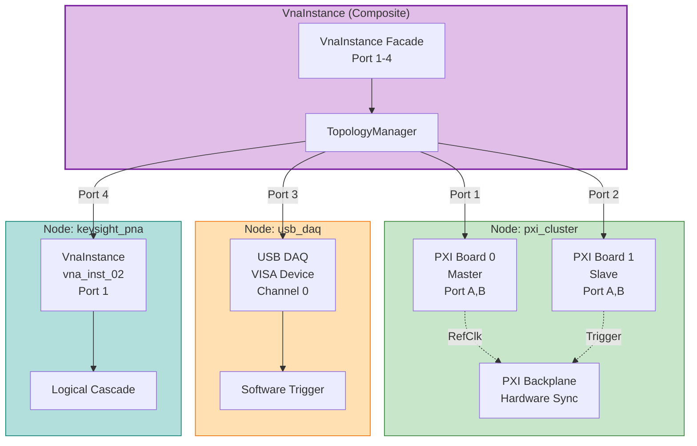

**数据流层（异构多源聚合）**
```
[PXI Board 0 - Port A] ──┐
[PXI Board 1 - Port A] ──┤ (硬件同步)
                         ├→ [时间戳对齐] → [结果聚合]
[USB DAQ - Channel 0] ───┤ (软件触发)
[Sub-Instance Port 1] ───┘ (逻辑级联)
```
- **异构缓冲管理** — 每个节点独立缓冲（PXI环形缓冲 / VISA轮询缓冲）
- **多级时间戳对齐** — 硬件同步优先，软件补偿备用
- **数据格式适配** — 统一 IQ / S参数 / Raw 格式到内部表示

#### 3.1.4 实例生命周期与状态机

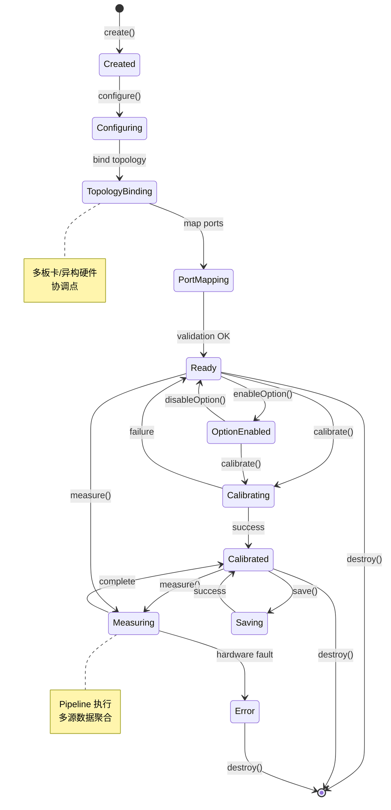

### 3.2 测量引擎设计 (vna_meas)

```
┌─────────────────────────────────────────────────────────────┐
│                    MeasurementPipeline                      │
├─────────────────────────────────────────────────────────────┤
│  采集 → 处理 → 校准应用 → 域转换 → Trace → Marker → 导出   │
└─────────────────────────────────────────────────────────────┘
```

| 模块 | 职责 | 核心功能 |
|-----|------|---------|
| SweepController | 扫描控制 | Linear/Log/Segment/Power/CW 扫描 |
| TriggerManager | 触发管理 | Internal/External/Manual/Bus 触发 |
| MeasurementCore | 测量算法 | S参数计算、格式转换 |
| DomainConverter | 域转换 | 频域↔时域、TDR/TDT |
| TraceManager | 轨迹管理 | 多Trace、格式、数学运算 |
| MarkerManager | 游标管理 | Marker/Delta/Peak/Bandwidth |

#### MeasurementPipeline 执行流程

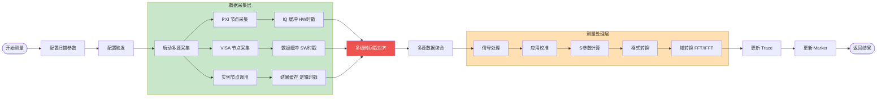

### 3.3 校准模块设计 (vna_calib)

| 模块 | 职责 |
|-----|------|
| CalibrationEngine | SOLT/TRL/QSOLT/ECal 校准算法 |
| FixtureSimulator | De-embedding/Embedding/Port Extension |
| TimeGating | 时域门控滤波 |
| CalibrationDB | 校准数据存储（SQLite） |

#### 校准流程序列图

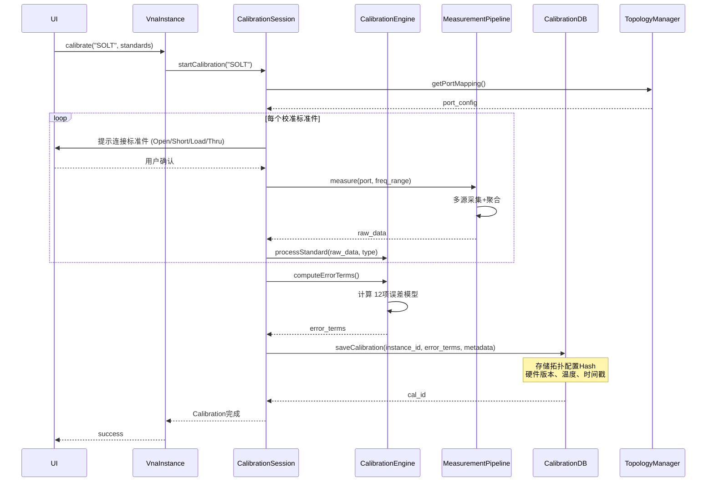

### 3.4 插件系统设计

#### C ABI 插件接口

```c
// vna_plugin_api.h

#define VNA_PLUGIN_API_VERSION 1

typedef enum {
    VNA_PLUGIN_DRIVER,
    VNA_PLUGIN_INSTANCE,
    VNA_PLUGIN_OPTION
} VnaPluginType;

typedef struct {
    const char* id;           // "vna.driver.keysight"
    const char* name;         // "Keysight VNA Driver"
    const char* version;      // "1.0.0"
    uint32_t api_version;
    VnaPluginType type;
} VnaPluginInfo;

typedef struct VnaPlugin {
    VnaPluginInfo info;
    int  (*init)(void);
    void (*cleanup)(void);
    void* (*create_context)(const char* config_json);
    void  (*destroy_context)(void* ctx);
} VnaPlugin;

// 导出函数
extern "C" VNA_EXPORT VnaPlugin* vna_plugin_create(void);
extern "C" VNA_EXPORT void vna_plugin_destroy(VnaPlugin* plugin);
```

#### 插件加载流程图

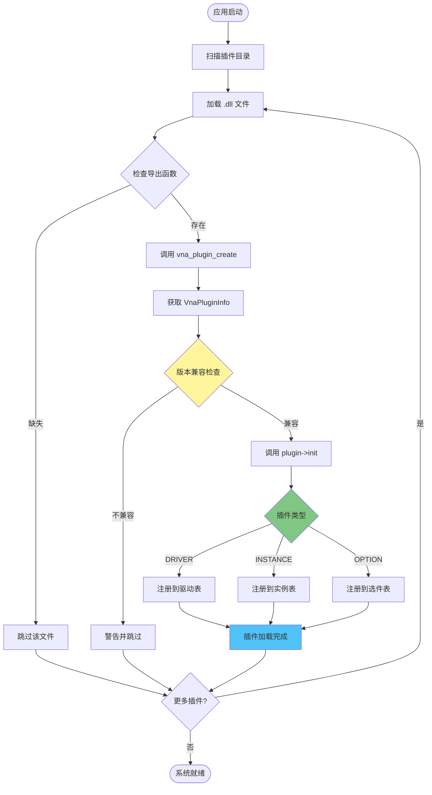

---

## 4. 选件插件化设计（实例级）

### 4.1 核心原则

1. **选件是实例级别的** — 每个 VNA 实例独立启用/配置选件
2. **支持多种 License 模式** — 全局/实例/混合
3. **热插拔** — 运行时加载/卸载选件插件

### 4.2 实例级选件架构

```
┌───────────────────────────────────────────────────────────┐
│                 OptionManager (全局单例)                   │
│  - 扫描并加载所有选件插件                                  │
│  - 管理全局 License                                        │
└───────────────────────────────────────────────────────────┘
                            │
          ┌─────────────────┼─────────────────┐
          ▼                 ▼                 ▼
┌────────────────┐ ┌────────────────┐ ┌────────────────┐
│ VnaInstance #1 │ │ VnaInstance #2 │ │ VnaInstance #3 │
├────────────────┤ ├────────────────┤ ├────────────────┤
│ InstanceOption │ │ InstanceOption │ │ InstanceOption │
│ Context        │ │ Context        │ │ Context        │
│ ┌────────────┐ │ │ ┌────────────┐ │ │ ┌────────────┐ │
│ │ pulse ✓   │ │ │ │ nf ✓       │ │ │ │ (无选件)   │ │
│ │ tdr ✓     │ │ │ │            │ │ │ │            │ │
│ └────────────┘ │ │ └────────────┘ │ │ └────────────┘ │
└────────────────┘ └────────────────┘ └────────────────┘
```

### 4.3 可插件化选件列表

| 选件 ID | 名称 | 功能 | License |
|--------|------|------|---------|
| vna.opt.pulse | 脉冲测量 | 脉冲 RF 包络/调制 | 实例级 |
| vna.opt.nf | 噪声系数 | 噪声系数/温度测量 | 实例级 |
| vna.opt.imd | 非线性测试 | IMD/谐波/压缩 | 实例级 |
| vna.opt.tdr | 高级时域 | TDR/TDT/眼图 | 实例级 |
| vna.opt.material | 材料测量 | 介电常数/磁导率 | 全局 |
| vna.opt.ecal.* | ECal 支持 | 电子校准件驱动 | 全局 |

### 4.4 核心非插件化功能

以下功能必须在核心库，**不应插件化**：
- 基础 S 参数测量（S11/S21/S12/S22）
- 基本校准（SOLT/TRL）
- 标准 Trace/Marker 功能
- 基础时域转换（FFT/IFFT）
- Touchstone 导出
- 基本扫描与触发

## 5. 多板卡协调与硬件管理

### 5.1 拓扑管理器（TopologyManager）

#### 拓扑验证流程图

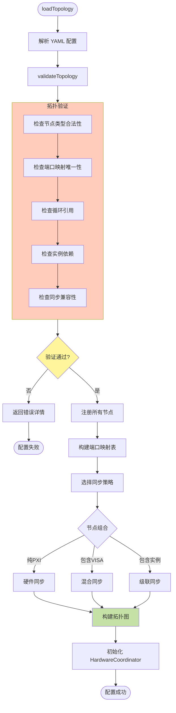

#### TopologyManager API

每个 VnaInstance 需要一个拓扑管理器来管理异构硬件节点：

```cpp
class TopologyManager {
public:
    // 拓扑配置
    Status loadTopology(const TopologyConfig& config);
    Status validateTopology();  // 检查循环依赖、类型兼容性
    TopologyGraph getTopologyGraph();
    
    // 节点管理（异构）
    Status registerNode(const NodeConfig& node);
    NodeHandle getNode(const std::string& node_id);
    std::vector<NodeInfo> getAllNodes();
    
    // 端口映射（跨节点）
    Status mapLogicalPort(PortNumber logical, const PortMapping& mapping);
    NodePortRef resolveLogicalPort(PortNumber logical);
    
    // 同步策略
    Status configureSyncStrategy(const SyncConfig& config);
    SyncMode getSyncModeForTopology();
};
```

### 5.2 硬件协调器（HardwareCoordinator）

拓扑管理器下的执行层，负责具体采集协调：

```cpp
class HardwareCoordinator {
public:
    // 初始化（接收拓扑）
    Status initialize(const TopologyGraph& topology);
    
    // 采集协调（异构）
    Status startAcquisition(const AcquisitionConfig& config);
    Status stopAcquisition();
    
    // 多源数据汇聚
    std::vector<SampleBuffer> waitForAlignedSamples(uint32_t sample_count);
    
    // 节点特定操作
    Status triggerNode(const std::string& node_id);
    Status syncNodes(const std::vector<std::string>& node_ids);
    
    // 资源检查
    ConflictInfo detectConflict();
};
```

**关键特性：**
- **异构节点抽象** — PXI/VISA/Instance 统一为 ITopologyNode 接口
- **分层同步策略** — 硬件同步（PXI 背板）+ 软件触发（VISA）+ 逻辑级联（实例）
- **拓扑感知调度** — 根据拓扑图确定采集顺序和数据流路由
- **多级时间戳对齐** — 硬件时戳优先，软件补偿备用

#### 多源数据聚合流程图

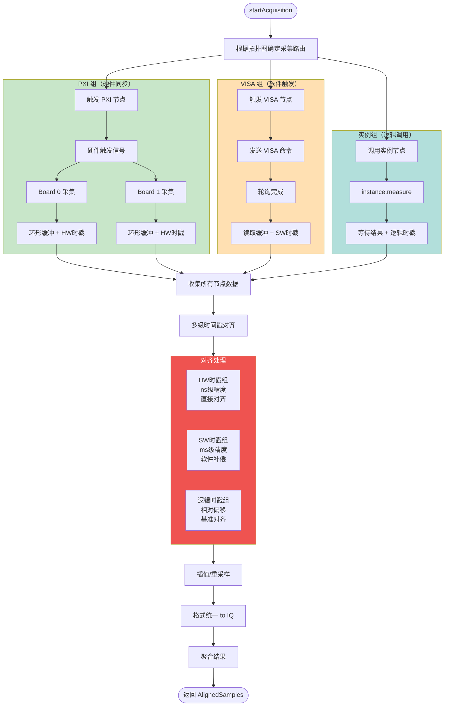

### 5.3 采集编排模式（异构支持）

| 编排模式 | 说明 | 适用场景 |
|---------|------|---------|
| **硬件同步并行** | PXI 背板/外部硬件触发，所有 PXI 板卡同时采集 | 纯 PXI 拓扑 |
| **软件触发协调** | 通过 VISA 命令序列触发 USB/LAN 设备；部分 PXI 也可按板卡能力使用软件触发 | 包含 VISA 设备或支持软件触发的 PXI |
| **混合同步** | PXI 组内硬件或软件触发，组间软件触发 | PXI + VISA 混合拓扑 |
| **实例级联** | 调用子实例的 measure() 接口，逻辑组合结果 | 包含嵌套实例的拓扑 |
| **时序级联** | Master 先采，Slave 根据 Master 结果触发 | 特殊 de-embedding 流程 |

**注**：PXI 设备是否支持软件触发取决于板卡设计；**主从角色由用户在拓扑配置中指定**，TopologyManager 负责能力校验与冲突检测。

#### 5.3.1 串联触发链（Trigger / PLL / 10MHz Ref Chain）

本节描述一种常见的级联测试方案：将各板卡的触发线、PLL / 10MHz 参考按序串联或背板分发。主从角色**由用户在拓扑配置中指定**，启动扫描时先确认从卡已就绪并锁定时钟，然后由主卡发起触发，利用前级输出驱动下一级板卡启动扫描，完成一次完整扫描帧。若板卡支持软件触发，可在该流程中替换触发链的部分节点。

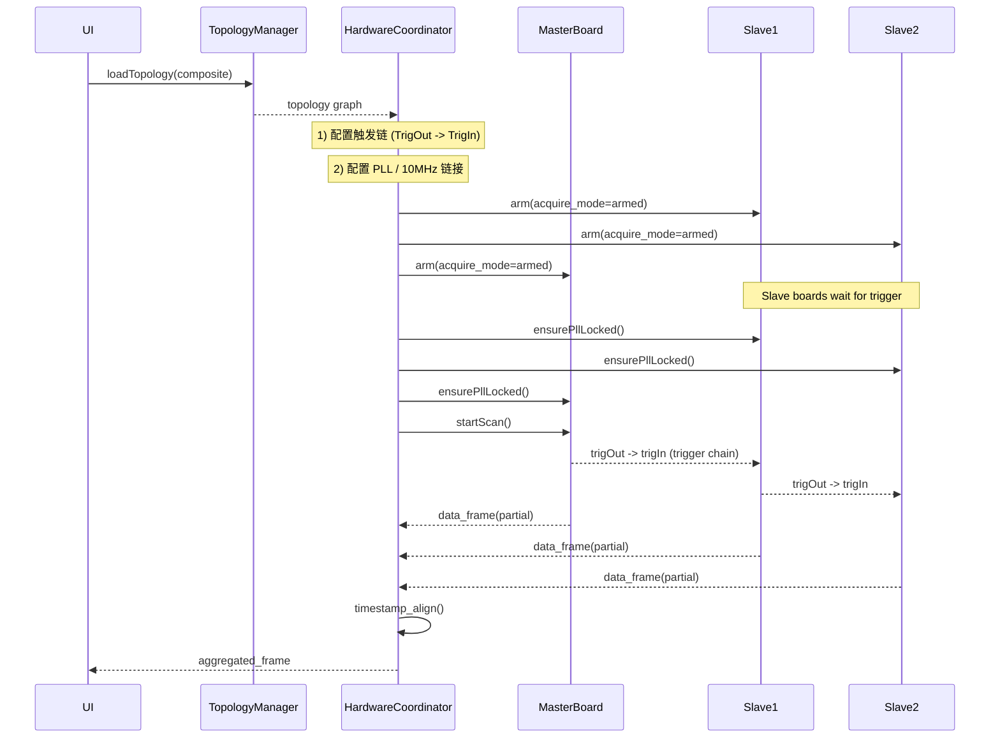

关键步骤说明：
- **预配置/上电**：先配置每块板卡的采集参数与触发模式，并将从卡设置为“armed/waiting”状态；同时检查 PLL/10MHz 参考已锁定（或等待锁定完成）。
- **触发链连接**：物理连接应保证 TrigOut -> TrigIn 串联或通过 PXI 背板路由；推荐在 Topology 校验阶段验证触发线路拓扑。
- **启动顺序**：先调用 `arm()` 或 `startAcquisition()` 使从卡处于就绪状态（不立即开始采集），再启动主卡（master）扫描；主卡在其预设时间点输出触发脉冲，沿触发链逐级唤醒下一级板卡开始采集。
- **时序与延迟补偿**：触发沿传播将产生固有延迟，需在 HardwareCoordinator 的时间戳对齐阶段补偿传输延迟与触发传播延迟。
- **PLL/Ref 要求**：确保所有参与板卡 PLL/参考时钟稳定并处于锁相状态；若使用外部 10MHz 参考级联，应验证信号完整性与衰减。
- **失败与降级策略**：若任一从卡 PLL 未锁或触发链断开，可采用以下策略之一：
  - 自动重试（等待 PLL 锁定并重试）
  - 切换为回退方案（软件触发 / 单板采集）
  - 报告并停止测量（严格模式下）

实现建议与验证点：
- 在 `TopologyManager.validateTopology()` 增加触发链完整性校验（检查 TrigOut->TrigIn 连通性）。
- 在 `HardwareCoordinator` 提供 `ensurePllLocked()`、`arm()`、`startScan()`、`getTriggerPropagationDelay()` 等接口，并在采集前做延迟测量（可通过回环测试或自检帧）。
- 记录触发 propagation delay 与 jitter 指标到诊断日志，供后续时间戳对齐与质量评估。

#### 5.3.2 主从角色配置示例

主从角色由用户在拓扑配置中显式指定，TopologyManager 负责校验板卡能力与触发链完整性。以下是三种典型场景的配置示例。

**场景 1：纯硬件触发链（PXI 背板触发）**

```yaml
topology:
  nodes:
    - id: pxi_master
      type: pxi_boards
      board_id: 0
      role: master              # 用户指定主卡
      ref_clock: 10MHz
      trigger_mode: hardware    # 板卡支持硬件触发
      trigger_output: PXI_TRIG0
      
    - id: pxi_slave_1
      type: pxi_boards
      board_id: 1
      role: slave               # 用户指定从卡
      trigger_mode: hardware
      trigger_input: PXI_TRIG0  # 连接到主卡触发线
      trigger_output: PXI_TRIG1 # 级联到下一级
      
    - id: pxi_slave_2
      type: pxi_boards
      board_id: 2
      role: slave
      trigger_mode: hardware
      trigger_input: PXI_TRIG1  # 从上一级接收触发

  sync_strategy:
    type: hardware_chain
    master: pxi_master
    propagation_delay_ns: 50   # 预估延迟
```

**场景 2：混合触发（PXI 主卡 + 软件触发从卡）**

```yaml
topology:
  nodes:
    - id: pxi_master
      type: pxi_boards
      board_id: 0
      role: master
      trigger_mode: hardware
      ref_clock: 10MHz
      
    - id: pxi_slave_sw
      type: pxi_boards
      board_id: 1
      role: slave
      trigger_mode: software    # 该板卡支持软件触发
      # 无 trigger_input/output 配置
      
  sync_strategy:
    type: mixed
    master: pxi_master
    software_trigger_delay_ms: 5  # 软件触发延迟补偿
```

**场景 3：全软件触发（用户指定主从仅用于逻辑顺序）**

```yaml
topology:
  nodes:
    - id: pxi_coordinator
      type: pxi_boards
      board_id: 0
      role: master              # 逻辑主卡（非触发主）
      trigger_mode: software
      
    - id: pxi_worker_1
      type: pxi_boards
      board_id: 1
      role: slave
      trigger_mode: software
      
    - id: pxi_worker_2
      type: pxi_boards
      board_id: 2
      role: slave
      trigger_mode: software
      
  sync_strategy:
    type: software_coordinated
    coordinator: pxi_coordinator
    trigger_sequence: [pxi_worker_1, pxi_worker_2, pxi_coordinator]
```

**主从关系可视化（Mermaid）**

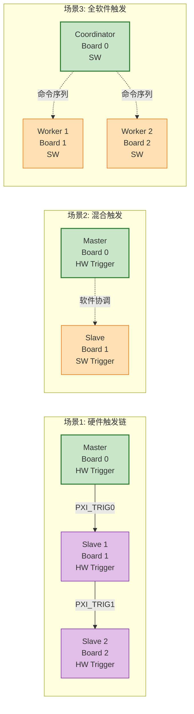

**拓扑验证规则（TopologyManager）**

- 主卡必须存在且唯一（每个拓扑仅一个 `role: master`）。
- 硬件触发链：验证 `trigger_output` → `trigger_input` 连通性与无环。
- 板卡能力检查：若配置 `trigger_mode: hardware` 但板卡不支持，则拒绝并提示。
- 软件触发回退：若硬件触发不可用，自动建议切换为软件触发（需用户确认）。

---

### 5.4 组件职责划分

| 组件 | 职责 | 作用域 |
|-----|------|--------|
| **ResourceManager** | 生命周期租约、超时释放、全局冲突检测 | 全局（跨实例） |
| **HardwareArbitrator** | 通道分配、触发线路由、时钟树管理 | 全局（板卡级） |
| **TopologyManager** | 拓扑解析、节点注册、同步策略选择、拓扑验证 | 实例级 |
| **HardwareCoordinator** | 异构采集编排、数据汇聚、时间戳对齐 | 实例级 |

---

## 5. 资源管理与并发

原有的 5.1-5.2 内容保持不变，见下面...

### 5.1 ResourceManager

```cpp
class ResourceManager {
public:
    Lease acquireResource(ResourceId id, Duration timeout);
    void releaseResource(Lease& lease);
    bool isAvailable(ResourceId id);
    ConflictInfo checkConflict(ResourceRequest request);
};
```

#### 资源租约状态机

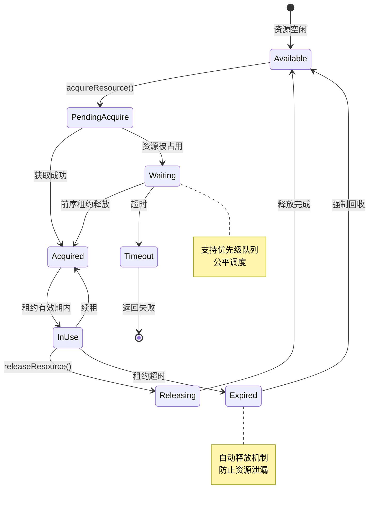

### 5.2 HardwareArbitrator

```cpp
class HardwareArbitrator {
public:
    ChannelHandle allocateChannel(PortConfig config);
    void releaseChannel(ChannelHandle handle);
    void configureTriggerSync(std::vector<InstanceId> instances);
    void setReferenceClock(ClockSource source);
};
```

### 5.3 多实例并发策略

| 场景 | 策略 |
|-----|------|
| 硬件通道冲突 | 互斥 + 队列等待 |
| 触发同步 | Master-Slave 模式 |
| 时钟共享 | 统一参考源 |
| 资源超时 | 租约机制自动释放 |

### 5.5 跨进程 / 多开资源协调（Global Resource Arbitration）

当应用支持 "多开"（多个进程/实例同时运行）时，必须避免设备资源竞争与不可预期的并发访问。设计中增加以下跨进程资源协商方案：

1) 全局资源代理（推荐） — Global Resource Broker (daemon/service)
- 全局单例进程，运行在本机（或局域网）中，负责维护硬件资源表（board_id / visa_addr / device_id 等）。
- 客户端（每个应用进程）通过 IPC（本地 Unix domain socket / Windows Named Pipe / TCP loopback）向 Broker 发起资源查询、申请（acquire）、续租（renew）、释放（release）。
- Broker 实现租约（lease）机制、心跳（heartbeat）检测与超时回收；支持独占（exclusive）和共享（shared）访问模式。例：

```text
Client -> Broker: acquire(device_id, mode=exclusive, timeout=5s)
Broker -> Client: lease(id=123, ttl=30s, owner=pid)
Client -> Broker: renew(lease_id)
Client -> Broker: release(lease_id)
```

- 优点：跨进程可集中管理并实现公平调度、优先级和审计日志；易于 UI 展示资源占用情况。

2) 轻量替代（文件锁 / 命名互斥）
- 使用 OS 提供的文件锁（flock/LockFileEx）或 Windows Named Mutex + 状态文件（JSON）实现资源登记与冲突检测。适合不希望引入守护进程的场景。

3) 驱动/设备层互斥（依赖硬件/驱动）
- 对于 VISA/USB 设备，可使用设备驱动的独占打开特性（若支持）作为保护措施；仍建议结合全局 Broker 以统一视图与策略。

4) 约定策略与 UI 体验
- 在拓扑加载 & validate 阶段（TopologyManager.validateTopology）进行全局资源可用性检查（调用 Broker 或锁定检查）。
- 若资源被占用：
  - 提示用户占用信息（占用进程/实例、占用时长、可释放时间）
  - 提供抢占（preempt）或排队（enqueue）选项（需谨慎，默认不自动抢占硬件）
  - 支持 "strict" 模式拒绝共享/抢占，仅允许独占成功时启动测量

5) 租约与回收细则
- 租约 TTL（例如 30s）与心跳机制：客户端必须在 TTL 前续租，否则 Broker 会回收资源并通知相关进程。  
- 崩溃检测与回收：Broker 对失联客户端（心跳中断或进程不存在）进行强制回收，释放设备并记录事件。

6) 安全与权限控制
- Broker 应支持本地认证（可基于用户名/UID 或进程签名）并对敏感操作（抢占）做权限校验。  
- 日志需要记录操作审计（谁在何时获取/释放了哪台设备）。

7) 实现建议（优先级）
- 首选：实现 Global Resource Broker（daemon + IPC）并在 ResourceManager 中对接；
- 次选：实现基于 Windows NamedMutex / Unix flock 的本地锁 + 状态文件；
- 兼容：尽量利用设备驱动的独占打开特性作为最后一道保护线。

8) 测试与监控
- 自动化集成测试：模拟多进程并发获取同一设备的场景，验证回退、排队、抢占和回收行为；
- 监控：在 Broker 中导出指标（当前占用、等待队列长度、租约超时次数）供诊断。 

---

## 6. vna_instance_pxi 设计细节（多板卡实例）

### 6.1 PXI 实例的关键职责

`vna_instance_pxi` 是 VnaInstance 的 PXI 具体实现，需要处理的核心问题：

| 问题 | 解决方案 |
|-----|---------|
| **多板卡发现** | 启动时枚举 PXI 机箱中所有可用板卡，注册到 HardwareCoordinator |
| **端口映射** | 将逻辑 VNA 端口（Port 1/2/3/4）映射到物理板卡的收发端口 |
| **时钟同步** | 选定 Master 板卡作为参考时钟源，配置触发同步线路 |
| **采集协调** | 根据配置启动多板卡同步采集，汇聚 IQ 数据到统一缓冲 |
| **时间戳对齐** | 处理不同板卡的采样延迟，确保样点时间一致 |
| **资源冲突** | 检测端口占用、触发线冲突、时钟源冲突 |

### 6.2 配置示例（异构拓扑）

```yaml
# instance_composite_config.yaml
instance:
  id: "vna_instance_hybrid_01"
  type: "composite"       # 异构组合实例

topology:
  nodes:
    # PXI 板卡集群
    - id: "pxi_cluster"
      type: "pxi_boards"
      boards:
        - id: 0
          model: "PXI-5160"
          role: "master"
          ref_clock: 10MHz
        - id: 1
          model: "PXI-5160"
          role: "slave"
          trigger_master: 0
      sync:
        mode: "hardware"
        trigger_bus: "PXI7"
    
    # USB 采集卡（VISA）
    - id: "usb_daq"
      type: "visa_device"
      visa_addr: "USB0::0x1234::0x5678::INSTR"
      driver: "vna_driver_custom_daq"
      sync:
        mode: "software_trigger"
        master_ref: "pxi_cluster"  # 参考 PXI 主节点
    
    # 嵌套实例（真实 VNA）
    - id: "keysight_pna"
      type: "vna_instance"
      instance_ref: "vna_keysight_inst_02"  # 引用已创建实例
      sync:
        mode: "logical_cascade"
  
  port_mapping:
    Port 1: {node: "pxi_cluster", board: 0, port: A}
    Port 2: {node: "pxi_cluster", board: 1, port: A}
    Port 3: {node: "usb_daq", channel: 0}
    Port 4: {node: "keysight_pna", logical_port: 1}

sync_strategy:
  primary: "hardware"      # PXI 组优先硬件同步
  fallback: "software"     # VISA/实例使用软件触发
  timestamp_align: true    # 启用时间戳对齐

calibration:
  per_instance: true
  storage: "instance_hybrid_01_calib.db"
  cross_node: true         # 支持跨节点校准
```

### 6.3 数据流示例（异构拓扑）

```
┌──────────────────────────────────────────────────────────────┐
│         VnaInstance (Composite - Facade)                     │
│  measure(freq: 1-10GHz, ports: [1,2,3,4])                   │
└───────────────────────┬──────────────────────────────────────┘
                        │
        ┌───────────────┼────────────────┬─────────────────┐
        ▼               ▼                ▼                 ▼
   [PXI 集群]      [USB DAQ]      [Keysight PNA]    [实例级联]
  ┌────────────┐  ┌──────────┐   ┌─────────────┐
  │ Board 0    │  │ VISA设备 │   │ vna_inst_02 │
  │ Board 1    │  │ (软触发) │   │ (逻辑调用)  │
  └─────┬──────┘  └────┬─────┘   └──────┬──────┘
        │ PXI背板      │ USB/VISA       │ measure() API
        │ 硬件同步     │ 软件触发       │
        ▼              ▼                ▼
  [IQ Buf 0/1]   [VISA Buf]      [结果缓存]
   时戳: HW       时戳: SW        时戳: Logical
        │              │                │
        └──────────────┴────────────────┘
                       │
                       ▼
            [TopologyManager 数据汇聚]
             - 解析拓扑图确定数据流路径
             - 多级时间戳对齐（HW/SW/Logical）
             - 数据格式统一（IQ → S参数）
                       │
                       ▼
              [多源聚合结果]
                Port 1 ← PXI Board 0 Port A
                Port 2 ← PXI Board 1 Port A
                Port 3 ← USB DAQ Channel 0
                Port 4 ← Keysight PNA Port 1
                       │
                       ▼
            [MeasurementCore 计算]
              S11, S21, S12, S22
                       │
                       ▼
              [Trace 返回 UI]
```

### 6.4 HardwareCoordinator API 在 vna_instance_pxi 中的使用

```cpp
// 伪代码示例
class PxiInstanceImpl : public VnaInstance {
private:
    std::unique_ptr<HardwareCoordinator> hw_coord_;
    
public:
    Status configure(const PxiConfig& cfg) override {
        // 1. 发现所有可用板卡
        hw_coord_->discoverBoards();
        
        // 2. 建立端口映射
        for (const auto& [logical_port, board_cfg] : cfg.port_mapping) {
            hw_coord_->mapLogicalPort(
                logical_port,
                board_cfg.board_id,
                board_cfg.physical_port
            );
        }
        
        // 3. 配置同步（Master-Slave）
        hw_coord_->configureSync(
            SyncMode::PARALLEL,
            cfg.master_board_id
        );
        
        return Status::OK;
    }
    
    Status measure(const MeasurementParams& params) override {
        // 1. 启动采集
        hw_coord_->startAcquisition(params.config);
        
        // 2. 等待对齐的多源样点
        while (!measurement_complete) {
            auto aligned_samples = hw_coord_->waitForAlignedSamples(1024);
            // aligned_samples[0]: Port 1
            // aligned_samples[1]: Port 2
            // aligned_samples[2]: Port 3
            // aligned_samples[3]: Port 4
            
            // 3. 传给 MeasurementPipeline 处理
            pipeline_->process(aligned_samples);
        }
        
        // 4. 停止采集
        hw_coord_->stopAcquisition();
        
        return Status::OK;
    }
};
```

---

## 6. 构建产物清单

### 6.1 动态库

| 库名称 | 类型 | 说明 |
|-------|------|------|
| vna_core_base | 核心 | 配置/日志/错误 |
| vna_core_runtime | 核心 | 插件/实例/资源管理 |
| vna_plugin_api | 核心 | C ABI 接口定义 |
| vna_instance | 核心 | 实例 Facade |
| vna_meas | 功能 | 测量引擎 |
| vna_calib | 功能 | 校准模块 |
| vna_data | 功能 | 数据 I/O |
| vna_hw_abstraction | 功能 | 硬件抽象 |

### 6.2 插件

| 插件名称 | 类型 |
|---------|------|
| vna_driver_keysight | 驱动 |
| vna_driver_rs | 驱动 |
| vna_instance_pxi | 实例 |
| vna_instance_sim | 实例 |
| vna_opt_pulse | 选件 |
| vna_opt_nf | 选件 |
| vna_opt_tdr | 选件 |

### 6.3 可执行文件

| 程序名称 | 功能 |
|---------|------|
| vna_ui | Qt GUI 主程序 |
| vna_cli | 命令行工具 |
| vna_sim_app | 独立仿真器 |
| vna_tests | 测试套件 |

---

## 7. 目录结构

```
xswl-zap-vna/
├── CMakeLists.txt
├── cmake/
│   └── VnaPlugin.cmake
├── include/vna/
│   ├── core/
│   ├── meas/
│   ├── calib/
│   ├── data/
│   └── plugin_api.h
├── src/
│   ├── core_base/
│   ├── core_runtime/
│   ├── instance/
│   ├── meas/
│   ├── calib/
│   ├── data/
│   └── hw_abstraction/
├── plugins/
│   ├── drivers/
│   ├── instances/
│   └── options/
├── apps/
│   ├── ui/
│   ├── cli/
│   └── sim_app/
├── tests/
│   ├── unit/
│   └── integration/
└── docs/
```

---

## 8. 实现路线图

### Phase 1: MVP
- [ ] vna_core_base（配置/日志/错误）
- [ ] vna_plugin_api（C ABI 接口）
- [ ] vna_data（Touchstone I/O）
- [ ] vna_meas（基础 S 参数）
- [ ] vna_calib（SOLT 校准）
- [ ] vna_instance + vna_instance_sim
- [ ] vna_cli + 单元测试

### Phase 2: 核心功能
- [ ] vna_core_runtime
- [ ] vna_hw_abstraction + HardwareArbitrator
- [ ] vna_instance_pxi
- [ ] TraceManager / MarkerManager / SweepController
- [ ] vna_ui 基础版

### Phase 3: 完整功能
- [ ] DomainConverter（时域/TDR）
- [ ] FixtureSimulator / TimeGating
- [ ] OptionManager + 选件框架
- [ ] 多实例并发
- [ ] 厂商驱动插件

### Phase 4: 生产优化
- [ ] 性能优化
- [ ] 选件插件（Pulse/NF/TDR）
- [ ] 完整 UI
- [ ] 文档与 SDK

---

## 9. 设计满足性评估

| VNA 功能 | 对应模块 | 状态 |
|---------|---------|------|
| 多种测试功能 | MeasurementCore + 选件 | ✅ |
| 测量模式 | SweepController + TriggerManager | ✅ |
| 游标功能 | MarkerManager | ✅ |
| 校准 | CalibrationEngine | ✅ |
| 夹具仿真 | FixtureSimulator | ✅ |
| 时域测量/TDR | DomainConverter | ✅ |
| 频率功率设置 | SweepController | ✅ |
| 扫描触发配置 | TriggerManager | ✅ |
| 选件功能 | OptionManager + 插件 | ✅ |
| PXI 实例 | vna_instance_pxi | ✅ |
| 多实例并发 | ResourceManager + Arbitrator | ✅ |
| **多板卡实例** | **HardwareCoordinator + vna_instance_pxi** | **✅** |
| **端口映射** | **HardwareCoordinator** | **✅** |
| **多板卡时钟同步** | **HardwareCoordinator + PXI 触发线** | **✅** |
| **多源数据聚合** | **HardwareCoordinator 缓冲管理** | **✅** |
| **异构硬件混合** | **TopologyManager + 异构节点抽象** | **✅** |
| **用户可配置拓扑** | **YAML 拓扑配置 + 验证** | **✅** |
| **实例嵌套/组合** | **VnaInstance 组合引用 + 生命周期管理** | **✅** |
| **多级同步策略** | **硬件/软件/逻辑混合同步** | **✅** |

---

## 10. 架构风险与改进建议

本设计已通过多轮评审与优化，但仍需在实现阶段注意以下风险点：

### 问题 1: 多板卡采集数据一致性
**风险**: 不同板卡的采样时钟、采样延迟存在差异，可能导致时间戳对齐不准确。  
**改进**: 在 HardwareCoordinator 中实现显式的时戳校准机制，记录每块板卡相对于 Master 的时序偏差，在数据聚合前进行补偿。

### 问题 2: 插件卸载时的引用安全
**风险**: 选件插件卸载时，如果仍有实例在使用，可能导致悬垂引用。  
**改进**: PluginManager 卸载前应检查引用计数，实例销毁时显式释放选件插件引用；考虑延迟卸载或禁止热卸载。

### 问题 3: 校准数据与硬件配置的版本绑定
**风险**: 升级硬件驱动或更新板卡配置后，旧校准数据可能失效但无法检测。  
**改进**: CalibrationDB 应记录校准时的硬件版本、IFBW、温度等上下文；恢复时校验一致性，失配时警告或禁用。

### 问题 4: 选件扩展点不够细粒度
**风险**: 选件只能扩展 MeasurementCore，难以在校准、数据导出等流程中插入自定义逻辑。  
**改进**: 在 CalibrationSession、DataIO、MeasurementPipeline 的关键节点定义钩子接口，允许选件注册回调。

### 问题 5: 多实例资源竞争的公平性
**风险**: ResourceManager 的租约机制是先来先得，可能导致某些实例长期无法获得资源。  
**改进**: 实现优先级队列和公平调度算法；提供超时重试和降级策略文档。

### 问题 6: 真实仪器驱动与 PXI 实例的接口差异
**风险**: vna_driver_* 和 vna_instance_pxi 两种实现的硬件接口差异大，客户端代码难以统一。  
**改进**: 在 vna_hw_abstraction 上再抽一层适配器（IVnaHardwareAdapter），屏蔽驱动与实例的差异。

### 问题 7: 日志与诊断的可观测性
**风险**: 多实例+多板卡场景下，日志混乱难以追踪问题（如哪个板卡的触发线故障）。  
**改进**: 在日志中加入 instance_id、board_id、port_id 等标签；支持按标签过滤输出。

### 问题 8: 性能瓶颈未提前规划
**风险**: 多源缓冲、时戳对齐、S参数计算可能成为吞吐瓶颈，导致实时性下降。  
**改进**: 在 Phase 2 中补充性能基准测试（throughput, latency, CPU/内存用量）；考虑 SIMD/多线程优化。

### 问题 9: 异构拓扑验证不足
**风险**: 用户配置的拓扑可能存在循环依赖、类型不兼容（如 VISA 设备不支持硬件触发）、端口冲突等问题。  
**改进**: TopologyManager.validateTopology() 应实现完整的静态检查（拓扑图环检测、节点能力校验、端口唯一性）；提供可视化工具辅助配置。

### 问题 10: 异构同步精度降级
**风险**: PXI 硬件同步精度高（ns 级），VISA 软件触发精度低（ms 级），混合时可能导致测量误差。  
**改进**: 在校准数据中记录同步精度等级；对低精度节点的数据标注误差范围；提供"严格同步"模式拒绝低精度节点。

### 问题 11: 实例嵌套的生命周期依赖
**风险**: 父实例引用子实例时，子实例被提前销毁或重配置可能导致父实例失效。  
**改进**: 实现引用计数或依赖追踪机制；禁止销毁被引用的子实例；提供拓扑依赖图显示工具。

### 问题 12: 跨进程设备资源冲突（多开场景）
**风险**: 在支持多开（多个应用进程）时，多个进程同时争用仪器资源（PXI 板卡、VISA 设备）会导致访问冲突、不可预期的行为或数据损坏。  
**改进**: 推荐实现 Global Resource Broker（本地守护进程）作为跨进程中央仲裁器；或采用系统级命名互斥/文件锁作为轻量替代。Broker 应支持租约/心跳、抢占策略、审计日志与权限控制；在 TopologyManager.validateTopology 阶段进行全局资源可用性检测，并在 UI 中显示占用信息与提供排队/抢占选项。

---
## 11. Workspace 工作区支持（隔离与资源协调）

为保证多开应用之间测试和测量的独立性，应把 Workspace（工作区）作为一级隔离单元引入架构。下面把设计做成可实现的规范，包含元模型、生命周期、资源协调与接口。

### 11.1 目标
- **隔离性**：配置、校准、测量结果和日志按 workspace 隔离存放。
- **命名空间式资源分配**：设备租约、端口映射和触发线由 WorkspaceContext 管理并可向 Global Broker 注册。
- **可复现性**：支持 workspace 快照（拓扑、校准、选件、采集参数）与恢复。
- **可观测性与审计**：记录每个 workspace 的资源占用、租约事件与操作审计日志。

### 11.2 Workspace 元模型与目录
- workspace_id: string, owner: user, policy: {strict|shared}
- 每个 workspace 对应目录结构：
```
workspaces/<workspace_id>/
  config.yaml        # 拓扑 + 配置
  calib.db           # 校准数据库（按 workspace 隔离）
  traces/            # 测量结果
  logs/              # workspace 日志
  snapshots/         # 快照存档
```

#### Workspace 生命周期（Mermaid）

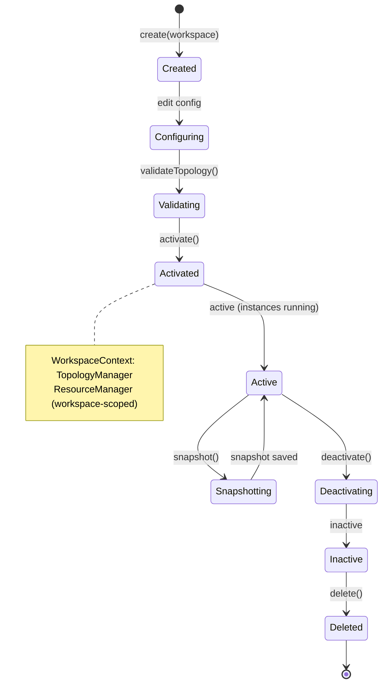

### 11.3 Workspace 内资源协调（机制与 API）
- **Workspace-scoped ResourceManager / ResourceProxy**
  - 每个 workspace 持有一个 ResourceManager 实例，用于管理 workspace 内的硬件租约、端口映射与本地队列。
  - ResourceManager 与 Global Broker 协作：若 Broker 存在，workspace 的 ResourceManager 向 Broker 请求租约并同步状态；若无 Broker，则降级为本地命名互斥 + 状态文件。

- **核心 API（建议）**
```cpp
// workspace scope
Lease acquireResource(ResourceId id, WorkspaceId wid, AccessMode mode, Duration timeout);
bool renewLease(LeaseId lease, Duration ttl);
void releaseResource(LeaseId lease);
ConflictInfo checkConflict(ResourceRequest req);
```

- **本地事务与锁**
  - 对 CalibrationDB 使用事务与行级锁；对配置/快照写入采用原子写（临时文件+重命名）或文件锁。
  - 对端口/触发线路资源申请按资源 id 全序 acquire（避免死锁），并在超时后回滚。

#### Workspace 资源分配流程（Mermaid）

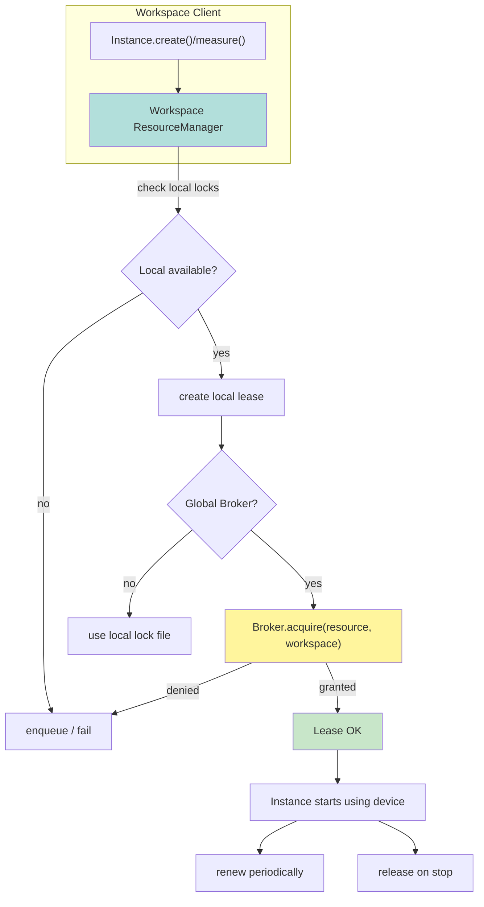

### 11.4 冲突检测与策略
- **即时拒绝**：严格模式（policy=strict）下，TopologyManager.validateTopology 在激活时拒绝资源有冲突的拓扑。  
- **排队/抢占**：默认排队；管理员/有权限用户可选择抢占（Broker 协调并需审计）。
- **降级策略**：若硬件同步链不可用，则尝试软件触发回退并标注 sync_quality 低。
- **死锁预防**：按资源唯一 id 排序获取锁，若存在等待超时触发回滚并打日志告警。

### 11.5 测试 & 验收
- 并发场景：多个实例在同一 workspace 并发申请同一端口，验证排队、超时、抢占行为。  
- 崩溃与回收：模拟实例或客户端进程崩溃，验证租约 TTL 到期自动回收与审计记录。  
- Snapshot/Restore：验证 Snapshot 恢复后拓扑、校准和选件状态一致且可继续测量。

### 11.6 UI/CLI 支持（建议）
- CLI: `vna_cli workspace create/list/switch/snapshot/restore`。
- UI: Workspace 下拉选择、资源视图（显示租约、占用者、等待队列）、快照按钮、严格模式开关。

---

继续：我可以将这些接口草案和示例测试用例转换为具体的 Issue 模板并生成初始实现任务清单。