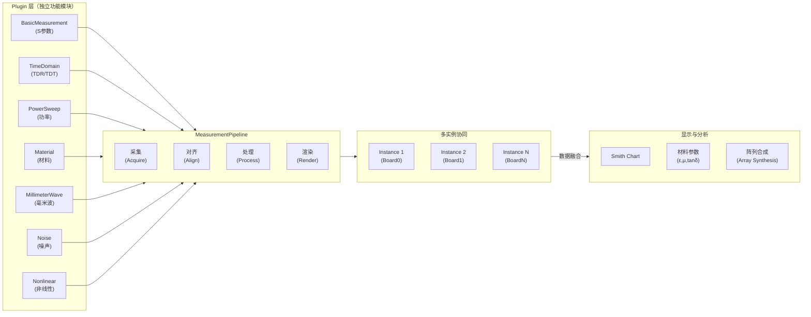

# VNA 功能特性清单 (Feature Inventory)

> 目的：系统整理市面上主流 VNA 支持的各类测量功能，作为后续功能规划和 plugin 开发的参考。

---

## 1. 基础 S 参数测量

### 1.1 网络参数测量

| 功能 | 描述 | 应用场景 |
|------|------|----------|
| S 参数 (S11, S12, S21, S22, ...) | 散射参数，反映网络的线性特性 | 阻抗匹配、滤波器设计、功放特性评估 |
| 其他参数转换 | Y/Z/T/ABCD 参数、反射系数 Γ、传输系数 | 电路设计、仿真模型提取 |
| 群延迟 (Group Delay) | 频率范围内的相位延迟变化 | 宽带滤波器、传输线特性评估 |
| 时间延迟 (Propagation Delay) | 信号传播延迟 | PCB 走线长度验证、传输线设计 |

### 1.2 阻抗与反射

| 功能 | 描述 | 应用场景 |
|------|------|----------|
| 阻抗 (Z, Zreal, Zimag) | 实部/虚部分离 | 匹配网络设计、传输线特征阻抗验证 |
| 导纳 (Y, Yreal, Yimag) | 并联等效表示 | 并联电路分析、谐振器设计 |
| 反射系数 (Γ, Γmag, Γangle) | 幅度和相位 | Smith Chart 绘图、稳定性分析 |
| 驻波比 (VSWR) | 电压驻波比 | 天线调试、传输线质量评估 |
| 回波损耗 (Return Loss) | S11 幅度（dB），反映反射强度 | 端口匹配质量评估 |

### 1.3 增益与损耗

| 功能 | 描述 | 应用场景 |
|------|------|----------|
| 直通插损 (IL, Insertion Loss) | S21 幅度，单向传输损耗 | 滤波器、连接器、PCB 线路损耗评估 |
| 隔离度 (Isolation) | S12 幅度（反向隔离） | 隔离器、定向耦合器设计 |
| 增益 (Gain) | S21 > 0 dB 的情况，如功放 | 放大器特性评估 |
| 噪声系数 (Noise Figure) | 与噪声源配合测量 | 低噪声放大器 LNA 评估 |

### 1.4 稳定性分析

| 功能 | 描述 | 应用场景 |
|------|------|----------|
| K 因子 (Stability Factor) | 无条件稳定判据 | 功放、LNA 线性度验证 |
| µ 因子 (µ-factor) | Stern's 稳定因子 | 条件稳定设计 |
| 稳定圆 (Stability Circles) | 源/负载稳定圆 | Smith Chart 上显示不稳定区域 |

---

## 2. 频率域特殊测量

### 2.1 频率扫描模式

| 功能 | 描述 | 应用场景 |
|------|------|----------|
| 线性扫描 (Linear Sweep) | 固定步长频率扫描 | 平坦谱带宽度测量 |
| 对数扫描 (Log Sweep) | 对数步长扫描 | 宽频段测量，节省测点 |
| CW (连续波) | 单频率测量，可手动调谐 | 单点验证、实时阻抗监测 |
| 分段扫描 (Segment Sweep) | 多个频段独立扫描参数 | 多频带设备（如双工器）、不同段采用不同BW |
| 列表扫描 (List Mode) | 任意频率点列表 | 特定频点组合测量 |

### 2.2 功率扫描

| 功能 | 描述 | 应用场景 |
|------|------|----------|
| 功率扫描 (Power Sweep) | 变化激励功率，测定功率依赖特性 | 功放非线性特性、压缩点（P1dB）、IP3 测量 |
| CW 功率变化 | 单频多功率点 | 动态范围、增益压缩评估 |
| 功率与频率二维扫描 | 同时扫描频率和功率 | 宽工作范围特性评估 |

### 2.3 频谱与谐波测量

| 功能 | 描述 | 应用场景 |
|------|------|----------|
| 谐波分量 (Harmonics) | 二倍频、三倍频等 | 非线性器件特性、混频器分析 |
| 频谱分析 (Spectrum Analysis) | 频域分布、谱峰识别 | 寄生辐射、干扰识别 |
| 频率标记 (Frequency Markers) | 标记特定频点的S参数值 | 关键频点快速查询 |

### 2.4 相关频率特性

| 功能 | 描述 | 应用场景 |
|------|------|----------|
| 频率偏差/频率偏移测量 | 谐振频率 vs 名义频率的偏移 | 滤波器中心频率调试、VCO 频率偏差 |
| 3dB 带宽 | -3dB 下的频率范围 | 滤波器 BW、谐振器 Q 值估算 |
| 相位平坦度 | 频段内相位变化 | 宽带匹配网络设计 |

---

## 3. 时域测量 (TDR / TDT / Pulse)

### 3.1 TDR（时域反射）

| 功能 | 描述 | 应用场景 |
|------|------|----------|
| 标准 TDR | 单端激励，通过 S11 计算阻抗随距离变化 | PCB 走线特性、连接器位置识别、断路/短路定位 |
| 距离/长度显示 | 将时间轴转换为物理距离 | 直观的传输线缺陷定位 |
| 脉冲响应 | 反射脉冲的时间形状 | 信号完整性评估、多重反射识别 |

### 3.2 TDT（时域传输）

| 功能 | 描述 | 应用场景 |
|------|------|----------|
| 双端 TDR / TDT | 结合 Port 1 与 Port 2，测定两端传输特性 | 差分对完整性、两端连接器特性 |
| 传输脉冲形状 | Port 2 收到的脉冲 | 线路损耗、群延迟、信号衰减 |
| 回波与透射合成分析 | TDR + TDT 联合显示 | 完整的传输路径特性 |

### 3.3 脉冲激励模式

| 功能 | 描述 | 应用场景 |
|------|------|----------|
| 脉冲响应测量 (Pulse Response) | 短脉冲激励替代 CW | 时间分辨率更高、寄生参数更明显 |
| 脉冲宽度可调 | 控制脉冲时长 | 平衡时间/频率分辨率 |
| 脉冲重复率 | PRF 调整 | 热效应、漂移补偿 |

---

## 4. 功率与功效相关测量

### 4.1 功率相关

| 功能 | 描述 | 应用场景 |
|------|------|----------|
| 输出功率 | 激励源功率显示 | 功率设置验证、功放驱动电平 |
| 功率检波 | 检测反射/透射功率 | 实时功率平衡显示 |
| 1dB 压缩点 (P1dB) | 输出功率偏离线性 1dB 的功率 | 功放线性度评估、最大线性输出功率 |
| IP3 (Third-Order Intercept) | 三阶截断点 | 线性度综合指标，与功率扫描配合 |

### 4.2 效率与失配

| 功能 | 描述 | 应用场景 |
|------|------|----------|
| 功率匹配效率 | 源与负载功率转移效率 | 匹配网络优化、射频集成度评估 |
| 反射功率 | S11 引起的功率反射 | 负载匹配质量实时监测 |
| 传输功率与损耗 | 激励 vs 接收功率差 | 整体链路性能评估 |

---

## 5. 混频与非线性测量

### 5.1 混频器特性

| 功能 | 描述 | 应用场景 |
|------|------|----------|
| 混频损耗 (Conversion Loss) | 射频到中频的转换损耗 | 混频器性能评估 |
| 隔离度 (Isolation) | RF/LO/IF 之间的相互隔离 | 混频器设计验证 |
| 谐波抑制 | 不期望谐波的衰减 | 滤波器段的有效性 |

### 5.2 非线性特性提取

| 功能 | 描述 | 应用场景 |
|------|------|----------|
| X-参数 (eXtended Parameters) | Agilent/Keysight 标准，描述非线性器件的动态特性 | 功放、混频器、变频器仿真模型提取 |
| 大信号 S 参数 | 在高功率下的 S 参数变化 | 功放工作点特性、压缩区域分析 |
| 动态特性曲线 | AM/AM, AM/PM 曲线 | 功放线性度、相位失真评估 |

---

## 6. 噪声与温度相关

### 6.1 噪声测量

| 功能 | 描述 | 应用场景 |
|------|------|----------|
| 噪声系数 (NF) | 与外部噪声源配合 | LNA 评估、低噪声电路设计验证 |
| 噪声温度 (Noise Temperature) | 噪声系数的温度单位表示 | 卫星通信、天文设备 |
| 噪声功率 | 绝对噪声功率测量 | 系统 SNR 评估 |

### 6.2 温度相关（扩展功能）

| 功能 | 描述 | 应用场景 |
|------|------|----------|
| 温度补偿 | 自动消除温度漂移 | 精密测量、长期稳定性 |
| 温度扫描 | 在不同温度下重复测量 | 工作温度范围验证、可靠性评估 |
| 热失配补偿 (TCA) | 去除热膨胀影响 | 高精度校准 |

---

## 7. 校准与参考测量

### 7.1 校准类型

| 功能 | 描述 | 应用场景 |
|------|------|----------|
| SOLT (Short-Open-Load-Thru) | 标准 4 标准校准 | 通用前端校准 |
| TRL (Thru-Reflect-Line) | 传输线参考校准 | 低频/高频段、非 50Ω 特征阻抗 |
| ECal (Electronic Calibration) | 电子校准件自动校准 | 快速、重复性好、无手工干扰 |
| FixtureCompensation (Fixture De-Embed) | 夹具去嵌入 | 片上网络、内部特性测量 |
| Through Normalization | 基于通孔的快速归一化 | 相对测量、快速验证 |

### 7.2 标准管理

| 功能 | 描述 | 应用场景 |
|------|------|----------|
| 标准库 | 多组校准标准的存储与切换 | 多条测试线快速复用 |
| 标准追溯 | 校准标准的溯源信息 | 质量管理、计量确认 |
| Uncertainty 计算 | 测量不确定度估算 | 精密测量结果评估 |

---

## 8. 数学运算与处理

### 8.1 基础运算

| 功能 | 描述 | 应用场景 |
|------|------|----------|
| 四则运算 (Trace Math) | +, -, ×, ÷ 在迹之间 | 级联特性计算、差分测量 |
| 绝对值 (Magnitude) | |S| 显示 | 幅度-频率特性图 |
| 相位 (Phase) | ∠S 显示 | 相位特性分析 |
| 幅度与相位分离 | 分别或组合显示 | 多角度分析 |

### 8.2 高级处理

| 功能 | 描述 | 应用场景 |
|------|------|----------|
| 平均 (Averaging) | 多次扫描平均 | 噪声抑制、稳定性提高 |
| 平滑 (Smoothing) | 滑动窗口/样条平滑 | 高频噪声滤除 |
| 去嵌入 (De-embedding) | 级联 ABCD 矩阵移除已知级联 | 内部组件特性提取 |
| 去标准化 (Denormalization) | 将校准结果转换为非 50Ω 特征阻抗 | 阻抗变换线路特性 |

### 8.3 数据变换

| 功能 | 描述 | 应用场景 |
|------|------|----------|
| 极坐标 ↔ 直角坐标 | 幅相 ↔ 实虚 | 不同视角分析 |
| dB ↔ 线性 | 对数 ↔ 线性刻度 | 宽动态范围显示 |
| 坐标变换 | Smith Chart / Polar / Rectangular | 视觉化选择 |

---

## 9. 校准相关特殊测量

### 9.1 端口扩展与适配

| 功能 | 描述 | 应用场景 |
|------|------|----------|
| 机械校准件自动识别 | SOLT/TRL 标准的属性自动读取 | 加速校准流程 |
| 多端口校准 | N-port 标准化 (如 3, 4, 6 端口) | 多端口器件特性测量 |
| 16-Port 扩展 (某些型号) | 多路由器、多端口网络测量 | 大规模网络分析 |

### 9.2 损耗补偿

| 功能 | 描述 | 应用场景 |
|------|------|----------|
| 电缆损耗补偿 | 自动去除电缆传播损耗 | 远程探针、长电缆测量 |
| 衰减器补偿 | 级联衰减器的损耗与相位补偿 | 保护前端的同时精确测量 |
| 跨越补偿 (Bridging) | 冗余放大器/缓冲级的去嵌入 | 测量系统的内部特性 |

---

## 10. 时序与同步

### 10.1 触发与同步

| 功能 | 描述 | 应用场景 |
|------|------|----------|
| 手动触发 | 操作员按键启动单次扫描 | 逐点验证、故障排查 |
| 自动触发 | 连续扫描 | 常规测量 |
| 外部触发 | TTL/脉冲输入 | 与外部设备同步（如调制源） |
| 基于 IF 功率的自适应触发 | 等待 IF 滤波器建立后触发 | 动态测量 | 提高稳定性 |

### 10.2 多通道同步

| 功能 | 描述 | 应用场景 |
|------|------|----------|
| 多 VNA 同步 | 多台 VNA 的触发对齐 | 多端口/多板协同测量 |
| 外部 Clock Reference | 时基同步 | 与外部频率源锁定 |
| PXI 时隙同步 (PXI 型 VNA) | 多板卡通过 PXI 星形触发 | 多板协同、低延迟对齐 |

---

## 11. 显示与报告

### 11.1 图表类型

| 功能 | 描述 | 应用场景 |
|------|------|----------|
| Smith Chart | 复阻抗/反射系数圆图 | 匹配网络设计、谐振器分析 |
| Polar / 极坐标 | 极坐标圆极图 | 增益、相位关系 |
| 笛卡尔 (Rectangular) | 传统 XY 图 | 定量分析、频率特性 |
| 3D 视图 | 频率-功率-S参数等维度 | 非线性特性可视化 |

### 11.2 标记与注释

| 功能 | 描述 | 应用场景 |
|------|------|----------|
| 单点标记 (Single Marker) | 查询单个频点 | 快速验证 |
| 多点标记 (Multi Marker) | 同时显示多个标记点 | 关键频点对比 |
| 峰值搜索 (Peak Search) | 自动查找极值 | 谐振频率、带宽快速定位 |
| 标签与注释 | 用户标注信息 | 测量记录、问题标记 |

### 11.3 数据导出与报告

| 功能 | 描述 | 应用场景 |
|------|------|----------|
| CSV/TXT 导出 | 原始数据表格 | 数据处理、后续分析 |
| 图像导出 (PNG/PDF) | 屏幕快照 | 报告生成 |
| 完整数据格式 | Touchstone (.s2p/.s1p) | 仿真工具导入、数据交换 |
| 自动报告生成 | HTML/PDF 格式测量报告 | 质量文档、客户交付 |

---

## 12. 高级应用模块

### 12.1 参数提取与优化

| 功能 | 描述 | 应用场景 |
|------|------|----------|
| 电路元件值提取 | 从 Z/Y 参数反向计算 R/L/C | 被动网络特性识别 |
| 传输线参数 | 从 S 参数推导 Z0, 衰减系数 | 传输线设计 |
| 非线性模型拟合 | 功率扫描数据的曲线拟合 | 功放模型提取 |

### 12.2 合成与级联

| 功能 | 描述 | 应用场景 |
|------|------|----------|
| S 参数级联合成 (Cascade) | 多个网络的级联 ABCD/S 参数计算 | 系统级特性预测 |
| Mismatch 不确定度 | 失配情况下的测量不确定度 | 精度评估 |
| Source/Load Pull | 扫描负载阻抗，测定最优匹配 | 功放匹配设计、功率最大化 |

### 12.3 仿真与验证

| 功能 | 描述 | 应用场景 |
|------|------|----------|
| S 参数仿真对标 | 与 ADS/HFSS/CST 仿真结果对比 | 设计验证 |
| 温度/工艺变化仿真 | 工艺偏差影响评估 | 可靠性分析 |

---

## 13. 诊断与故障排查

### 13.1 实时监测

| 功能 | 描述 | 应用场景 |
|------|------|----------|
| 端口功率显示 | 实时射频功率水平 | 功率管理、过驱保护 |
| 频率/相位锁定状态 | PLL 锁定指示 | 频率源健康状态 |
| 温度监测 | 内部传感器温度 | 热漂移预警 |
| 校准状态 | 当前校准集有效期 | 测量可靠性标识 |

### 13.2 自检与诊断

| 功能 | 描述 | 应用场景 |
|------|------|----------|
| Built-in Self-Test (BIST) | 内部电路自检 | 故障诊断 |
| 前端诊断 | 探针/电缆连接检测 | 接触不良识别 |
| 残留误差分析 (Residual Error) | 校准后的系统误差评估 | 校准质量判定 |

---

## 14. 自动化与编程

### 14.1 脚本与自动化

| 功能 | 描述 | 应用场景 |
|------|------|----------|
| SCPI 命令控制 | 标准仪器命令协议 | 远程自动化、集成测试系统 |
| 内置脚本语言 | VBA/Python (部分型号) | 定制测量流程 |
| 任务队列 | 预定义测量任务序列 | 批量测试、无人值守 |

### 14.2 数据接口

| 功能 | 描述 | 应用场景 |
|------|------|----------|
| GPIB/USB/Ethernet | 远程连接接口 | 自动化测试台集成 |
| REST/gRPC API | 现代网络接口 | 云端测试、微服务架构 |
| 数据库导出 | 直接保存到数据库 | 大规模数据管理 |

---

## 15. 市场典型产品对标

### 15.1 高端产品（Keysight PNA-X / Rohde & Schwarz ZVA）

```
核心特性：
✓ DC-110 GHz 频率范围
✓ X-参数、脉冲测量、混频器特性
✓ 4/6/8 端口支持
✓ 多个独立接收机（A1/A2/B1/B2/Ref）
✓ 内置功率扫描、失配不确定度
✓ 完整的噪声测量
✓ 大规模自动化编程能力
```

### 15.2 中端产品（Keysight E5071C / Rohde & Schwarz ZNA）

```
核心特性：
✓ 100 kHz-20 GHz
✓ 2/4 端口
✓ TDR/TDT 时域分析
✓ 基础功率扫描
✓ SOLT/TRL/ECal 校准
✓ 吸收与显示
✓ USB 和 GPIB 接口
```

### 15.3 低成本产品（Copper Mountain CT-2000）

```
核心特性：
✓ 100 kHz-7.5 GHz
✓ 2 端口
✓ PC 软件控制
✓ TDR 时域功能
✓ Smith Chart / Rectangular 显示
✓ USB 连接
✗ 有限的校准选项
✗ 功能扩展能力弱
```

---

## 16. 功能优先级建议（MVP 规划）

### 16.1 第一版本（基础功能集）

**必须有**：
- ✅ S 参数基础测量 (S11, S21, S12, S22)
- ✅ 分段扫描 (Segment Sweep)
- ✅ SOLT/TRL 校准
- ✅ Smith Chart / Rectangular 显示
- ✅ 基本数学运算（+, -, ×, ÷）
- ✅ CSV 数据导出
- ✅ 多实例并发测量
- ✅ 多板卡协同

**可选但重要**：
- 🟡 TDR 时域分析
- 🟡 功率扫描
- 🟡 Touchstone 导入/导出
- 🟡 ECal 支持

### 16.2 第二版本（扩展功能）

- 功率特性 (P1dB, IP3)
- 噪声系数测量
- 谐波分量分析
- X 参数测量
- 自动报告生成
- 脚本编程 API

### 16.3 未来版本（高级功能）

- 脉冲激励测量
- 混频器非线性特性
- 大信号 S 参数
- 3D 时频功率展示
- AI 故障诊断
- 云端数据管理

---

## 17. 功能模块化设计建议

基于 plugin 架构，建议按功能模块划分：

```
核心必装：
├── measurement_basic.so        # S参数、幅相、Smith图
├── calibration_solt.so         # SOLT校准
├── math_trace.so               # 迹数学运算
└── export_csv.so               # CSV导出

标准安装：
├── calibration_trl.so          # TRL校准
├── time_domain_tdr.so          # TDR/TDT
├── power_sweep.so              # 功率扫描
└── export_touchstone.so        # S2P导出

高级功能：
├── ecal_support.so             # ECal电子校准
├── noise_measurement.so        # 噪声测量
├── xparameter.so               # X参数提取
├── pulse_response.so           # 脉冲激励
├── nonlinear_model.so          # 非线性模型拟合
└── advanced_report.so          # 自动报告生成
```

---

## 18. 材料与介质特性测量

### 18.1 介质常数与损耗测量

| 功能 | 描述 | 应用场景 |
|------|------|----------|
| 复介电常数 (εr, ε', ε'') | 相对介电常数的实虚部 | PCB/基材选型、陶瓷介质评估 |
| 复磁导率 (μr, μ', μ'') | 相对磁导率的实虚部 | 磁性材料特性、吸收体设计 |
| 损耗角正切 (tan δ) | 介质损耗的量化指标 | 材料质量评估、工作频率适用性 |
| 介质损耗因子 (Loss Tangent) | 与频率的关系曲线 | 宽频段材料特性表征 |

### 18.2 测量方法与治具

| 功能 | 描述 | 应用场景 |
|------|------|----------|
| 开路-短路-负载 (Open-Short-Load) 治具 | 标准材料测量治具 | 板材、薄膜介质特征 |
| 传输线治具 | 同轴或微带传输线 | 厚膜、芯片材料 |
| 自由空间测量 | 无接触测量（喇叭天线） | 大尺寸、易损伤样品 |
| 共面波导 (CPW) 治具 | 片上或薄膜材料 | 集成电路基材、薄膜评估 |
| 同轴探针 | 液体、粉末、膏体材料 | 液体介电常数、吸收膏 |

### 18.3 材料参数提取

| 功能 | 描述 | 应用场景 |
|------|------|----------|
| Nicholson-Ross-Weir (NRW) 反演 | 从 S 参数计算材料参数 | 宽频段扁平样品 |
| Transmit-Reflect (TR) 算法 | 透射-反射联合反演 | 吸收材料、磁性材料 |
| 参数去嵌入 | 去除治具贡献，提取纯材料特性 | 精确材料表征 |
| 自动参数扫描拟合 | 关键参数的快速优化 | 工艺控制、质量检验 |

### 18.4 应用领域

| 应用 | 关键指标 |
|------|----------|
| PCB 基材选型 | Dk (介电常数), Df (损耗) vs 频率 |
| 电磁屏蔽膜 | 反射/吸收性能、阻抗匹配 |
| 天线设计基材 | 相位常数、群速度、色散 |
| 吸波材料 (RAM) | 阻抗匹配深度 (impedance matching depth) |
| 隐身涂料 | 频带宽度内的吸收系数 |
| 复合材料 | 纤维取向对 ε/μ 的影响 |

---

## 19. 毫米波与太赫兹测量（mmWave & THz）

### 19.1 毫米波特定功能（24-110 GHz）

#### 19.1.1 高频校准

| 功能 | 描述 | 应用场景 |
|------|------|----------|
| 多端口 SOLT/TRL | 高频段 4/6/8 端口校准 | 毫米波前端、相控阵设计 |
| 电子校准件 (ECal) | 自动快速校准 | 生产环境快速切换 |
| 接触探针校准 | Wafer-on-probe 校准 | 片上网络、芯片测量 |
| 片上校准标准 | 集成 SOLT/TRL 标准 | 硅基 VNA、集成电路评估 |

#### 19.1.2 天线与辐射

| 功能 | 描述 | 应用场景 |
|------|------|----------|
| 天线增益与方向图 | 与天线辐射模式配合 | 毫米波天线设计验证 |
| 天线失配特性 | S11 与辐射方向图关系 | 相控阵天平衡性 |
| 近场到远场变换 | 近场 S 参数到远场辐射 | 天线设计优化 |
| 相位中心定位 | 天线相位中心确定 | 天线排列设计 |

#### 19.1.3 毫米波功率特性

| 功能 | 描述 | 应用场景 |
|------|------|----------|
| 大功率校准（10+ dBm） | 毫米波功率源限制 | GaN/GaAs 功放设计 |
| 脉冲功率测量 | 雷达/通信脉冲功率 | 脉冲功放特性评估 |
| 功率合成效率 | 多路合成器的效率 | 功率放大芯片验证 |

#### 19.1.4 集成电路与芯片

| 功能 | 描述 | 应用场景 |
|------|------|----------|
| On-Wafer 测量 | 晶圆上直接测量 | 芯片设计优化、可靠性评估 |
| Thru-Reflect-Line 去嵌入 | 通孔、探针损耗去除 | 精确的芯片内部特性 |
| De-Embedding 多级级联 | 探针、焊盘、pad 去嵌入 | 晶圆级评估 |
| 标准单元库表征 | 设计库组件的高频特性 | EDA 工具库提取 |

### 19.2 太赫兹测量（>110 GHz）

| 功能 | 描述 | 应用场景 |
|------|------|----------|
| THz 倍频单元 | GHz 驱动产生 THz 信号 | THz 通信、太赫兹雷达 |
| THz 混频器特性 | 上/下变频 THz 信号 | THz 信号链设计 |
| THz 材料吸收 | THz 频段材料损耗 | THz 窗口设计、隐身材料 |
| THz 成像材料扫描 | 频域成像信息提取 | THz 安检、医疗诊断 |

### 19.3 毫米波应用场景

| 应用领域 | 频段 | 关键指标 |
|----------|------|----------|
| 5G/6G 通信 | 24-73 GHz | 相控阵天线阵列、IC 设计验证 |
| 汽车雷达 | 77-81 GHz | 功放效率、噪声系数、失配容限 |
| 卫星通信 | 20-110 GHz | 路径损耗、温度稳定性 |
| 成像雷达 | 77/79 GHz | 2D 阵列校准、方向图测量 |
| 物质检测 | 20-100 GHz | 材料吸收、透射率 |

### 19.4 毫米波与 xswl-zap-vna 的关系

毫米波测量对多实例/多板卡的需求：

```
┌─────────────────────────────────────────┐
│  相控阵天线系统（8-64 元素）            │
├─────────────────────────────────────────┤
│  Port 1: 功放路  │  Port 2: LNA 路      │
│  Port 3: 控制    │  Port 4: 反馈       │
└─────────────────────────────────────────┘
         │                    │
    ┌────┴───┐            ┌───┴────┐
    ▼        ▼            ▼        ▼
  Board0   Board1      Board2   Board3
  (77GHz)  (77GHz)    (79GHz)  (79GHz)
    │        │          │        │
    └────┬───┴──────────┴───┬────┘
         │                  │
    [PXI_TRIG0]        [PXI_TRIG1]
    同步触发链            同步触发链
```

**多实例应用**：
- 每个元素或子阵列一个 VnaInstance
- 多个 Board 通过 PXI 触发对齐
- 并行测量 + 数据融合 → 阵列特性完整表征

---

## 20. 与 xswl-zap-vna 架构的映射（扩展）



---

## 21. 功能优先级建议（修订版）

### 21.1 MVP 第一版本（基础 + 多实例）

**必须有**：
- ✅ S 参数基础测量 (S11, S21, S12, S22)
- ✅ 分段扫描 (Segment Sweep)
- ✅ SOLT/TRL 校准
- ✅ Smith Chart / Rectangular 显示
- ✅ 基本数学运算
- ✅ CSV 导出
- ✅ **多实例并发测量**
- ✅ **多板卡 PXI 触发对齐**
- ✅ **数据对齐与同步**

### 21.2 第二版本（功能扩展）

- 🟡 TDR/时域分析
- 🟡 功率扫描
- 🟡 **材料参数提取（NRW 反演）**
- 🟡 Touchstone 导入/导出
- 🟡 ECal 支持

### 21.3 第三版本（高频与应用）

- 🔴 毫米波特定校准（on-wafer, 片上标准）
- 🔴 天线与辐射特性测量
- 🔴 功率特性 (P1dB, IP3)
- 🔴 噪声系数测量
- 🔴 **多实例数据融合分析**（阵列特性合成）

### 21.4 未来版本

- 非线性特性提取（X 参数）
- 脉冲激励测量
- 太赫兹扩展
- AI 故障诊断
- 云端数据管理

---

## 22. 核心竞争力总结

xswl-zap-vna 的差异化优势应该集中在：

| 优势领域 | 传统 VNA | xswl-zap-vna |
|----------|-----------|--------------|
| 单实例性能 | ⭐⭐⭐⭐⭐ | ⭐⭐⭐⭐ |
| **多实例协同** | ⭐⭐ (昂贵或不支持) | **⭐⭐⭐⭐⭐** |
| **多板卡对齐** | ⭐⭐⭐ (需特殊配置) | **⭐⭐⭐⭐⭐** |
| **成本** | $$$ | **$** |
| **可扩展性** | 局限 | **无限** |
| **开源生态** | ✗ | **✓** |

**推荐的商业定位**：
> *"多通道 VNA 系统的开源上位机平台"*
> 
> 面向教学、科研、小批量测试场景，提供**高成本-效益比**的多实例/多板卡协同测量方案。
> 与现有仪器（PXI 卡、USB VNA）集成，而非与昂贵的整体 VNA 竞争。

---

*文档版本：v1.1 | 创建日期：2026-02-04 | 补充内容：材料测量、毫米波测量 | 参考：Keysight PNA, Rohde & Schwarz ZVA/ZNA, 毫米波芯片表征标准*
